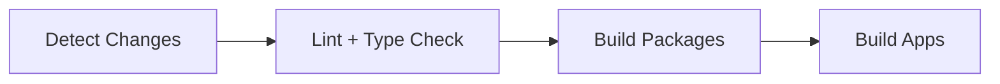

# CI/CD (Short)

Minimal overview of the pipeline. Full details are in the workflow files under [.github/workflows](.github/workflows).



## Key Jobs

- `detect-changes`
- `lint-and-typecheck`
- `build-packages`
- `build-app-*`

## Local Parity

```bash
pnpm lint
pnpm type-check
pnpm build
```
