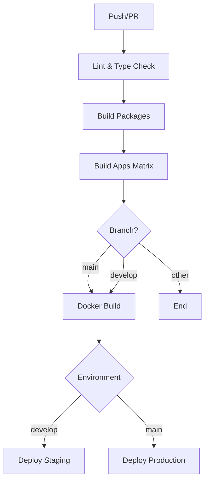

# CI/CD Pipeline Documentation

## Overview

Automated CI/CD pipeline for the Orbit micro-frontend platform using GitHub Actions.

## Pipeline Stages

### 1. **Lint & Type Check**

- Runs ESLint on all TypeScript/JavaScript files
- Performs type checking across the monorepo
- Ensures code quality standards

### 2. **Build Packages**

- Builds shared packages (`@repo/config`, `@repo/core`, `@repo/ui`, `@repo/utils`)
- Caches build artifacts for downstream jobs
- Ensures packages are build-ready before apps

### 3. **Build Apps (Matrix)**

- Builds all MFE apps in parallel:
  - `app-react`
  - `app-nextjs`
  - `app-vue`
  - `app-svelte`
  - `app-solidjs`
  - `shell`
- Uses matrix strategy for parallel execution
- Uploads build artifacts for Docker stage

### 4. **Docker Build (Matrix)**

- **Trigger:** Only on `main` branch pushes
- Builds Docker images for all services in parallel
- Pushes to DockerHub with tags:
  - `latest` (main branch only)
  - `{branch}-{sha}`
  - `{branch}` ref
- Uses layer caching for faster builds

### 5. **Deploy**

- **Staging:** Auto-deploy on `develop` branch
- **Production:** Auto-deploy on `main` branch
- Uses GitHub Environments for approvals

## Build Scripts

### Local Development

```bash
# Build all packages
pnpm build:packages

# Build all MFE apps
pnpm build:mfes

# Build specific app
pnpm --filter=app-react build:mfe
```

### Docker Commands

```bash
# Build all images
pnpm docker:build

# Start all services
pnpm docker:up

# Stop all services
pnpm docker:down

# View logs
pnpm docker:logs
```

## Environment Variables

### Required Secrets

- `DOCKERHUB_USERNAME`: DockerHub account username
- `DOCKERHUB_TOKEN`: DockerHub access token

### Build-time Environment Variables

- `NODE_ENV`: Set to `production` for optimized builds
- `MFE_MODE`: Set to `true` for MFE-specific builds

## Deployment

### Staging Environment

- Auto-deploys from `develop` branch
- URL: <https://staging.orbit.example.com>
- Requires approval for first deployment

### Production Environment  

- Auto-deploys from `main` branch
- URL: <https://orbit.example.com>
- Requires manual approval from team leads

## Workflow Diagram



## Troubleshooting

### Build Failures

**Issue:** Native binaries error (fsevents, etc.)

```text
Solution: Build scripts exclude native modules in production
```

**Issue:** Type errors blocking build

```text
Solution: Type check runs separately; build uses --skipLibCheck
```

**Issue:** Docker build slow

```text
Solution: Uses layer caching; ensure .dockerignore is optimized
```

## Optimization Tips

1. **Parallel Builds:** Matrix strategy runs apps in parallel
2. **Caching:**
   - pnpm cache for dependencies
   - GitHub Actions cache for build artifacts
   - Docker layer cache for image builds
3. **Incremental Builds:** Turbo caches unchanged packages

## Manual Workflows

### Triggering Manual Deployment

```bash
# Via GitHub CLI
gh workflow run ci-cd.yml --ref main

# Via GitHub UI
Actions → CI/CD Pipeline → Run workflow
```

### Rolling Back

```bash
# Revert to previous Docker image
docker pull yourorg/orbit-shell:previous-sha
docker-compose up -d
```

## Monitoring

- **Build Status:** GitHub Actions tab
- **Docker Images:** DockerHub repository
- **Deployments:** GitHub Environments

## Future Enhancements

- [ ] Add E2E tests stage
- [ ] Implement canary deployments
- [ ] Add performance budgets
- [ ] Slack/Discord notifications
- [ ] Auto-scaling based on traffic
