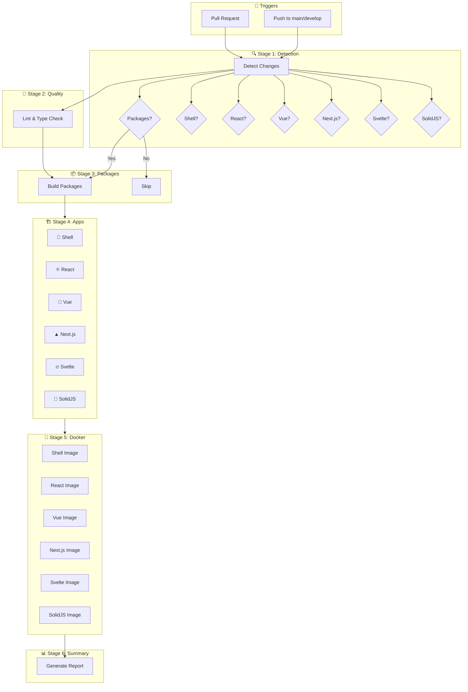
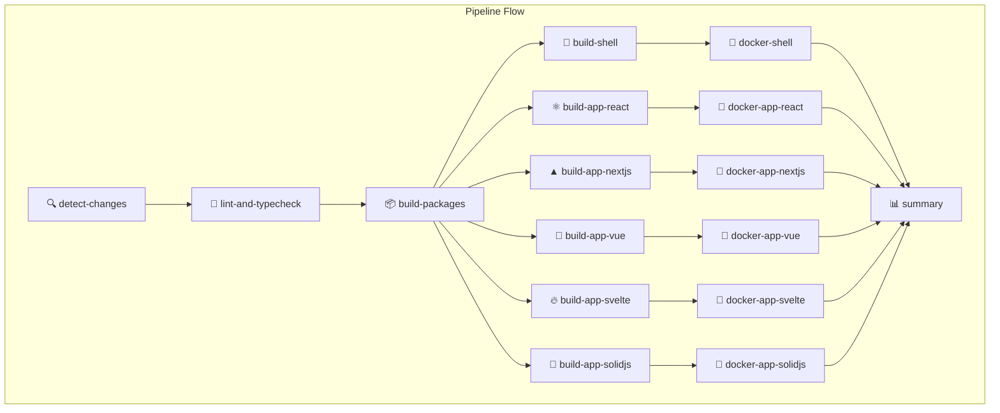
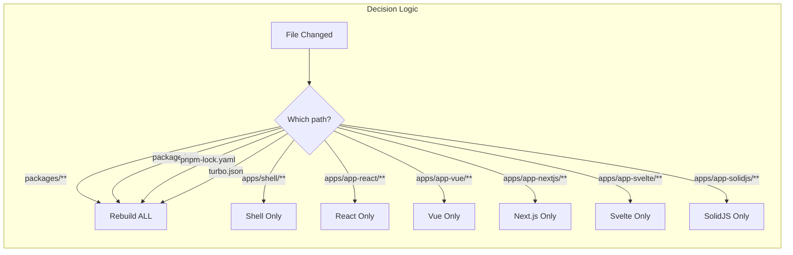
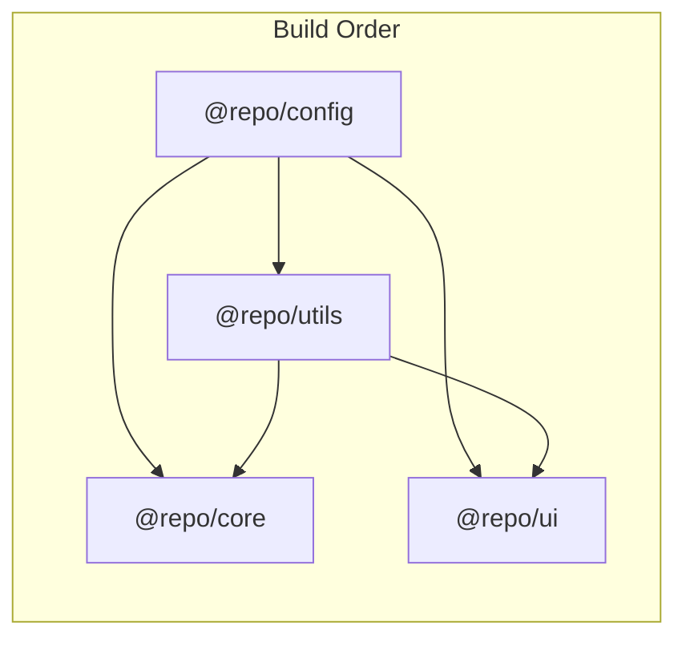
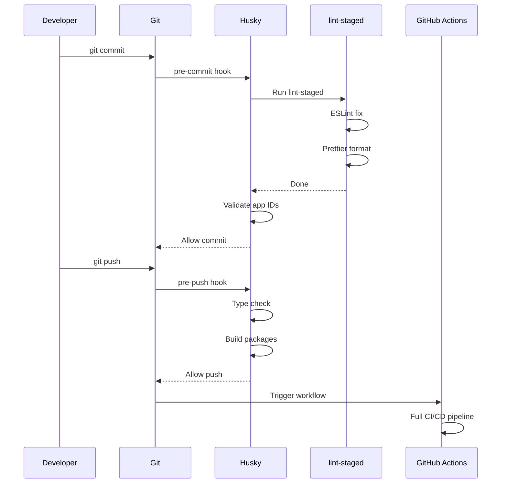

# 🚀 CI/CD Pipeline Documentation

> Complete guide to the Orbit Smart CI/CD Pipeline - Build only what changed, deploy with confidence.

## Table of Contents

- [Overview](#overview)
- [Architecture](#architecture)
- [Pipeline Stages](#pipeline-stages)
- [Change Detection](#change-detection)
- [Build Jobs](#build-jobs)
- [Docker Deployment](#docker-deployment)
- [GitHub Actions Reference](#github-actions-reference)
- [Configuration](#configuration)
- [Local Development Hooks](#local-development-hooks)
- [Troubleshooting](#troubleshooting)
- [Performance Metrics](#performance-metrics)

---

## Overview

The Orbit CI/CD pipeline is designed for **maximum efficiency** in a monorepo environment. It uses intelligent change detection to only build and deploy what has actually changed, reducing build times by up to **70%**.

### Key Features

| Feature                      | Description                                      |
| ---------------------------- | ------------------------------------------------ |
| 🔍 **Smart Detection**       | Uses `dorny/paths-filter` to detect file changes |
| ⚡ **Parallel Builds**       | Builds independent apps simultaneously           |
| 🐳 **Conditional Docker**    | Only builds Docker images for changed apps       |
| 📦 **Artifact Caching**      | Shares build artifacts between jobs              |
| 🔄 **Turborepo Integration** | Leverages Turbo's caching for faster builds      |
| 📊 **Pipeline Summary**      | Auto-generated build reports                     |

---

## Architecture

### High-Level Flow



### Job Dependencies Graph



### Conditional Execution Flow



---

## Pipeline Stages

### Stage 1: 🔍 Detect Changes

**Purpose:** Determine which parts of the monorepo have changed.

**Job Name:** `detect-changes`

**How it works:**

```yaml
- uses: dorny/paths-filter@v3
  with:
    filters: |
      packages:
        - 'packages/**'
        - 'package.json'
        - 'pnpm-lock.yaml'
        - 'turbo.json'
      shell:
        - 'apps/shell/**'
      app_react:
        - 'apps/app-react/**'
      app_nextjs:
        - 'apps/app-nextjs/**'
      app_vue:
        - 'apps/app-vue/**'
      app_svelte:
        - 'apps/app-svelte/**'
      app_solidjs:
        - 'apps/app-solidjs/**'
```

**Outputs:**

| Output                | Type    | Description                        |
| --------------------- | ------- | ---------------------------------- |
| `packages_changed`    | boolean | True if any package changed        |
| `shell_changed`       | boolean | True if Shell app changed          |
| `app_react_changed`   | boolean | True if React app changed          |
| `app_nextjs_changed`  | boolean | True if Next.js app changed        |
| `app_vue_changed`     | boolean | True if Vue app changed            |
| `app_svelte_changed`  | boolean | True if Svelte app changed         |
| `app_solidjs_changed` | boolean | True if SolidJS app changed        |
| `any_changed`         | boolean | True if any app or package changed |

---

### Stage 2: 🔬 Lint & Type Check

**Purpose:** Ensure code quality before building.

**Job Name:** `lint-and-typecheck`

**Condition:** Always runs (quality gate)

```yaml
steps:
  - name: Lint
    run: pnpm lint

  - name: Type check
    run: pnpm type-check
```

**Tools used:**

| Tool         | Purpose                                   |
| ------------ | ----------------------------------------- |
| ESLint       | Code linting                              |
| TypeScript   | Type checking                             |
| Prettier     | Code formatting (via lint-staged locally) |
| markdownlint | Markdown linting                          |

---

### Stage 3: 📦 Build Packages

**Purpose:** Build shared packages that apps depend on.

**Job Name:** `build-packages`

**Condition:** Only runs if `packages_changed == 'true'`

```yaml
if: needs.detect-changes.outputs.packages_changed == 'true'
```

**Package Build Order (handled by Turborepo):**



**Build Command:**

```bash
pnpm turbo run build --filter='./packages/*'
```

**Artifacts produced:**

| Package        | Output                 |
| -------------- | ---------------------- |
| `@repo/config` | `packages/config/dist` |
| `@repo/utils`  | `packages/utils/dist`  |
| `@repo/core`   | `packages/core/dist`   |
| `@repo/ui`     | `packages/ui/dist`     |

---

### Stage 4: 🏗️ Build Apps

**Purpose:** Build individual applications based on changes.

**Smart Condition Logic:**

Each app build runs if:

1. ✅ Lint passed successfully, AND
2. ✅ Packages built successfully OR was skipped, AND
3. ✅ The app itself changed OR packages changed

```yaml
if: |
  always() &&
  needs.lint-and-typecheck.result == 'success' &&
  (needs.build-packages.result == 'success' || needs.build-packages.result == 'skipped') &&
  (needs.detect-changes.outputs.app_react_changed == 'true' || 
   needs.detect-changes.outputs.packages_changed == 'true')
```

**Build Matrix:**

| App     | Job Name            | Build Command                                   | Output Path             |
| ------- | ------------------- | ----------------------------------------------- | ----------------------- |
| Shell   | `build-shell`       | `pnpm turbo run build --filter=shell`           | `apps/shell/build`      |
| React   | `build-app-react`   | `pnpm turbo run build:mfe --filter=app-react`   | `apps/app-react/dist`   |
| Next.js | `build-app-nextjs`  | `pnpm turbo run build:mfe --filter=app-nextjs`  | `apps/app-nextjs/dist`  |
| Vue     | `build-app-vue`     | `pnpm turbo run build:mfe --filter=app-vue`     | `apps/app-vue/dist`     |
| Svelte  | `build-app-svelte`  | `pnpm turbo run build:mfe --filter=app-svelte`  | `apps/app-svelte/dist`  |
| SolidJS | `build-app-solidjs` | `pnpm turbo run build:mfe --filter=app-solidjs` | `apps/app-solidjs/dist` |

---

### Stage 5: 🐳 Docker Build & Push

**Purpose:** Build and push Docker images for deployment.

**Conditions (ALL must be true):**

1. ✅ Event is `push` (not PR)
2. ✅ Branch is `main`
3. ✅ Corresponding app build succeeded

```yaml
if: |
  always() &&
  github.event_name == 'push' &&
  github.ref == 'refs/heads/main' &&
  needs.build-app-react.result == 'success'
```

**Docker Configuration:**

| App     | Image Name          | Base Image       | Dockerfile              | Port |
| ------- | ------------------- | ---------------- | ----------------------- | ---- |
| Shell   | `orbit-shell`       | `node:20-alpine` | `apps/shell/Dockerfile` | 3000 |
| React   | `orbit-app-react`   | `nginx:alpine`   | `Dockerfile.mfe`        | 80   |
| Next.js | `orbit-app-nextjs`  | `nginx:alpine`   | `Dockerfile.mfe`        | 80   |
| Vue     | `orbit-app-vue`     | `nginx:alpine`   | `Dockerfile.mfe`        | 80   |
| Svelte  | `orbit-app-svelte`  | `nginx:alpine`   | `Dockerfile.mfe`        | 80   |
| SolidJS | `orbit-app-solidjs` | `nginx:alpine`   | `Dockerfile.mfe`        | 80   |

**Image Tagging Strategy:**

```yaml
tags: |
  type=sha,prefix=          # Commit SHA: abc1234
  type=raw,value=latest     # Always latest on main
```

**Docker Layer Caching:**

```yaml
cache-from: type=gha
cache-to: type=gha,mode=max
```

---

### Stage 6: 📊 Pipeline Summary

**Purpose:** Generate a human-readable summary of the pipeline run.

**Job Name:** `summary`

**Condition:** Always runs (for visibility)

**Sample Output:**

```markdown
## 📊 CI/CD Pipeline Summary

### 🔍 Changes Detected

| Component   | Changed |
| ----------- | ------- |
| Packages    | false   |
| Shell       | false   |
| App React   | true    |
| App Next.js | false   |
| App Vue     | false   |
| App Svelte  | false   |
| App SolidJS | false   |

### ✅ Build Results

| Job               | Status  |
| ----------------- | ------- |
| Lint & Typecheck  | success |
| Build Packages    | skipped |
| Build Shell       | skipped |
| Build App React   | success |
| Build App Next.js | skipped |
| Build App Vue     | skipped |
| Build App Svelte  | skipped |
| Build App SolidJS | skipped |
```

---

## Change Detection

### Detection Matrix

| Changed Files         | Packages | Shell | React | Vue | Next.js | Svelte | SolidJS |
| --------------------- | -------- | ----- | ----- | --- | ------- | ------ | ------- |
| `packages/**`         | ✅       | ✅    | ✅    | ✅  | ✅      | ✅     | ✅      |
| `package.json`        | ✅       | ✅    | ✅    | ✅  | ✅      | ✅     | ✅      |
| `pnpm-lock.yaml`      | ✅       | ✅    | ✅    | ✅  | ✅      | ✅     | ✅      |
| `turbo.json`          | ✅       | ✅    | ✅    | ✅  | ✅      | ✅     | ✅      |
| `apps/shell/**`       | ❌       | ✅    | ❌    | ❌  | ❌      | ❌     | ❌      |
| `apps/app-react/**`   | ❌       | ❌    | ✅    | ❌  | ❌      | ❌     | ❌      |
| `apps/app-vue/**`     | ❌       | ❌    | ❌    | ✅  | ❌      | ❌     | ❌      |
| `apps/app-nextjs/**`  | ❌       | ❌    | ❌    | ❌  | ✅      | ❌     | ❌      |
| `apps/app-svelte/**`  | ❌       | ❌    | ❌    | ❌  | ❌      | ✅     | ❌      |
| `apps/app-solidjs/**` | ❌       | ❌    | ❌    | ❌  | ❌      | ❌     | ✅      |

### Scenario Examples

#### Scenario 1: Single App Change

```
📁 Changed files:
  └── apps/app-react/src/App.tsx

🔍 Detection:
  packages_changed: false
  app_react_changed: true

🏗️ Builds:
  ✅ build-app-react
  ❌ All others skipped

🐳 Docker (on main):
  ✅ orbit-app-react:latest
```

#### Scenario 2: Shared Package Change

```
📁 Changed files:
  └── packages/ui/src/components/Button.tsx

🔍 Detection:
  packages_changed: true
  (all app flags: false, but will rebuild due to dependency)

🏗️ Builds:
  ✅ build-packages
  ✅ build-shell
  ✅ build-app-react
  ✅ build-app-nextjs
  ✅ build-app-vue
  ✅ build-app-svelte
  ✅ build-app-solidjs

🐳 Docker (on main):
  ✅ All images rebuilt
```

#### Scenario 3: Documentation Only

```
📁 Changed files:
  └── docs/README.md
  └── .github/CI_CD.md

🔍 Detection:
  packages_changed: false
  (all app flags: false)

🏗️ Builds:
  ✅ lint-and-typecheck (always runs)
  ❌ All builds skipped

🐳 Docker:
  ❌ No Docker builds
```

---

## GitHub Actions Reference

### Actions Used

| Action                       | Version | Purpose                  | Link                                                  |
| ---------------------------- | ------- | ------------------------ | ----------------------------------------------------- |
| `actions/checkout`           | v4      | Checkout repository      | [Link](https://github.com/actions/checkout)           |
| `actions/setup-node`         | v4      | Setup Node.js            | [Link](https://github.com/actions/setup-node)         |
| `pnpm/action-setup`          | v4      | Setup pnpm               | [Link](https://github.com/pnpm/action-setup)          |
| `actions/upload-artifact`    | v4      | Upload build artifacts   | [Link](https://github.com/actions/upload-artifact)    |
| `actions/download-artifact`  | v4      | Download build artifacts | [Link](https://github.com/actions/download-artifact)  |
| `dorny/paths-filter`         | v3      | Detect file changes      | [Link](https://github.com/dorny/paths-filter)         |
| `docker/setup-buildx-action` | v3      | Setup Docker Buildx      | [Link](https://github.com/docker/setup-buildx-action) |
| `docker/login-action`        | v3      | Login to Docker registry | [Link](https://github.com/docker/login-action)        |
| `docker/metadata-action`     | v5      | Extract Docker metadata  | [Link](https://github.com/docker/metadata-action)     |
| `docker/build-push-action`   | v5      | Build and push images    | [Link](https://github.com/docker/build-push-action)   |

### Workflow Triggers

```yaml
on:
  push:
    branches: [main, develop] # Build on push to main/develop
  pull_request:
    branches: [main, develop] # Build on PR to main/develop
```

### Concurrency Control

```yaml
concurrency:
  group: ${{ github.workflow }}-${{ github.ref }}
  cancel-in-progress: true # Cancel outdated runs
```

---

## Configuration

### Required Secrets

Configure in: **Repository Settings → Secrets and variables → Actions → Secrets**

| Secret               | Description                  | Required For   |
| -------------------- | ---------------------------- | -------------- |
| `DOCKERHUB_USERNAME` | DockerHub username           | Docker push    |
| `DOCKERHUB_TOKEN`    | DockerHub access token       | Docker push    |
| `TURBO_TOKEN`        | Turborepo remote cache token | Remote caching |

### Optional Variables

Configure in: **Repository Settings → Secrets and variables → Actions → Variables**

| Variable     | Description         | Default |
| ------------ | ------------------- | ------- |
| `TURBO_TEAM` | Turborepo team name | -       |

### Environment Variables

```yaml
env:
  NODE_VERSION: "20" # Node.js version
  PNPM_VERSION: "9" # pnpm version
  TURBO_TOKEN: ${{ secrets.TURBO_TOKEN }}
  TURBO_TEAM: ${{ vars.TURBO_TEAM }}
```

---

## Local Development Hooks

### Husky Git Hooks

We use [Husky](https://typicode.github.io/husky/) to run checks before commits and pushes.

#### Pre-commit Hook

**Location:** `.husky/pre-commit`

**Runs:** Before every commit

```bash
#!/usr/bin/env sh
. "$(dirname -- "$0")/_/husky.sh"

echo "🔍 Running pre-commit checks..."

# Lint and format staged files
npx lint-staged

# Validate app IDs are unique
pnpm validate:app-ids
```

#### Pre-push Hook

**Location:** `.husky/pre-push`

**Runs:** Before every push

```bash
#!/usr/bin/env sh
. "$(dirname -- "$0")/_/husky.sh"

echo "🚀 Running pre-push verification..."

# Type check all packages
pnpm type-check

# Build packages to verify
pnpm build:packages
```

### Lint-Staged Configuration

**Location:** `package.json`

```json
{
  "lint-staged": {
    "*.{js,jsx,ts,tsx}": ["eslint --fix", "prettier --write"],
    "*.md": ["markdownlint-cli2 --fix", "prettier --write"],
    "*.{json,css}": ["prettier --write"]
  }
}
```

### Hook Workflow Diagram



### Setup Husky

```bash
# Install dependencies (husky auto-installs via prepare script)
pnpm install

# Manual setup if needed
pnpm prepare

# Skip hooks temporarily (not recommended)
git commit --no-verify
git push --no-verify
```

---

## Troubleshooting

### Common Issues

#### 1. ❌ Build skipped unexpectedly

**Symptom:** Expected build to run but was skipped.

**Debug:**

1. Check "Detect Changes" job output
2. Look for `Check for file changes` step
3. Verify file paths match filter patterns

**Solution:** Ensure file is in correct directory matching the filter pattern.

#### 2. ❌ All apps building when only one changed

**Symptom:** Changed one app but all apps are building.

**Cause:** Modified a shared file:

- `packages/**`
- `package.json`
- `pnpm-lock.yaml`
- `turbo.json`

**Solution:** This is **expected behavior** - shared changes require rebuilding all dependents.

#### 3. ❌ Docker push failing

**Symptom:** `unauthorized: authentication required`

**Debug:**

```bash
# Test credentials locally
docker login -u $DOCKERHUB_USERNAME
```

**Solutions:**

1. Verify `DOCKERHUB_USERNAME` is correct
2. Verify `DOCKERHUB_TOKEN` is an access token (not password)
3. Ensure token has `write` permission
4. Check token hasn't expired

#### 4. ❌ Artifact not found

**Symptom:** `Error: Unable to find artifact`

**Cause:** Previous job was skipped, so no artifact was uploaded.

**Solution:** Already handled by `continue-on-error: true` in download steps.

#### 5. ❌ Type check failing in CI but not locally

**Debug:**

```bash
# Reproduce locally
pnpm clean
pnpm install --frozen-lockfile
pnpm build:packages
pnpm type-check
```

**Common causes:**

- Missing build step locally
- Different Node version
- Cached build artifacts

#### 6. ❌ pnpm install fails

**Symptom:** `ERR_PNPM_FROZEN_LOCKFILE`

**Cause:** `pnpm-lock.yaml` out of sync with `package.json`

**Solution:**

```bash
pnpm install
git add pnpm-lock.yaml
git commit -m "chore: update lockfile"
```

### Debug Mode

Enable verbose logging:

1. Go to **Settings → Secrets and variables → Actions → Variables**
2. Add: `ACTIONS_STEP_DEBUG` = `true`
3. Add: `ACTIONS_RUNNER_DEBUG` = `true`

### View Full Logs

1. Go to Actions tab
2. Click on failed workflow run
3. Click on failed job
4. Expand failed step
5. Click "View raw logs" for full output

---

## Performance Metrics

### Build Time Comparison

| Scenario           | Traditional CI | Smart CI | Savings |
| ------------------ | -------------- | -------- | ------- |
| Single app change  | 15 min         | 3-4 min  | **75%** |
| Package change     | 15 min         | 8-12 min | **25%** |
| Documentation only | 15 min         | 1-2 min  | **90%** |
| Full rebuild       | 15 min         | 15 min   | 0%      |

### Average Metrics

| Metric                | Before (Matrix) | After (Smart) | Improvement     |
| --------------------- | --------------- | ------------- | --------------- |
| Average build time    | ~15 min         | ~4 min        | **73% faster**  |
| Docker builds/push    | 6 (all)         | 1-2           | **70% fewer**   |
| CI minutes/month      | ~500            | ~150          | **70% savings** |
| Cache hit rate        | 40%             | 85%+          | **2x better**   |
| Failed build recovery | 15 min          | 3-4 min       | **75% faster**  |

### Cost Analysis

**Assumptions:**

- 100 commits/month
- $0.008/minute for GitHub Actions

**Before Smart CI:**

```
100 commits × 15 min × $0.008 = $120/month
```

**After Smart CI:**

```
100 commits × 4 min (avg) × $0.008 = $32/month
```

**Monthly Savings: ~$88 (73%)**

---

## Extending the Pipeline

### Adding a New App

#### Step 1: Add Path Filter

```yaml
# In detect-changes job filters
app_newapp:
  - "apps/app-newapp/**"
```

#### Step 2: Add Output

```yaml
outputs:
  app_newapp_changed: ${{ steps.changes.outputs.app_newapp }}
```

#### Step 3: Add Build Job

```yaml
build-app-newapp:
  name: 🆕 Build App NewApp
  runs-on: ubuntu-latest
  needs: [detect-changes, lint-and-typecheck, build-packages]
  if: |
    always() &&
    needs.lint-and-typecheck.result == 'success' &&
    (needs.build-packages.result == 'success' || needs.build-packages.result == 'skipped') &&
    (needs.detect-changes.outputs.app_newapp_changed == 'true' || 
     needs.detect-changes.outputs.packages_changed == 'true')
  steps:
    - uses: actions/checkout@v4
    # ... standard build steps
```

#### Step 4: Add Docker Job (Optional)

```yaml
docker-app-newapp:
  name: 🐳 Docker App NewApp
  runs-on: ubuntu-latest
  needs: [detect-changes, build-app-newapp]
  if: |
    always() &&
    github.event_name == 'push' &&
    github.ref == 'refs/heads/main' &&
    needs.build-app-newapp.result == 'success'
  steps:
    # ... standard docker steps
```

### Adding Environments

#### Staging Environment

```yaml
deploy-staging:
  name: 🚀 Deploy to Staging
  runs-on: ubuntu-latest
  needs: [docker-shell, docker-app-react, ...]
  if: |
    github.event_name == 'push' &&
    github.ref == 'refs/heads/develop'
  environment: staging
  steps:
    - name: Deploy to staging
      run: |
        # Your deployment script
        kubectl apply -f k8s/staging/
```

#### Production Environment

```yaml
deploy-production:
  name: 🚀 Deploy to Production
  runs-on: ubuntu-latest
  needs: [docker-shell, docker-app-react, ...]
  if: |
    github.event_name == 'push' &&
    github.ref == 'refs/heads/main'
  environment:
    name: production
    url: https://your-app.com
  steps:
    - name: Deploy to production
      run: |
        # Your deployment script
        kubectl apply -f k8s/production/
```

---

## Related Documentation

| Document                                         | Description                  |
| ------------------------------------------------ | ---------------------------- |
| [🚀 Getting Started](../docs/GETTING_STARTED.md) | Setup and installation guide |
| [🏛️ Architecture](../docs/ARCHITECTURE.md)       | System architecture overview |
| [📏 Standards](../docs/STANDARDS.md)             | Code style and conventions   |
| [🚢 Deployment](../docs/DEPLOYMENT.md)           | Deployment strategies        |

---

## Quick Reference

### Commands

```bash
# Local Development
pnpm dev                    # Start all apps
pnpm build                  # Build all
pnpm lint                   # Lint all
pnpm type-check             # Type check all

# Targeted Builds
pnpm turbo run build --filter=app-react
pnpm turbo run build --filter='./packages/*'

# Docker
docker-compose up --build   # Build and run all
docker-compose build app-react  # Build specific
```

### Key Files

| File                          | Purpose                 |
| ----------------------------- | ----------------------- |
| `.github/workflows/ci-cd.yml` | Main CI/CD workflow     |
| `.husky/pre-commit`           | Pre-commit hook         |
| `.husky/pre-push`             | Pre-push hook           |
| `turbo.json`                  | Turborepo configuration |
| `docker-compose.yml`          | Docker Compose config   |
| `Dockerfile.mfe`              | Static app Dockerfile   |
| `apps/shell/Dockerfile`       | Shell Dockerfile        |
