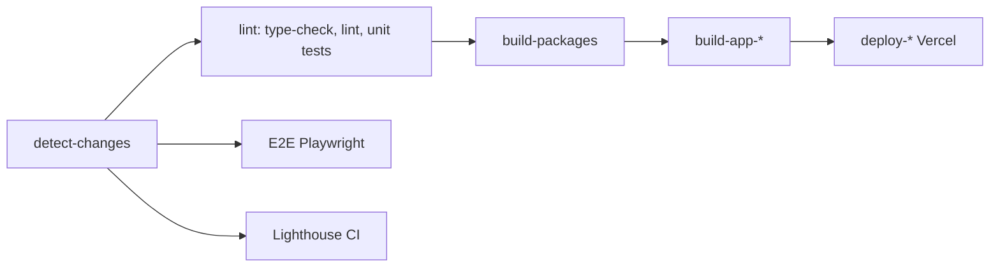

# CI/CD

Workflows live in [`.github/workflows`](./workflows). `ci-cd.yml`
orchestrates reusable workflows on every push/PR to `main` or `develop`.


```mermaid
flowchart LR
  D[detect-changes] --> L[lint: type-check, lint, unit tests]
  D --> E[E2E Playwright]
  D --> H[Lighthouse CI]
  L --> P[build-packages] --> B[build-app-*] --> V[deploy-* Vercel]
```

| Job                    | Fails the PR when                                                |
| ---------------------- | ---------------------------------------------------------------- |
| Lint & Type Check      | type errors, lint errors, failing unit tests (affected packages) |
| E2E (Playwright)       | login/redirect/MFE-mount flows break                             |
| Lighthouse CI          | accessibility / best-practices / public SEO < 0.9                |
| `build-*` / `deploy-*` | build or Vercel deploy fails (deploys need Vercel secrets)       |

Secrets: `VERCEL_TOKEN`, `VERCEL_ORG_ID`, `VERCEL_PROJECT_ID_<APP>`, and
optionally `TURBO_TOKEN` / `TURBO_TEAM` for remote caching.

Local parity:

```bash
pnpm type-check && pnpm lint && pnpm test && pnpm test:e2e
pnpm --filter shell build && SESSION_SECRET=dev pnpm lhci
```

Details: [docs/testing-and-quality.md](../docs/testing-and-quality.md),
[docs/deployment.md](../docs/deployment.md).
