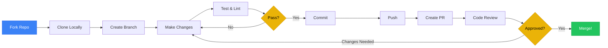
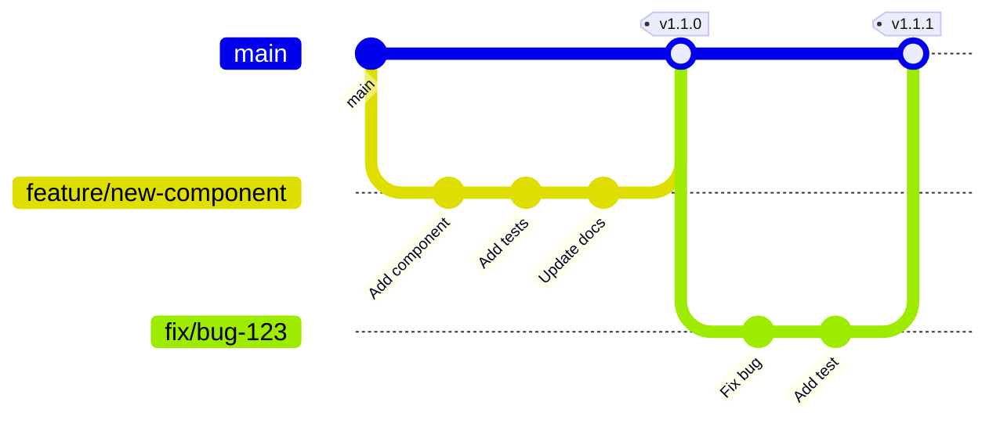

# Contributing to Orbit

Thank you for your interest in contributing to the Orbit Micro-Frontend Platform!



---

## Table of Contents

1. [Code of Conduct](#code-of-conduct)
2. [Getting Started](#getting-started)
3. [Development Workflow](#development-workflow)
4. [Coding Standards](#coding-standards)
5. [Commit Guidelines](#commit-guidelines)
6. [Pull Request Process](#pull-request-process)
7. [Testing Guidelines](#testing-guidelines)
8. [Documentation](#documentation)

---

## Code of Conduct

### Our Pledge

We are committed to providing a welcoming and inclusive experience for everyone. We expect all contributors to:

- ✅ Be respectful and considerate
- ✅ Accept constructive criticism gracefully
- ✅ Focus on what's best for the community
- ✅ Show empathy towards other community members

### Unacceptable Behavior

- ❌ Harassment, trolling, or discriminatory language
- ❌ Publishing others' private information
- ❌ Other unprofessional or unethical conduct

---

## Getting Started

### Prerequisites

Ensure you have the required tools installed:

- **Node.js** v18+
- **pnpm** v8+
- **Git**
- **Docker** (optional, for testing deployments)

### Fork and Clone

1. **Fork the repository** on GitHub
2. **Clone your fork**:

```bash
git clone https://github.com/YOUR_USERNAME/micro-frontend-base.git
cd micro-frontend-base
```

1. **Add upstream remote**:

```bash
git remote add upstream https://github.com/ORIGINAL_OWNER/micro-frontend-base.git
```

1. **Install dependencies**:

```bash
pnpm install
```

1. **Run the setup script**:

```bash
bash scripts/onboard.sh
```

---

## Development Workflow

### Branch Strategy



### 1. Create a Branch

Always create a new branch for your work:

```bash
# Update your main branch
git checkout main
git pull upstream main

# Create a feature branch
git checkout -b feature/your-feature-name

# Or a bugfix branch
git checkout -b fix/issue-number-description
```

**Branch Naming Conventions:**

- `feature/` - New features
- `fix/` - Bug fixes
- `docs/` - Documentation updates
- `refactor/` - Code refactoring
- `test/` - Adding or updating tests
- `chore/` - Maintenance tasks

### 2. Make Your Changes

```bash
# Start development servers
pnpm dev

# Or run specific apps
pnpm dev:shell
pnpm dev:mfes
```

### 3. Test Your Changes

```bash
# Lint your code
pnpm lint

# Type check
pnpm type-check

# Run tests (if available)
pnpm test

# Build to verify no errors
pnpm build
```

### 4. Commit Your Changes

Follow our [commit guidelines](#commit-guidelines) when committing:

```bash
git add .
git commit -m "feat: add new component"
```

### 5. Keep Your Branch Updated

```bash
# Fetch latest changes
git fetch upstream

# Rebase your branch
git rebase upstream/main

# Force push if needed (only on your fork)
git push origin feature/your-feature-name --force
```

---

## Coding Standards

### TypeScript

- **Use TypeScript** for all new code
- **Enable strict mode** - No `any` unless absolutely necessary
- **Prefer interfaces** for object shapes, **types** for unions
- **Use const assertions** for literal types

```typescript
// ✅ Good
interface UserProps {
  id: string;
  name: string;
  role: "admin" | "user";
}

const user: UserProps = {
  id: "123",
  name: "John",
  role: "admin",
};

// ❌ Bad
const user: any = {
  id: "123",
  name: "John",
};
```

### File Naming

- **Files**: `kebab-case.ts` (e.g., `user-profile.tsx`)
- **Directories**: `kebab-case` (e.g., `components/ui/`)
- **Components**: `PascalCase` in code (e.g., `UserProfile`)
- **Test files**: `*.test.ts` (e.g., `button.test.tsx`)

### Import Order

```typescript
// 1. External packages
import { useState } from "react";

// 2. Internal packages
import { Button } from "@repo/ui/react";
import { EventBus } from "@repo/core/react";

// 3. Relative imports
import { useLocalState } from "./hooks";

// 4. Types (last)
import type { User } from "./types";
```

### ESLint and Prettier

All code must pass ESLint and Prettier checks:

```bash
# Auto-fix issues
pnpm lint:fix
pnpm format
```

**Configuration:**

- ESLint: `@repo/config/eslint-preset.cjs`
- Prettier: `.prettierrc` at root

---

## Commit Guidelines

We follow [Conventional Commits](https://www.conventionalcommits.org/) specification.

### Commit Message Format

```
<type>(<scope>): <subject>

<body>

<footer>
```

### Types

| Type       | Description                                       |
| ---------- | ------------------------------------------------- |
| `feat`     | New feature                                       |
| `fix`      | Bug fix                                           |
| `docs`     | Documentation only changes                        |
| `style`    | Code style changes (formatting, semicolons, etc.) |
| `refactor` | Code refactoring (no feature/fix)                 |
| `perf`     | Performance improvements                          |
| `test`     | Adding or updating tests                          |
| `chore`    | Build process, tooling, dependencies              |
| `ci`       | CI/CD changes                                     |
| `revert`   | Revert a previous commit                          |

### Scopes (Optional)

- `shell` - Shell app changes
- `app-react` - React app changes
- `app-vue` - Vue app changes
- `core` - @repo/core changes
- `ui` - @repo/ui changes
- `utils` - @repo/utils changes
- `config` - @repo/config changes
- `docs` - Documentation changes

### Examples

```bash
# Feature
git commit -m "feat(ui): add new Button variant"

# Bug fix
git commit -m "fix(shell): resolve MFE loading race condition"

# Documentation
git commit -m "docs: update deployment guide"

# Refactor
git commit -m "refactor(core): simplify event bus implementation"

# Breaking change
git commit -m "feat(core)!: change EventBus API

BREAKING CHANGE: EventBus.emit() now requires event type parameter"
```

### Commit Body and Footer

```
feat(ui): add dark mode toggle component

- Add DarkModeToggle component with sun/moon icon
- Implement theme persistence in localStorage
- Add keyboard shortcut (Ctrl+Shift+D)

Closes #123
```

---

## Pull Request Process

### Before Submitting

Ensure your PR:

1. ✅ Passes all linting and type checks
2. ✅ Includes tests (if applicable)
3. ✅ Updates documentation
4. ✅ Follows coding standards
5. ✅ Has a clear, descriptive title

### PR Title Format

Use the same format as commit messages:

```
feat(ui): add new Button variant
fix(shell): resolve MFE loading issue
docs: update CONTRIBUTING.md
```

### PR Description Template

```markdown
## Description

Brief description of what this PR does.

## Type of Change

- [ ] Bug fix (non-breaking change which fixes an issue)
- [ ] New feature (non-breaking change which adds functionality)
- [ ] Breaking change (fix or feature that would cause existing functionality to not work as expected)
- [ ] Documentation update

## How to Test

1. Step-by-step testing instructions
2. Expected behavior

## Related Issues

Closes #123

## Screenshots (if applicable)

[Add screenshots here]

## Checklist

- [ ] I have followed the coding standards
- [ ] I have performed a self-review of my code
- [ ] I have commented my code where necessary
- [ ] I have updated the documentation
- [ ] My changes generate no new warnings
- [ ] I have added tests that prove my fix is effective or that my feature works
```

### Review Process

1. **Automated Checks**: CI/CD pipeline runs automatically
2. **Code Review**: At least one maintainer review required
3. **Changes Requested**: Address feedback and update PR
4. **Approval**: Once approved, maintainers will merge

### After Approval

- **Squash and Merge** is preferred for most PRs
- **Rebase and Merge** for maintaining commit history
- **Delete branch** after merging

---

## Testing Guidelines

### Writing Tests

```typescript
// button.test.tsx
import { render, screen } from "@testing-library/react";
import { Button } from "./button";

describe("Button", () => {
  it("renders with correct text", () => {
    render(<Button>Click me</Button>);
    expect(screen.getByText("Click me")).toBeInTheDocument();
  });

  it("calls onClick when clicked", () => {
    const handleClick = jest.fn();
    render(<Button onClick={handleClick}>Click</Button>);
    screen.getByText("Click").click();
    expect(handleClick).toHaveBeenCalledTimes(1);
  });
});
```

### Test Coverage

- **Critical features**: Must have tests
- **Bug fixes**: Add regression tests
- **New components**: Test basic functionality
- **Utilities**: Test edge cases

### Running Tests

```bash
# Run all tests
pnpm test

# Run tests for specific package
pnpm --filter @repo/ui test

# Run tests in watch mode
pnpm test --watch
```

---

## Documentation

### What to Document

1. **New Features**: Update relevant docs
2. **API Changes**: Update API reference
3. **Breaking Changes**: Add migration guide
4. **Examples**: Add usage examples

### Documentation Files

- `README.md` - Main project overview
- `docs/GETTING_STARTED.md` - Setup and installation
- `docs/TUTORIAL.md` - Step-by-step guides
- `docs/ARCHITECTURE.md` - System design
- `docs/DEPLOYMENT.md` - Deployment guides
- `docs/STANDARDS.md` - Coding standards
- Package `README.md` - Package-specific docs

### Writing Style

- **Clear and concise**
- **Use examples**
- **Include code snippets**
- **Add diagrams** (Mermaid) where helpful
- **Link related docs**

---

## Community

### Getting Help

- **GitHub Discussions**: Ask questions and share ideas
- **GitHub Issues**: Report bugs and request features
- **Discord/Slack**: Real-time chat (if available)

### Reporting Bugs

Use the bug report template and include:

1. **Description**: Clear description of the bug
2. **Steps to Reproduce**: Minimal reproduction steps
3. **Expected Behavior**: What should happen
4. **Actual Behavior**: What actually happens
5. **Environment**: OS, Node version, pnpm version
6. **Screenshots**: If applicable

### Feature Requests

Use the feature request template and include:

1. **Problem**: What problem does this solve?
2. **Solution**: Proposed solution
3. **Alternatives**: Alternative solutions considered
4. **Examples**: Examples from other projects

---

## Project Structure

Understanding the structure helps you contribute effectively:

```
.
├── apps/                  # Micro-frontend applications
│   ├── shell/            # Main shell (Remix)
│   ├── app-react/        # React MFE
│   ├── app-vue/          # Vue MFE
│   ├── app-svelte/       # Svelte MFE
│   └── app-solidjs/      # SolidJS MFE
├── packages/             # Shared packages
│   ├── core/            # State management, event bus
│   ├── ui/              # Multi-framework UI components
│   ├── utils/           # Utility functions
│   └── config/          # Shared configurations
├── scripts/             # Build and automation scripts
├── docs/                # Documentation
└── .github/             # CI/CD workflows
```

---

## Release Process

Releases are managed by maintainers:

1. **Version bump** following [Semantic Versioning](https://semver.org/)
2. **Update CHANGELOG.md**
3. **Create Git tag**
4. **Publish to npm** (if applicable)
5. **Create GitHub Release**

### Semantic Versioning

- **MAJOR**: Breaking changes
- **MINOR**: New features (backward compatible)
- **PATCH**: Bug fixes (backward compatible)

---

## License

By contributing, you agree that your contributions will be licensed under the MIT License.

---

## Questions?

If you have questions not covered in this guide:

1. Check existing [GitHub Issues](https://github.com/ORIGINAL_OWNER/micro-frontend-base/issues)
2. Search [GitHub Discussions](https://github.com/ORIGINAL_OWNER/micro-frontend-base/discussions)
3. Open a new discussion

---

**Thank you for contributing to Orbit! 🚀**
