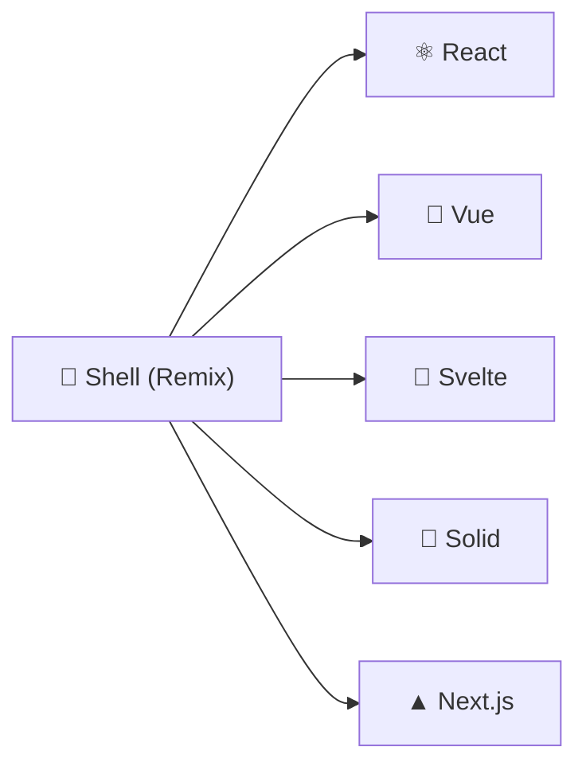
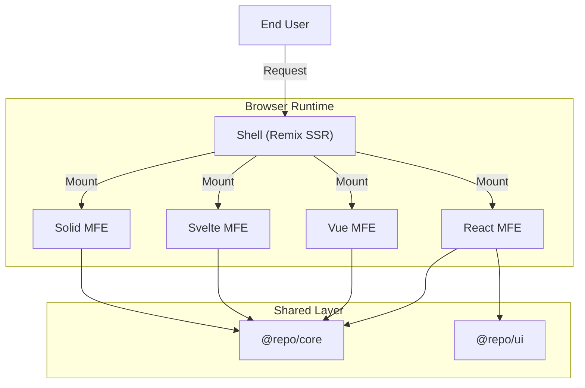

# 🪐 Orbit: Enterprise Micro-Frontend Platform

> **Production-ready, multi-framework micro-frontend architecture** optimized for scalability, performance, and developer experience.

[](https://www.typescriptlang.org/)
[](https://turbo.build/)
[](https://github.com/originjs/vite-plugin-federation)
[](https://tailwindcss.com/)
[](https://pnpm.io/)
[](./LICENSE)

**Hub-and-Spoke Architecture:** Like planets orbiting a sun, your micro-frontends (React, Vue, Svelte, SolidJS) revolve around a central Remix Shell, working in perfect harmony while maintaining independence.



---

## 📚 Documentation

| Guide                                           | Description                                        |
| ----------------------------------------------- | -------------------------------------------------- |
| [🚀 Getting Started](./docs/GETTING_STARTED.md) | Setup, Installation, and Running the Platform      |
| [📖 Tutorial](./docs/TUTORIAL.md)               | Step-by-step guide to building your first MFE      |
| [🏗️ Architecture](./docs/ARCHITECTURE.md)       | System design, Module Federation, State Management |
| [📏 Standards](./docs/STANDARDS.md)             | Code style, Naming conventions, Best practices     |
| [🚢 Deployment](./docs/DEPLOYMENT.md)           | CI/CD, Docker strategies, Production setup         |

---

## ✨ Key Features

### 🎯 Multi-Framework Support

Build with **React, Vue, Svelte, SolidJS, or Next.js**. Each micro-frontend can use its optimal framework while sharing state and UI components seamlessly.

| Framework | Status | UI Components | State Management |
| --------- | :----: | :-----------: | :--------------: |
| React     |   ✅   |      ✅       |        ✅        |
| Vue 3     |   ✅   |      ✅       |        ✅        |
| Svelte    |   ✅   |      ✅       |        ✅        |
| SolidJS   |   ✅   |      ✅       |        ✅        |
| Next.js   |   ✅   |      ✅       |        ✅        |

### ⚡ Lightning-Fast Development

- **Vite-powered** builds (< 2s for most apps)
- **Turborepo caching** - never rebuild the same code twice
- **Hot Module Replacement** across all frameworks
- **Parallel builds** with intelligent dependency graph

### 📦 Optimized Bundle Sizes

- **Tree-shaking enabled** with proper `sideEffects` configuration
- **Framework-specific builds** - No React in Vue apps
- **~550KB+ savings** per non-React app
- **Shared dependencies** managed centrally

### 🔄 Smart CI/CD Pipeline

- **Change Detection** - Only build what changed
- **Conditional Docker** - Skip unchanged apps
- **~70% faster builds** on average
- **Parallel deployments**

### 🎨 Multi-Framework UI Library

- **Consistent design system** across all frameworks
- **Shared variants** using CVA (Class Variance Authority)
- **Storybook** for each framework
- **Dark mode ready**

---

## 🚀 Quick Start

### Prerequisites

- **Node.js** v18 or higher
- **pnpm** v8 or higher (`npm install -g pnpm`)

### Installation

```bash
# Clone repository
git clone <repository-url>
cd micro-frontend-base

# Install dependencies
pnpm install

# Start development
pnpm dev
```

🎉 **Open [http://localhost:8000](http://localhost:8000)**

---

## 📋 Common Commands

### Development

| Command          | Description                     |
| :--------------- | :------------------------------ |
| `pnpm dev`       | Start all apps (Shell + MFEs)   |
| `pnpm dev:shell` | Start only the Shell            |
| `pnpm dev:mfes`  | Start only MFE apps             |
| `pnpm storybook` | Run Storybook for UI components |
| `pnpm cli`       | Interactive CLI for scaffolding |

### Build & Deploy

| Command                   | Description                       |
| :------------------------ | :-------------------------------- |
| `pnpm build`              | Build all packages and apps       |
| `pnpm build:mfes`         | Build all MFE apps                |
| `pnpm build:mfes:prod`    | Production build for MFEs         |
| `pnpm docker:build:smart` | Smart Docker build (changed only) |

### Quality & Validation

| Command                    | Description                  |
| :------------------------- | :--------------------------- |
| `pnpm lint`                | Run ESLint                   |
| `pnpm type-check`          | TypeScript type checking     |
| `pnpm validate:mfe-config` | Check MFE configuration      |
| `pnpm validate:app-ids`    | Validate APP_IDS consistency |
| `pnpm test`                | Run all tests                |

---

## 📦 Project Structure

```text
micro-frontend-base/
├── apps/
│   ├── shell/           # 🌟 Remix host application (SSR)
│   ├── app-react/       # ⚛️  React micro-frontend
│   ├── app-nextjs/      # ▲  Next.js micro-frontend
│   ├── app-vue/         # 💚 Vue 3 micro-frontend
│   ├── app-svelte/      # 🧡 Svelte micro-frontend
│   └── app-solidjs/     # 💙 SolidJS micro-frontend
│
├── packages/
│   ├── ui/              # 🎨 Multi-framework design system
│   ├── core/            # 🧠 State management & MFE utilities
│   ├── utils/           # 🔧 Helper functions
│   └── config/          # ⚙️  Shared configurations
│
├── scripts/
│   ├── mfe.config.mjs   # 📋 Central MFE configuration
│   ├── cli.mjs          # 🛠️  Interactive CLI
│   ├── create-app.mjs   # 📁 App scaffolding
│   └── ...              # 🏗️  Build & utility scripts
│
└── docs/                # 📚 Documentation
```

---

## 🎨 UI Component Library

Our multi-framework UI library provides consistent components across all frameworks:

```tsx
// React
import { Button, Card } from "@repo/ui/react";

// Vue
import { Button, Card } from "@repo/ui/vue";

// Svelte
import { Button, Card } from "@repo/ui/svelte";

// SolidJS
import { Button, Card } from "@repo/ui/solid";
```

### Available Components

| Component | React | Vue | Solid | Svelte |
| --------- | :---: | :-: | :---: | :----: |
| Button    |  ✅   | ✅  |  ✅   |   ✅   |
| Card      |  ✅   | ✅  |  ✅   |   ✅   |
| Input     |  ✅   | ✅  |  ✅   |   ✅   |
| Avatar    |  ✅   | ✅  |  ✅   |   ✅   |
| Tooltip   |  ✅   | ✅  |  ✅   |   ✅   |
| Sheet     |  ✅   | 🔜  |  🔜   |   🔜   |
| Dropdown  |  ✅   | 🔜  |  🔜   |   🔜   |
| Sidebar   |  ✅   | 🔜  |  🔜   |   🔜   |

### Run Storybook

```bash
# All frameworks
pnpm storybook:all

# Individual frameworks
pnpm storybook:react   # Port 6006
pnpm storybook:vue     # Port 6007
pnpm storybook:solid   # Port 6008
pnpm storybook:svelte  # Port 6009
```

---

## 🔧 MFE Configuration

All MFE apps are configured centrally in `scripts/mfe.config.mjs`:

```javascript
export const MFE_APPS = [
  {
    name: "app-react",
    framework: "react",
    port: 8001,
    entryFile: "entry-mfe.tsx",
    outputDir: "dist",
  },
  // Add new apps here...
];
```

### Add a New MFE

1. **Use the CLI:**

```bash
pnpm cli
# Select: 1. create-app
```

1. **Add to config:**

```javascript
// scripts/mfe.config.mjs
{
  name: 'app-my-dashboard',
  framework: 'react',
  port: 8006,
  entryFile: 'entry-mfe.tsx',
  outputDir: 'dist',
}
```

1. **Start development:**

```bash
pnpm dev --filter=app-my-dashboard
```

---

## 🐳 Docker Deployment

### Development

```bash
# Start all services
docker-compose up --build

# Start specific services
docker-compose up shell app-react app-vue
```

### Production

```bash
# Smart build (only changed apps)
EXECUTE=true pnpm docker:build:smart

# Force build all
FORCE_ALL=true EXECUTE=true node scripts/smart-docker-build.js
```

---

## 🏗️ Architecture Overview



See [Architecture Guide](./docs/ARCHITECTURE.md) for detailed documentation.

---

## 🤝 Contributing

1. Fork the repository
2. Create your feature branch (`git checkout -b feat/amazing-feature`)
3. Commit your changes (`git commit -m 'feat: add amazing feature'`)
4. Push to the branch (`git push origin feat/amazing-feature`)
5. Open a Pull Request

See [Standards](./docs/STANDARDS.md) for coding conventions.

---

## 📬 Support

- 📖 Read the [Documentation](./docs/)
- 🐛 Report issues on GitHub
- 💬 Contact: [phamtuandev0907@gmail.com](mailto:phamtuandev0907@gmail.com)

---

## 📄 License

MIT License - see [LICENSE](./LICENSE) for details.

---

<p align="center">
  Built with ❤️ using <a href="https://turbo.build/">Turborepo</a>, <a href="https://vitejs.dev/">Vite</a>, and <a href="https://remix.run/">Remix</a>
</p>
