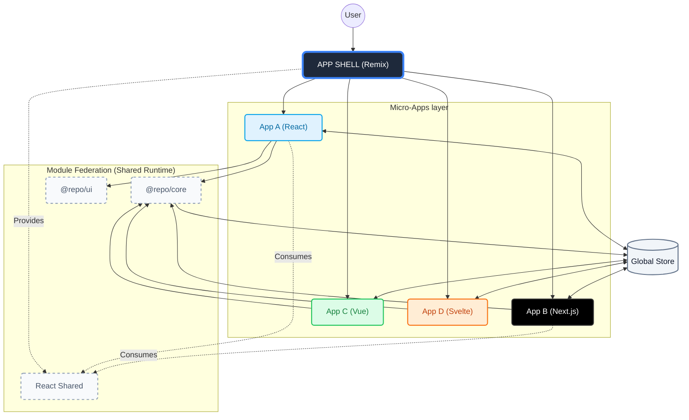

# Micro-Frontend Base Platform

A production-ready, Enterprise-grade Micro-Frontend foundation powered by **Turborepo**, **Vite 5**, and **Module Federation**.

## 🚀 Key Features

- **⚡ Monorepo Architecture**: High-performance pipeline powered by [Turborepo](https://turbo.build/) & pnpm workspaces.
- **🌐 Module Federation**: **Runtime dependency sharing** for `react`, `react-dom`, and `@repo/core`—drastically reducing bundle sizes.
- **🧩 Framework Agnostic**: Support for **React**, **Vue** (App C), and **Svelte** (App D) co-existing seamlessly.
- **🏗️ App Shell**: Robust Host built with [Remix](https://remix.run/) (SSR) and client-side Federation.
- **🎨 Design System**: [shadcn/ui](https://ui.shadcn.com/) ported to `@repo/ui` with framework-segregated exports.
- **🧠 Hybrid State Management**:
  - **Shared**: Framework-agnostic **Zustand** store (Vanilla JS).
  - **Reactive**: Custom Hooks/Adapters for React (`useUserStore`).
- **🛡️ Resilience**: Built-in health checks, retry mechanisms, and graceful maintenance modes.
- **✨ Developer Experience**:
  - **Beautiful Logging**: Custom standardized logger with dev/prod modes.
  - **Automated Scaffolding**: `pnpm create-app` to generate new MFEs in seconds.
  - **Unified Theme**: Shared Tailwind tokens across all apps.

---

## 🏛️ System Architecture

Our architecture follows a layered approach, strictly separating the **Platform** (Shared) from the **Domain** (Micro-Apps), bridged by **Module Federation**. For detailed architectural decisions, see [ARCHITECTURE.md](./docs/ARCHITECTURE.md).



---

## 🏗️ Project Structure

We enforce a strict separation of concerns:

```
├── apps
│   ├── shell         # (Host) Remix 2 + Vite (SSR)
│   ├── app-a         # (Remote) React 18 + Vite
│   ├── app-b         # (Remote) Next.js 14 + Vite (Hybrid MFE)
│   ├── app-c         # (Remote) Vue 3 + Vite
│   └── app-d         # (Remote) Svelte 4 + Vite
└── packages
    ├── core          # State, MFE Host, Event Bus
    │   ├── src/mfe/react    # React Host Component
    │   └── src/state/common # Vanilla State Logic
    ├── ui            # Design System (React)
    ├── config        # TypeScript, Tailwind, Ports
    └── utils         # Shared Helpers
```

---

## 🔌 Module Federation

We use `@originjs/vite-plugin-federation` to share dependencies at runtime.

| Application | Role   | Port | Exposed Entry     | Shared Deps  |
| :---------- | :----- | :--- | :---------------- | :----------- |
| **Shell**   | Host   | 8000 | N/A               | All          |
| **App A**   | Remote | 8001 | `./src/entry-mfe` | React, Core  |
| **App B**   | Remote | 8002 | `./src/entry-mfe` | React, Core  |
| **App C**   | Remote | 8003 | `./src/entry-mfe` | Vue, Core    |
| **App D**   | Remote | 8004 | `./src/entry-mfe` | Svelte, Core |

**Why?**

- **Performance**: Browser downloads `react` **once** (via Shell), not 5 times.
- **Consistency**: Ensures singleton instance of State Manager.

---

## 🛠️ Quick Start

### 1. Install & Bootstrap

```bash
pnpm install
```

### 2. Configure Environment

```bash
cp apps/shell/.env.example apps/shell/.env
```

### 3. Run Development

Starts the Shell and all Micro-Apps in parallel.

```bash
pnpm dev
```

- **Shell**: <http://localhost:8000>
- **App A**: <http://localhost:8001>
- **App B**: <http://localhost:8002>
- **App C**: <http://localhost:8003>
- **App D**: <http://localhost:8004>

### 4. Build for Production

Compiles all apps, validating types and Federation config.

```bash
pnpm turbo run build
```

---

## 🧠 State Management

We use a **Hybrid Approach**:

1.  **Common Source of Truth**: `src/state/common/user-store.ts` (Vanilla JS).
2.  **Framework Adapters**:
    - **React**: `src/state/react/use-user-store.ts`
    - **Vue/Svelte**: Direct subscription to the Vanilla store (TODO).

```typescript
// React Usage
import { useUserStore } from "@repo/core/store/react";
const user = useUserStore((s) => s.user);

// Vanilla / Non-React Usage
import { userStore } from "@repo/core/shared";
userStore.subscribe((state) => console.log(state.user));
```

---

## 📖 Essential Documentation

- [Onboarding Guide](./docs/ONBOARDING.md)
- [Project Structure](./docs/PROJECT_STRUCTURE.md)
- [Deployment Strategy](./docs/DEPLOYMENT.md)
