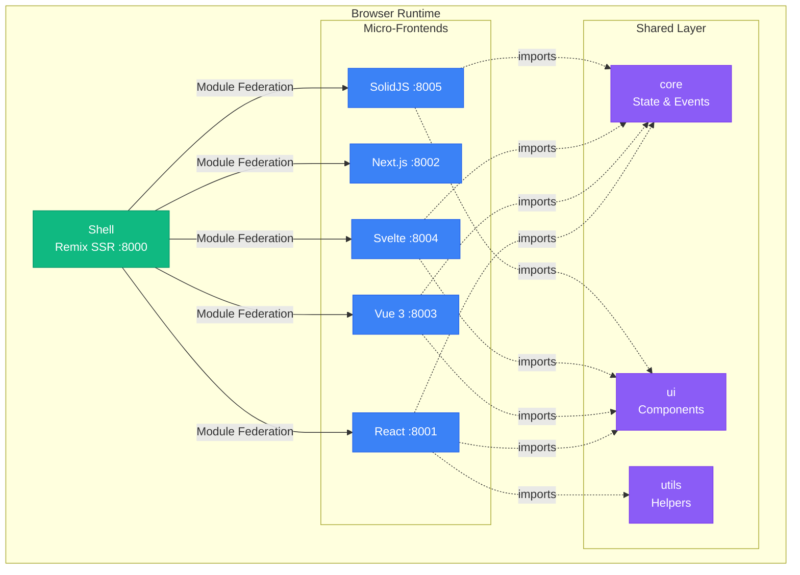
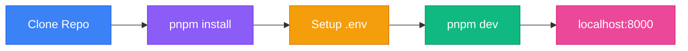
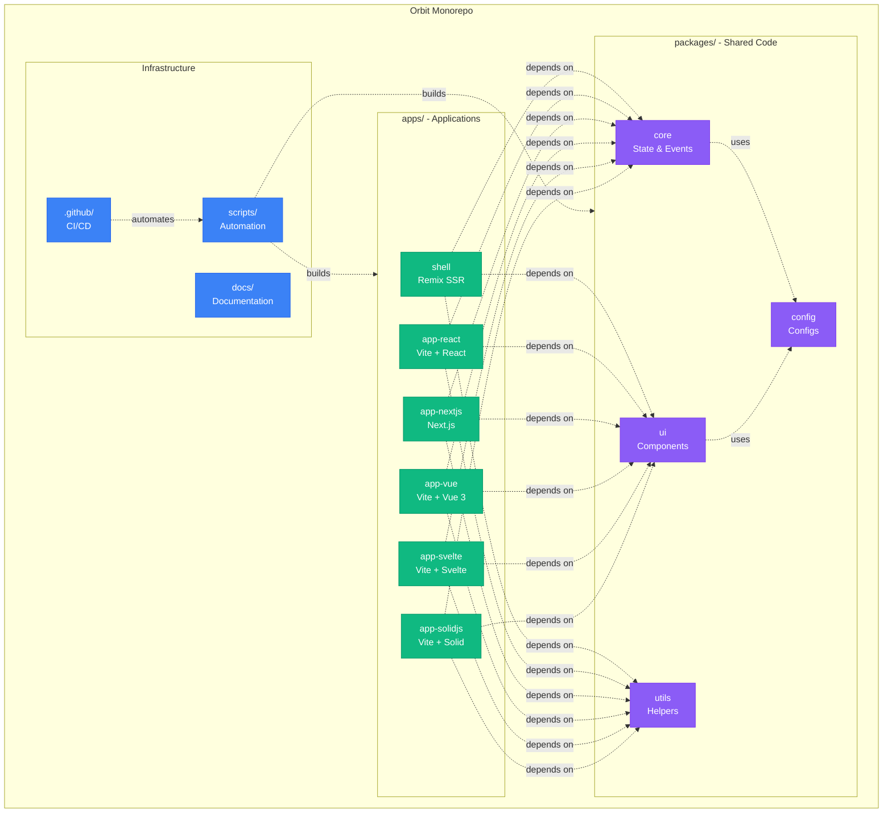
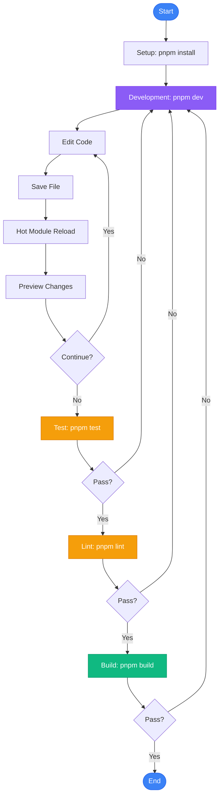
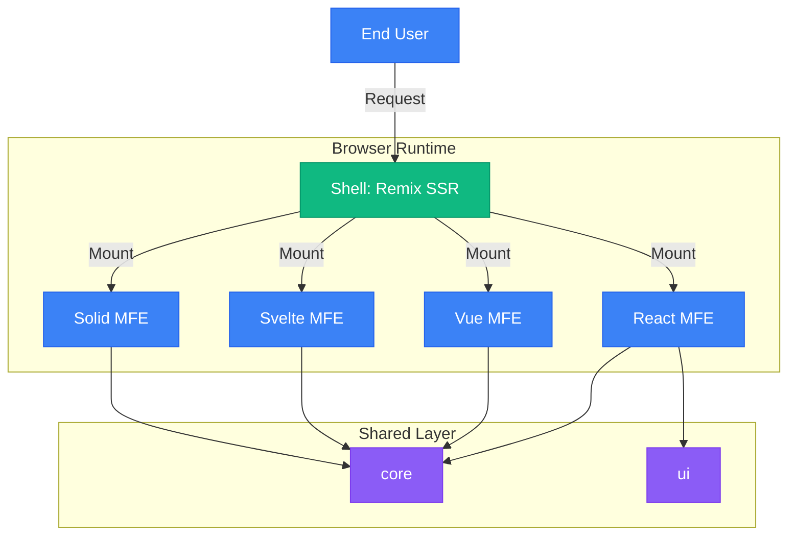

# Orbit: Enterprise Micro-Frontend Platform

> **Production-ready, multi-framework micro-frontend architecture** optimized for scalability, performance, and developer experience.

[](https://www.typescriptlang.org/)
[](https://turbo.build/)
[](https://github.com/originjs/vite-plugin-federation)
[](https://tailwindcss.com/)
[](https://pnpm.io/)
[](./LICENSE)

**Hub-and-Spoke Architecture:** Like planets orbiting a sun, your micro-frontends (React, Vue, Svelte, SolidJS) revolve around a central Remix Shell, working in perfect harmony while maintaining independence.



---

## Documentation

- [docs/PACKAGE_SUMMARY.md](docs/PACKAGE_SUMMARY.md) — Complete package overview (start here for navigation)
- [docs/DOCUMENTATION_MAP.md](docs/DOCUMENTATION_MAP.md) — How to navigate all documentation by role/use case
- [docs/ARCHITECTURE.md](docs/ARCHITECTURE.md) — SA/technical spec with diagrams
- [docs/API_CONTRACTS.md](docs/API_CONTRACTS.md) — public API boundaries, event contracts, versioning strategy
- [docs/MFE_ADAPTER_PATTERNS.md](docs/MFE_ADAPTER_PATTERNS.md) — framework adapter implementations (React/Vue/Svelte/Solid/Next.js)
- [docs/ENTERPRISE_PATTERNS_INTERVIEW_GUIDE.md](docs/ENTERPRISE_PATTERNS_INTERVIEW_GUIDE.md) — production patterns, interview prep, how Google/TikTok build MFEs
- [docs/MFE_DEVELOPMENT_GUIDE.md](docs/MFE_DEVELOPMENT_GUIDE.md) — dev + prod build guide
- [docs/TROUBLESHOOTING.md](docs/TROUBLESHOOTING.md) — issue handling
- [docs/examples/typed-event-communication.ts](docs/examples/typed-event-communication.ts) — runnable example: cross-MFE type-safe events

---

## Key Features

### Multi-Framework Support

Build with **React, Vue, Svelte, SolidJS, or Next.js**. Each micro-frontend can use its optimal framework while sharing state and UI components seamlessly.

| Framework | Status | UI Components | State Management |
| --------- | :----: | :-----------: | :--------------: |
| React     |   ✅   |      ✅       |        ✅        |
| Vue 3     |   ✅   |      ✅       |        ✅        |
| Svelte    |   ✅   |      ✅       |        ✅        |
| SolidJS   |   ✅   |      ✅       |        ✅        |
| Next.js   |   ✅   |      ✅       |        ✅        |

### Lightning-Fast Development

- **Vite-powered** builds (< 2s for most apps)
- **Turborepo caching** - never rebuild the same code twice
- **Hot Module Replacement** across all frameworks
- **Parallel builds** with intelligent dependency graph

### Optimized Bundle Sizes

- **Tree-shaking enabled** with proper `sideEffects` configuration
- **Framework-specific builds** - No React in Vue apps
- **~550KB+ savings** per non-React app
- **Shared dependencies** managed centrally

### Smart CI/CD Pipeline

- **Change Detection** - Only build what changed
- **Conditional Docker** - Skip unchanged apps
- **~70% faster builds** on average
- **Parallel deployments**

### Multi-Framework UI Library

- **Consistent design system** across all frameworks
- **Shared variants** using CVA (Class Variance Authority)
- **Storybook** for each framework
- **Dark mode ready**

---

## Quick Start



### Prerequisites

| Tool    | Version | Check           | Install                            |
| ------- | ------- | --------------- | ---------------------------------- |
| Node.js | v18+    | `node -v`       | [nodejs.org](https://nodejs.org)   |
| pnpm    | v9+     | `pnpm -v`       | `npm i -g pnpm`                    |
| Git     | Latest  | `git --version` | [git-scm.com](https://git-scm.com) |

### Installation

```bash
# 1️⃣ Clone repository
git clone <repository-url>
cd micro-fontend-base

# 2️⃣ Install dependencies
pnpm install

# 3️⃣ Start development
pnpm dev:all
```

**✨ Open [http://localhost:8000](http://localhost:8000)**

---

## 📁 Project Structure Overview



---

## Development Workflow



---

## Common Commands

### Development

| Command          | Description                     |
| :--------------- | :------------------------------ |
| `pnpm dev:all`   | Start all apps (Shell + MFEs)   |
| `pnpm dev:shell` | Start only the Shell            |
| `pnpm storybook` | Run Storybook for UI components |

### Build & Deploy

| Command                | Description                 |
| :--------------------- | :-------------------------- |
| `pnpm build`           | Build all packages and apps |
| `pnpm build:mfes:prod` | Production build for MFEs   |

### Quality & Validation

| Command           | Description              |
| :---------------- | :----------------------- |
| `pnpm lint`       | Run ESLint               |
| `pnpm type-check` | TypeScript type checking |

---

## UI Component Library

Our multi-framework UI library provides consistent components across all frameworks:

```tsx
// React
import { Button, Card } from "@repo/ui/react";

// Vue
import { Button, Card } from "@repo/ui/vue";

// Svelte
import { Button, Card } from "@repo/ui/svelte";

// SolidJS
import { Button, Card } from "@repo/ui/solid";
```

### Available Components

| Component | React | Vue | Solid | Svelte |
| --------- | :---: | :-: | :---: | :----: |
| Button    |  ✅   | ✅  |  ✅   |   ✅   |
| Card      |  ✅   | ✅  |  ✅   |   ✅   |
| Input     |  ✅   | ✅  |  ✅   |   ✅   |
| Avatar    |  ✅   | ✅  |  ✅   |   ✅   |
| Tooltip   |  ✅   | ✅  |  ✅   |   ✅   |
| Sheet     |  ✅   | 🔜  |  🔜   |   🔜   |
| Dropdown  |  ✅   | 🔜  |  🔜   |   🔜   |
| Sidebar   |  ✅   | 🔜  |  🔜   |   🔜   |

## Architecture Overview



See [Architecture Guide](./docs/ARCHITECTURE.md) for detailed documentation.

---

## Contributing

1. Fork the repository
2. Create your feature branch (`git checkout -b feat/amazing-feature`)
3. Commit your changes (`git commit -m 'feat: add amazing feature'`)
4. Push to the branch (`git push origin feat/amazing-feature`)
5. Open a Pull Request

See [.github/CONTRIBUTING.md](.github/CONTRIBUTING.md) for the short contribution guide.

---

## Support

- Read the [Documentation](./docs/)
- Report issues on GitHub
- Contact: [phamtuandev0907@gmail.com](mailto:phamtuandev0907@gmail.com)

---

## License

MIT License - see [LICENSE](./LICENSE) for details.

---

<p align="center">
  Built with ❤️ using <a href="https://turbo.build/">Turborepo</a>, <a href="https://vitejs.dev/">Vite</a>, and <a href="https://remix.run/">Remix</a>
</p>
