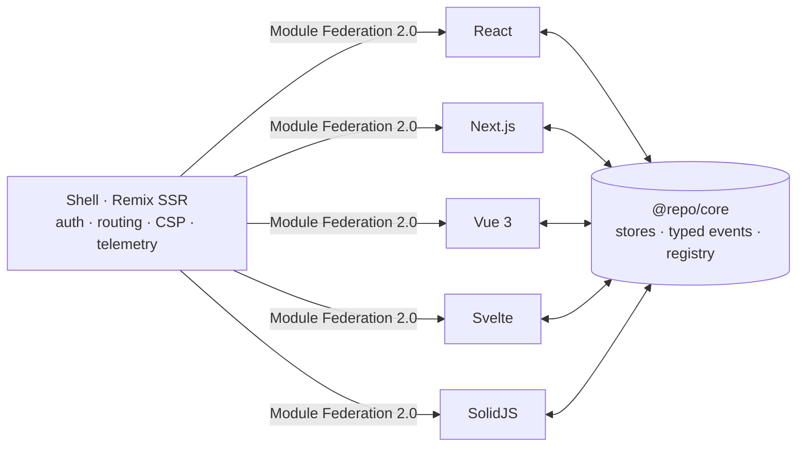

# Orbit: Micro-Frontend Platform

> A production-grade foundation for large web systems built from
> independently deployed micro-frontends, in any framework, behind one
> secure SSR shell.

[](https://www.typescriptlang.org/)
[](https://module-federation.io)
[](https://remix.run)
[](https://turbo.build/)
[](https://pnpm.io/)
[](./LICENSE)


```mermaid
flowchart LR
  Shell["Shell · Remix SSR\nauth · routing · CSP · telemetry"]
  Shell -- "Module Federation 2.0" --> React["React"] & Next["Next.js"] & Vue["Vue 3"] & Svelte["Svelte"] & Solid["SolidJS"]
  React & Next & Vue & Svelte & Solid <--> Shared[("@repo/core\nstores · typed events · registry")]
```

## Why Orbit

| Need on a large system                 | What Orbit gives you                                                                                                                          |
| -------------------------------------- | --------------------------------------------------------------------------------------------------------------------------------------------- |
| Teams ship independently               | One registry (`MFE_APPS`) plus per-app runtime URLs (`MFE_URL_<ID>`) let you deploy, roll back or canary one MFE without rebuilding the shell |
| Mixed / legacy frameworks              | React, Next.js, Vue, Svelte and SolidJS behind one contract (`mount` / `unmount`)                                                             |
| One broken team doesn't break the page | Health checks, maintenance mode, retry, error boundaries, load timeouts                                                                       |
| Security                               | Signed sessions, open-redirect protection, CSP with nonces, a proxy that never leaks credentials, host validation                             |
| No style or version collisions         | Per-MFE scoped Tailwind, framework singletons shared via MF 2.0, pnpm catalog for versions                                                    |
| Contracts that survive change          | Typed, namespaced, versioned events (`runtime:v1`)                                                                                            |
| Know what's happening in production    | Pluggable telemetry (beacon / Sentry), MFE load metrics, Core Web Vitals                                                                      |
| Quality gates                          | Type-check, lint, Vitest, Playwright e2e and Lighthouse budgets on every PR                                                                   |

## Quick start

```bash
pnpm install
pnpm dev                 # shell :8000 + MFEs :8001–8005
```

Open <http://localhost:8000> and sign in with `demo@example.com` /
`demo1234` (dev only).

## Documentation

|                       |                                                                                                                                                                        |
| --------------------- | ---------------------------------------------------------------------------------------------------------------------------------------------------------------------- |
| **Start here**        | [Getting started](./docs/getting-started.md) · [Architecture](./docs/architecture.md)                                                                                  |
| **Build**             | [Creating a micro-frontend](./docs/creating-a-micro-frontend.md) · [Configuration](./docs/configuration.md)                                                            |
| **API reference**     | [`@repo/core`](./docs/api/core.md) · [`@repo/config`](./docs/api/config.md) · [Shell](./docs/api/shell.md) · [`@repo/ui`](./packages/ui/README.md)                     |
| **Run in production** | [Edge cases & failure handling](./docs/edge-cases.md) · [Security](./docs/security.md) · [Observability](./docs/observability.md) · [Deployment](./docs/deployment.md) |
| **Quality**           | [Testing & quality gates](./docs/testing-and-quality.md) · [Troubleshooting](./docs/troubleshooting.md)                                                                |
| **Appendix**          | [Enterprise patterns & interview guide](./docs/appendix/enterprise-patterns-interview-guide.md) · [Changelog](./CHANGELOG.md)                                          |

Full index: [docs/README.md](./docs/README.md).

## Repository

```text
apps/shell        Remix SSR host
apps/app-*        micro-frontends (react, nextjs, vue, svelte, solidjs)
packages/config   registry, Vite/Tailwind factories, presets
packages/core     runtime: MfeHost, registry, stores, events, telemetry
packages/ui       design system + Storybook
packages/utils    cn()
e2e/              Playwright
docs/             documentation
```

## Commands

```bash
pnpm dev | build | type-check | lint | test | test:e2e | lhci
pnpm orbit:init --name <project> [--keep react,vue]
pnpm mfe:add <name> <react|vue|svelte|solidjs>
pnpm storybook
```

## Start a new project from Orbit

```bash
# GitHub: "Use this template", or clone, then:
pnpm install
pnpm orbit:init --name acme-portal --title "Acme Portal" --keep react,vue
```

`orbit:init` names the project, removes the MFEs you don't need from every
place they're wired (apps, registry, CI, docker, nav), generates a local
`SESSION_SECRET` and resets the changelog. Then plug in the client's
identity provider and add their MFEs with `pnpm mfe:add`. Full guide:
[docs/starting-a-new-project.md](./docs/starting-a-new-project.md).

## Contributing & security

See [CONTRIBUTING](./.github/CONTRIBUTING.md) and
[SECURITY](./.github/SECURITY.md). Licensed under [MIT](./LICENSE).
