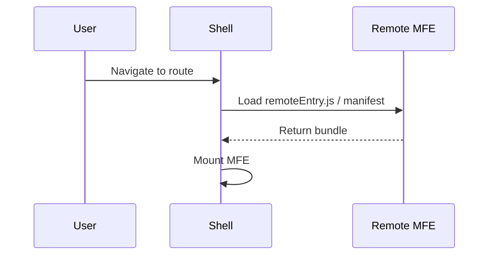
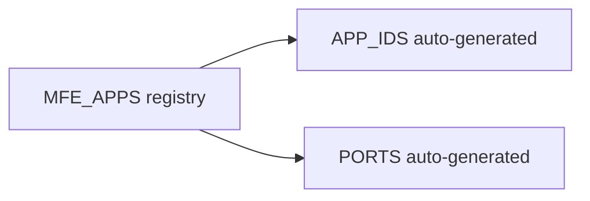
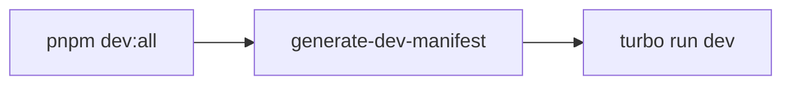
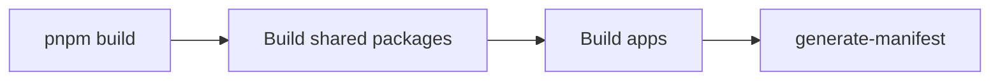

# Architecture & System Design (SA/Tech Spec)

This document is structured like a system design paper: goals, constraints, diagrams, operational flows, and maintenance guidance for evolving Orbit into a public MFE framework.

---

## Abstract

Orbit is a hub-and-spoke micro-frontend platform where a single **Shell** orchestrates multiple MFEs built on heterogeneous frameworks. The system prioritizes: (1) runtime isolation, (2) fast local development, (3) stable production builds, and (4) scalable configuration through a single source of truth.

---

## Goals

1. **Framework independence**: React/Vue/Svelte/Solid/Next MFEs coexist without hard coupling.
2. **Deterministic configuration**: a single registry drives IDs, ports, and runtime metadata.
3. **Safe evolution**: predictable upgrade path for new MFEs and shared packages.
4. **Observability**: consistent lifecycle logging and performance metrics.

## Non‑Goals

- Build system replacement (still Vite/Turbo).
- Monolithic UI state (only shared primitives, not full app state).
- Cross‑framework component parity for all UI widgets.

---

## System Context

```mermaid
flowchart LR
  User[User] --> Shell[Shell (Remix) :8000]
  Shell --> MFEs[Remote MFEs]
  MFEs --> Shared[Shared Packages]
```

---

## Architecture Overview

```mermaid
flowchart TD
  User[User] --> Shell[Shell (Remix) :8000]

  subgraph MFEs
    React[app-react :8001]
    Next[app-nextjs :8002]
    Vue[app-vue :8003]
    Svelte[app-svelte :8004]
    Solid[app-solidjs :8005]
  end

  subgraph Shared
    Core[@repo/core]
    UI[@repo/ui]
    Utils[@repo/utils]
    Config[@repo/config]
  end

  Shell --> React
  Shell --> Next
  Shell --> Vue
  Shell --> Svelte
  Shell --> Solid

  React -.-> Core
  React -.-> UI
  Vue -.-> Core
  Svelte -.-> Core
  Solid -.-> Core
  Core -.-> Config
  UI -.-> Config
  Utils -.-> Config
```

---

## Runtime Flow



**Key invariant:** the Shell never imports MFE internals directly. MFEs expose mount/unmount via federation entry points.

---

## Configuration Model (Single Source of Truth)

All runtime identity and ports are generated from `MFE_APPS` in [packages/config/src/constants/apps.ts](../packages/config/src/constants/apps.ts).



This guarantees deterministic IDs, avoids drift, and keeps scaling linear as new MFEs are added.

---

## Build & Release (Dev vs Prod)

### Development Build



### Production Build



Operational guidance is documented in [docs/MFE_DEVELOPMENT_GUIDE.md](MFE_DEVELOPMENT_GUIDE.md).

---

## Observability & Diagnostics

Standardized instrumentation is provided via:

- `mfeLogger` for lifecycle + errors
- `perfMonitor` for load/mount timings
- `MfeErrorBoundary` for isolation and fallback UI

This enables:

1. Per‑MFE mount timing measurement
2. Crash containment
3. Debug toggles in dev mode

---

## Failure Modes & Handling

| Failure Mode         | Symptom           | Detection            | Resolution                |
| -------------------- | ----------------- | -------------------- | ------------------------- |
| Remote entry missing | MFE stuck loading | Shell console errors | Restart MFE dev server    |
| Port conflict        | `EADDRINUSE`      | Dev server fails     | Run `pnpm kill-ports`     |
| Manifest mismatch    | 404 on assets     | Network tab          | Rebuild MFE and manifest  |
| Shared dep conflict  | duplicate React   | runtime warnings     | enforce shared singletons |

Detailed troubleshooting in [docs/TROUBLESHOOTING.md](TROUBLESHOOTING.md).

---

## Maintenance & Evolution

1. **Adding an MFE**: update `MFE_APPS` and run `pnpm mfe:add`.
2. **Upgrading shared deps**: bump versions in shared packages, rebuild all apps.
3. **Breaking change policy**: version shared packages before MFE upgrades.
4. **Performance regression checks**: compare `perfMonitor` metrics across releases.

---

## API Contracts & Public Boundaries

For production-grade MFE architecture, consult [docs/API_CONTRACTS.md](API_CONTRACTS.md):

- **Runtime Event Contracts**: Typed, cross-MFE event payloads (nav, auth, theme, etc.)
- **Store Access Patterns**: Safe read/write via Zustand stores
- **MFE Entry Point Interface**: Standard `mount`/`unmount` contract
- **Error Handling**: Boundary isolation to prevent crashes
- **Versioning Strategy**: SemVer policy for framework upgrades
- **Enterprise Patterns**: Feature flags, A/B testing, metrics collection

See also: [Example: Type-Safe Cross-MFE Communication](examples/typed-event-communication.ts)

---

## Public Framework Roadmap (Short)

1. Stable API surface for `@repo/core` runtime contracts ✅
2. Versioned configuration schema for `MFE_APPS`
3. CLI generator for new MFEs + documentation templates
4. Minimal adapter APIs for React/Vue/Svelte/Solid
