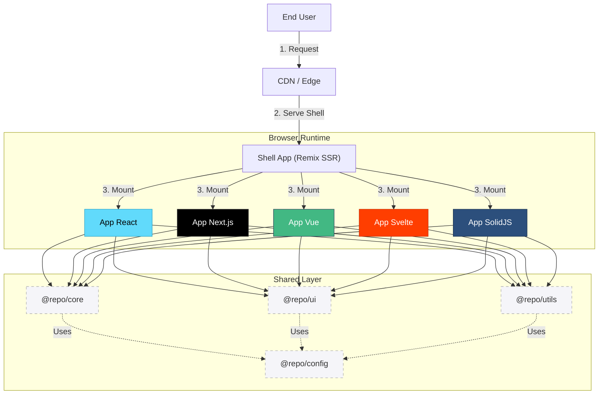
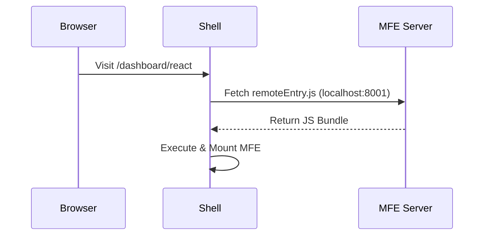
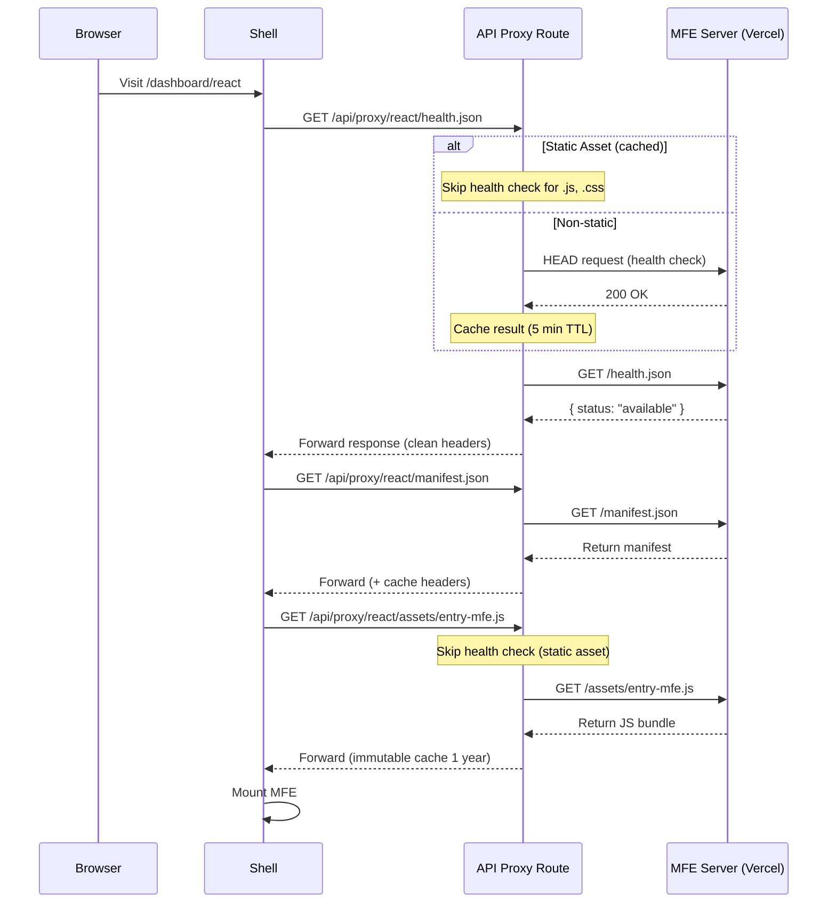
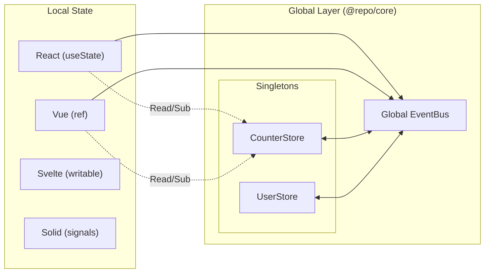
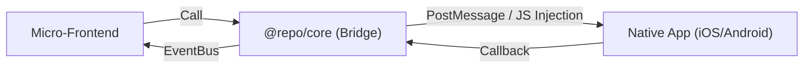

# Architecture & System Design

This document outlines the core technical decisions, patterns, and optimization strategies of the **Orbit** Micro-Frontend Platform.

---

## Table of Contents

1. [High-Level Architecture](#1-high-level-architecture)
2. [Loading Strategies](#2-loading-strategies)
3. [State Management](#3-state-management)
4. [Bundle Optimization](#4-bundle-optimization)
5. [MFE Configuration](#5-mfe-configuration)
6. [Communication Patterns](#6-communication-patterns)
7. [Directory Structure](#7-directory-structure)
8. [Security Considerations](#8-security-considerations)
9. [Mobile & WebView Support](#9-mobile--webview-support)

---

## 1. High-Level Architecture

The platform follows a **Hub-and-Spoke** architecture where the **Shell** (Remix) orchestrates multiple **Micro-Frontends (MFEs)** built with different frameworks.

### System Overview



### Core Components

| Component        | Role                                         | Technology                          |
| ---------------- | -------------------------------------------- | ----------------------------------- |
| **Shell**        | Authentication, Routing, Global Layout       | Remix + React                       |
| **MFEs**         | Feature-specific applications                | React/Vue/Svelte/Solid              |
| **@repo/core**   | Framework-agnostic State, Events, Strategies | TypeScript + Zustand (Vanilla)      |
| **@repo/ui**     | Multi-framework Design System                | Tailwind + CVA + Framework Adapters |
| **@repo/utils**  | Shared utilities (Dates, Validations, etc.)  | TypeScript                          |
| **@repo/config** | Configurations (Vite, Tailwind, ESLint)      | TypeScript                          |

### Key Design Principles

1. **Framework Agnostic**: Core logic is written in vanilla TypeScript; UI components support all major frameworks.
2. **Tree-Shakable Exports**: Packages expose subpaths (e.g., `@repo/core/react`, `@repo/ui/vue`) to minimize bundle size.
3. **Independent Deployment**: MFEs can be deployed without affecting others.
4. **Loose Coupling**: MFEs communicate via global events and shared singleton stores.
5. **Progressive Loading**: MFEs load on-demand via Module Federation (Dev) or Manifest (Prod).

---

## 2. Loading Strategies

We utilize a **Hybrid Loading Strategy** to balance Developer Experience (DX) and Production Stability.

### Development: Module Federation



- **Mechanism**: Vite Plugin Federation
- **Benefit**: Hot Module Replacement (HMR) and instant updates

### Production: Manifest-based Loading with API Proxy



**API Proxy Features:**

- Server-side proxy eliminates CORS issues
- Health check caching (5 minute TTL)
- Skip health check for static assets (JS, CSS, fonts, images)
- Aggressive caching for hashed files (1 year, immutable)
- Automatic content-encoding header cleanup

- **Mechanism**: Remix API Routes + Native Fetch
- **Benefit**: Stability, Cacheability, Independent Deployments

### MFE Mounting Strategy

We rely on the **Strategy Pattern** to handle framework-specific rendering. The `@repo/core` package provides `AppRegistry` and factory functions that wrap these strategies.

```typescript
// Example Strategy Interface
interface MfeStrategy {
  mount(app: MicroApp, container: HTMLElement, props: MicroAppProps): void;
  unmount(app: MicroApp, container: HTMLElement): void;
}
```

The `MfeHost` component in the Shell determines which MFE to load and uses the appropriate strategy (React, Vue, etc.) to mount it into a DOM container.

---

## 3. State Management

We use a **Distributed State Pattern** with **Singleton Stores** for cross-app synchronization.

### Architecture Overview



### Store Implementation (Singleton + EventBus)

Stores in `@repo/core` (like `counter-store.ts`) are implemented using **Vanilla Zustand** and are attached to the `window` object to guarantee a single instance across all micro-frontends.

**Key Features:**

1. **Framework Agnostic**: The core store is pure TypeScript/likely Vanilla JS.
2. **Auto-Sync**: Stores automatically listen to specific `EventBus` keys. When one MFE updates the store, it emits an event, and the same store instance in other MFEs (or the shared singleton) updates.
3. **Framework Adapters**: We export hooks or helpers for each framework.

#### Example Usage

**1. React (`@repo/core/react`)**
Uses a custom hook wrapper around the vanilla store.

```typescript
import { useCounterStore, incrementCounter } from "@repo/core/react";

function Counter() {
  const count = useCounterStore((state) => state.count);
  return <button onClick={incrementCounter}>{count}</button>;
}
```

**2. Vue (`@repo/core/vue`)**
Uses the vanilla store directly, which is reactive enough for direct reading or can be wrapped in `reactive`/`ref`.

```typescript
import { counterStore, incrementCounter } from "@repo/core/vue";

// Use in setup()
const count = ref(counterStore.getState().count);
counterStore.subscribe((state) => {
  count.value = state.count;
});
```

### Built-in Stores

- **CounterStore**: Demo sync store.
- **UserStore**: User profile and auth state.
- **ThemeStore**: UI theme preference.
- **LocaleStore**: I18n settings.

---

## 4. Bundle Optimization

We use **Subpath Exports** and **Shared Libraries** to optimize bundle sizes.

### Dependency Matrix

| App Type    | Shared Dependencies (via Federation/Global) | Integrated Framework Support |
| :---------- | :------------------------------------------ | :--------------------------- |
| **Shell**   | React, @repo/core, @repo/ui                 | Native (Remix)               |
| **React**   | React, @repo/core, @repo/ui                 | Native (Imports)             |
| **Vue**     | @repo/core, @repo/ui                        | Via `@repo/core/vue`         |
| **Svelte**  | @repo/core, @repo/ui                        | Via `@repo/core/svelte`      |
| **SolidJS** | @repo/core, @repo/ui                        | Via `@repo/core/solid`       |

> **Note**: `@repo/ui` provides specific exports (e.g., `@repo/ui/vue`) which import only the necessary code for that framework, ensuring standard React code isn't bundled into a Vue app.

### Optimization Techniques

1. **Subpath Exports**:
   - `@repo/core/react` vs `@repo/core/vue` ensures framework isolation.
   - `@repo/ui/react` vs `@repo/ui/vue` ensures design system isolation.
2. **Singleton deduplication**: Common large libs (like `core` logic) are shared singletons.
3. **Tree-Shaking**: All packages are configured with `sideEffects: false` where possible.

---

## 5. MFE Configuration

Defined in `scripts/mfe.config.mjs`, handling ports, framework types, and build paths.

```javascript
export const MFE_APPS = [
  { name: "app-react", framework: "react", port: 8001, ... },
  { name: "app-vue", framework: "vue", port: 8003, ... },
  // ...
];
```

Configuration flows into:

- **Vite Config**: Port assignment and federation setup.
- **CI/CD**: Build pipeline coordination.
- **Development**: `generate-dev-manifest.mjs` creation.

---

## 6. Communication Patterns

### Primary: Global Event Bus (`@repo/core/shared`)

Used for loose coupling interactions like:

- `nav:navigate` (Request Shell to change route)
- `notification:show` (Request Shell to show toast)
- `user:logout` (Trigger global logout)

### Secondary: Shared State (Stores)

Used for data synchronization:

- User Profile data
- Theme settings
- Shared counters/status

---

## 7. Directory Structure

```text
micro-frontend-base/
├── apps/
│   ├── shell/                 # Remix Host (Gateway)
│   │   ├── app/
│   │   │   ├── routes/
│   │   │   │   ├── api/
│   │   │   │   │   └── proxy/           # API Proxy for MFE loading
│   │   │   │   │       ├── route.ts     # GET /api/proxy
│   │   │   │   │       └── $/route.ts   # GET /api/proxy/:app/*
│   │   │   │   └── dashboard/           # MFE pages
│   │   │   ├── components/
│   │   │   ├── server/
│   │   │   │   └── config.ts            # MFE URL configuration
│   │   │   └── ...
│   │   └── ...
│   ├── app-react/             # React MFE
│   │   ├── public/
│   │   │   └── health.json    # Health check endpoint
│   │   ├── src/
│   │   │   └── entry-mfe.tsx  # MFE entry point
│   │   └── ...
│   ├── app-vue/               # Vue MFE
│   ├── app-svelte/            # Svelte MFE
│   ├── app-solidjs/           # SolidJS MFE
│   └── app-nextjs/            # Next.js MFE
│
├── packages/
│   ├── config/                # Shared Configs (eslint, tailwind, vite)
│   │
│   ├── core/                  # Core Runtime
│   │   ├── src/
│   │   │   ├── mfe/           # Factories, Strategies, Registry
│   │   │   ├── state/         # State Management
│   │   │   │   ├── common/    # Vanilla Stores (User, Counter)
│   │   │   │   └── react/     # React Hooks
│   │   │   ├── events/        # EventBus
│   │   │   ├── react.ts       # React Entry Point
│   │   │   ├── vue.ts         # Vue Entry Point
│   │   │   └── ...
│   │
│   ├── ui/                    # Design System (Multi-framework)
│   │   ├── src/
│   │   │   ├── components/
│   │   │   │   ├── react/     # Radix/React Components
│   │   │   │   ├── vue/       # Vue Components
│   │   │   │   ├── solid/     # Solid Components
│   │   │   │   └── svelte/    # Svelte Components
│   │   │   ├── shared/        # CVA Styles (Framework agnostic)
│   │   │   └── styles/        # Global CSS
│   │   ├── .storybook-react/
│   │   ├── .storybook-vue/
│   │   └── ...
│   │
│   └── utils/                 # Utility Functions
│
└── docs/                      # Documentation
```

---

## 8. Security Considerations

1. **CORS**: Localhost ports need CORS configuration for Dev.
2. **Content Security Policy (CSP)**: Shell must allow loading scripts from allowed CDN domains.
3. **Isolation**: CSS is isolated via Scoped Styles or Tailwind prefixing/bundling to prevent leakage (though global utility classes share the same definition in `@repo/ui`).

---

## 9. Mobile & WebView Support

The architecture supports **Hybrid Mobile Applications** (iOS/Android) via WebView wrappers (e.g., Capacitor, Ionic, or Native WebViews).

### Strategy: Remote Web App

By default, the Native App acts as a thin shell loading the deployed Shell URL.

### Native Bridge Pattern

To communicate between MFEs and Native Code, we use the **Bridge Pattern** integrated into `@repo/core`.



### Implementation Guideline

1. **Detection**: Check `window.Capacitor` or Custom User Agent.
2. **Abstraction**: MFEs should **never** call native code directly. Use `@repo/core` adapters.

```typescript
// @repo/core/src/bridge/camera.ts
export const openCamera = async () => {
  if (isNative) {
    return NativeBridge.postMessage("openCamera");
  } else {
    // Fallback for Web
    return navigator.mediaDevices.getUserMedia({ video: true });
  }
};
```
