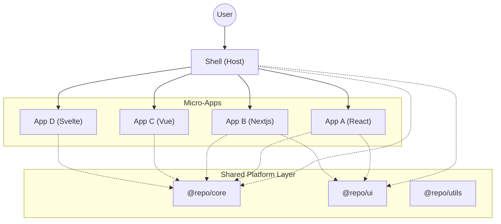

# System Architecture

## Overview

The platform uses a **Micro-Front-End (MFE)** architecture based on **Module Federation**. It separates the application into a **Host** (Shell) and multiple **Remotes** (Micro-Apps), allowing independent development, testing, and deployment of features.

**Deep Dive Documentation:**

- [Micro-Front-End Lifecycle & Integration Flow](./MFE_LIFECYCLE.md)
- [Internationalization (i18n) Strategy](./I18N_STRATEGY.md)

## Module Federation Strategy

We utilize runtime dependency sharing to optimize performance and ensure consistency.

### Shared Dependencies

To prevent duplicate downloads of common libraries (like React, Lodash), we define a **Centralized Shared Configuration** in `@repo/config`.

**Source of Truth:** `packages/config/src/shared-deps.ts`

The following libraries are shared as singletons:

- `react`, `react-dom`
- `lodash`, `dayjs`
- `@repo/core`
- `@repo/ui`
- `@repo/utils`

### Framework Handling

While the Shell is React-based, the platform supports polyglot micro-front-ends:

- **React Apps**: Consume the shared React instance from the Shell.
- **Vue/Svelte Apps**: Bundle their own framework runtime but still share framework-agnostic libs (Lodash, Core, Utils).

## Core Packages

### 1. `@repo/core`

The nervous system of the platform.

- **Logger**: Premium, standardized logging utility.
- **State**: Global state management (Zustand).
- **Events**: Cross-MFE communication.

### 2. `@repo/ui`

The design system.

- Built on **Radix UI** and **Tailwind CSS**.
- Theme-aware (Dark/Light mode).
- exported as ESM for tree-shaking.

### 3. `@repo/config`

Shared static configuration.

- Tailwind Config.
- ESLint Presets.
- Shared Dependency Lists.
- Port Constants.
