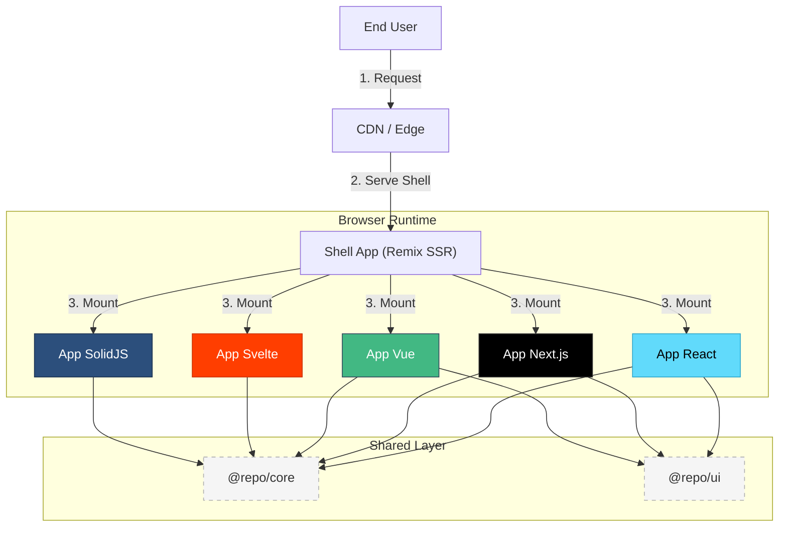
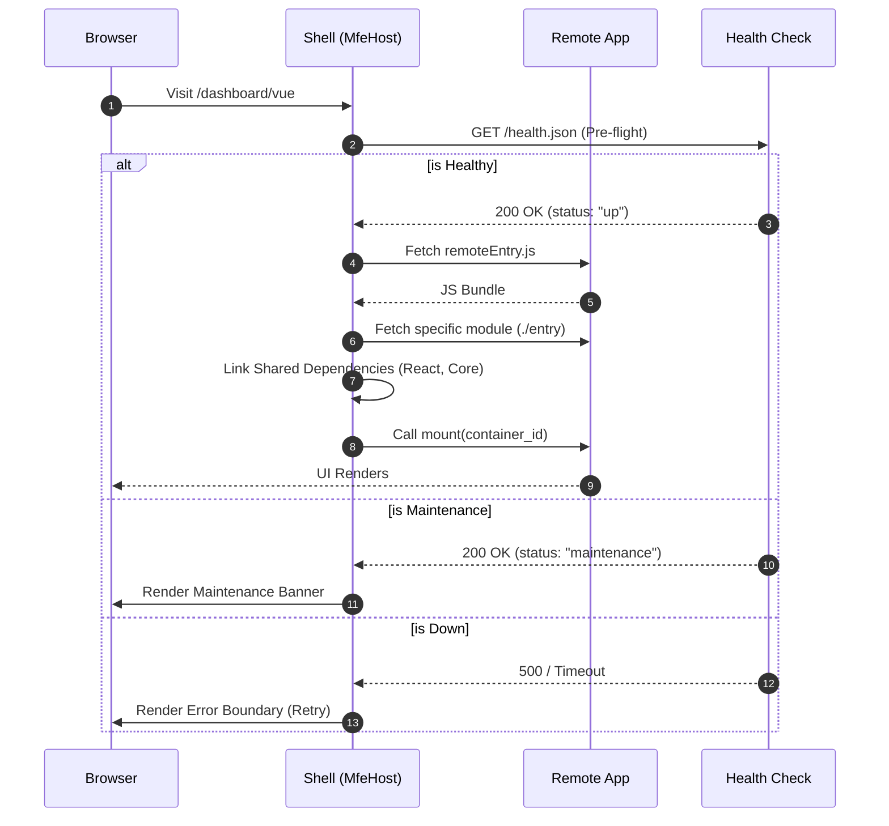
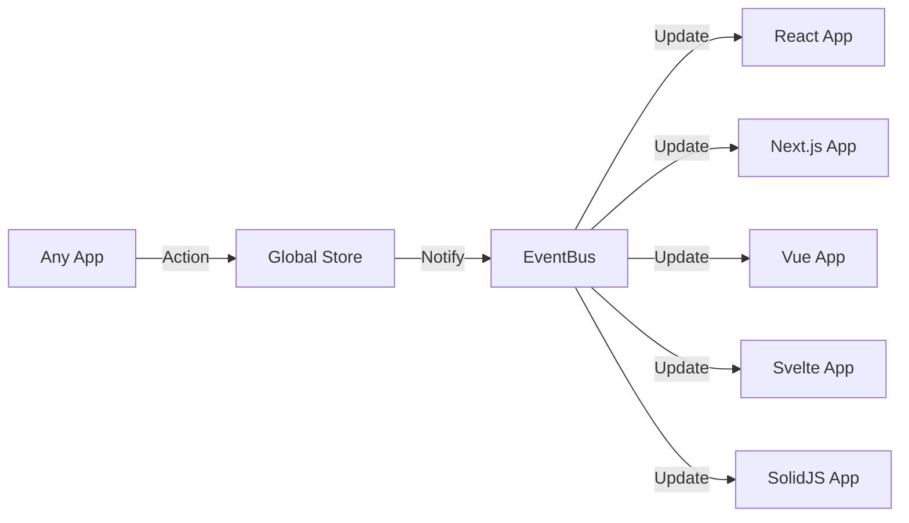
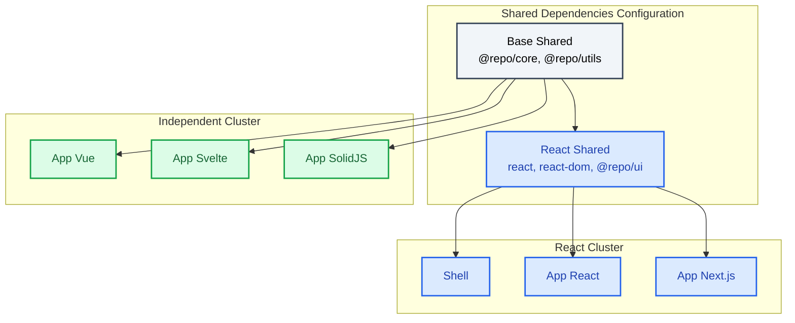

# 🏗️ Architecture & System Design

This document outlines the core technical decisions, patterns, and optimization strategies of the **Orbit** Micro-Frontend Platform.

## 1. High-Level Architecture

The platform follows a **Hub-and-Spoke** architecture where the **Shell** (Remix) orchestrates multiple **Micro-Frontends (MFEs)** (React, Vue, Svelte, SolidJS).



### Core Components

- **Shell (Host)**: Authentication, Routing, and Global Layout. Built with Remix.
- **Remotes (MFEs)**: Feature-specific applications composed of domain logic.
- **Shared Packages**:
  - `@repo/core`: State management (Zustand), EventBus, and MFE utilities.
  - `@repo/ui`: Design system (Shadcn/UI + Tailwind).
  - `@repo/config`: Centralized configurations (ESLint, TS, Ports).

---

## 2. Loading Strategies

We utilize a **Hybrid Loading Strategy** to balance Developer Experience (DX) and Production Stability.

### Development: Module Federation

- **Mechanism**: Vite Plugin Federation.
- **Benefit**: Hot Module Replacement (HMR) and instant updates.
- **Flow**: Shell loads `remoteEntry.js` from localhost ports.

### Production: Manifest-based Loading

- **Mechanism**: Native Fetch + Dynamic Import.
- **Benefit**: Stability, Cacheability, Independent Deployments.

#### Orchestration Flow



- **Flow**:
  1. Build generates `manifest.json` for each MFE.
  2. Shell fetches `health.json` to check availability.
  3. Shell fetches `manifest.json` to resolve entry assets.
  4. Script tags are injected to load the MFE.

---

## 3. State Management

We use a **Distributed State Pattern** with a Global Event Bus.

### Local State

Each MFE manages its own UI state using its framework's native tools (Context, Stores) or local Zustand instances.

### Global State (`@repo/core`)

- **EventBus**: A framework-agnostic pub/sub system for cross-app communication (e.g., `user:login`, `nav:open`).
- **Shared Stores**: Singleton Zustand stores for truly global data (User Session, Theme, Locale).



---

## 4. Bundle Optimization

We achieve significant size reduction (~550KB+ per app) through intelligent dependency sharing.

### Strategy

1. **Framework Segregation**:
   - **React Apps** share `react`, `react-dom`, and `@repo/ui`.
   - **Non-React Apps** (Vue, Svelte) **DO NOT** download React. They bundle their own runtimes but share framework-agnostic libs like `dayjs` and `@repo/core`.

2. **Tree-Shaking**:
   - `sideEffects: false` configured in all shared packages.
   - Unused exports are stripped at build time.

3. **Shared Configs**:
   - Defined in `packages/config/src/shared-deps.ts`.

### Dependency Graph

| App Type    | Shared Deps                      | Bundled Deps                 |
| :---------- | :------------------------------- | :--------------------------- |
| **React**   | React, DOM, @repo/ui, @repo/core | Feature-specific libs        |
| **Next.js** | React, DOM, @repo/ui, @repo/core | Feature-specific libs        |
| **Vue**     | @repo/core, @repo/utils          | Vue Runtime, Feature libs    |
| **Svelte**  | @repo/core, @repo/utils          | Svelte Runtime, Feature libs |
| **SolidJS** | @repo/core, @repo/utils          | Solid Runtime, Feature libs  |

### Dependency Sharing Strategy



---

## 5. Deployment Strategy (Smart Builds)

We use **Turborepo** to optimize CI/CD pipelines.

1. **Change Analysis**: GitHub Actions check which workspaces have changed.
2. **Selective Build**: Only affected apps are rebuilt.
3. **Docker Caching**: Docker layers are cached based on `pnpm-lock.yaml`.

---

## 6. Directory Structure

```text
root/
├── apps/
│   ├── shell/           # Host Application
│   ├── app-react/       # Remote
│   └── app-vue/         # Remote
├── packages/
│   ├── config/          # Shared Constants (Ports, Apps)
│   ├── core/            # Runtime Utilities
│   ├── ui/              # Design System
│   └── utils/           # Helpers
└── docker-compose.yml   # Orchestration
```
