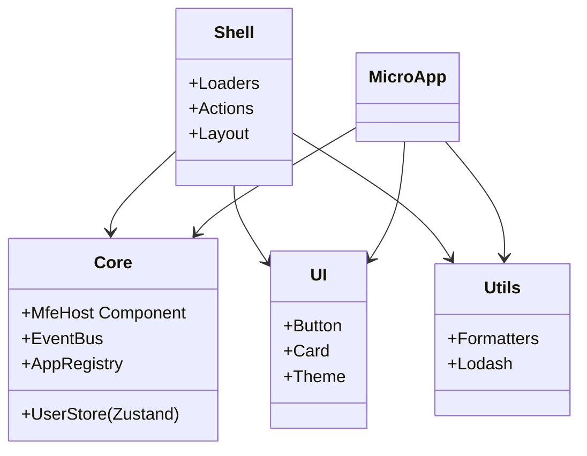
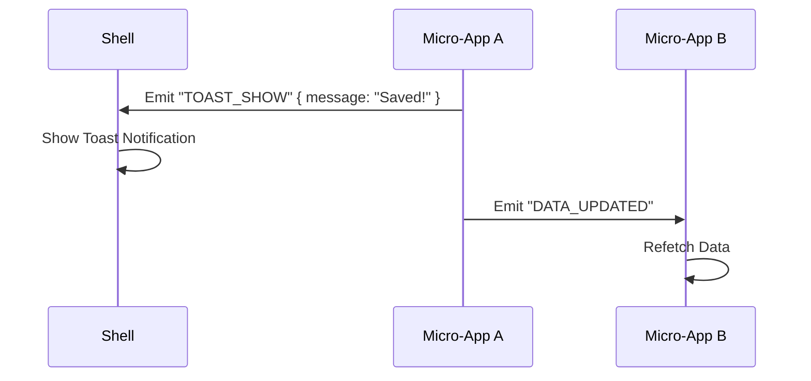

# Architecture Documentation

## 1. High-Level Architecture

The platform follows a **Composition-based Micro-Frontend** approach.

- **App Shell (Host)**: Built with **Remix SSR**. It handles:
  - Authentication (Checking User Session)
  - Global Routing (URL State)
  - Layout (Sidebar, Header)
  - Mounting Micro-Apps into DOM slots.

- **Micro Apps (Remotes)**: Built with **Vite (React)**. They are:
  - Deployed independently as static assets.
  - Runtime-loaded by the Shell.
  - Isolated (own styles, own bundles).

- **Shared Core**:
  - **State**: shared User Store via **Zustand**.
  - **Communication**: Event Bus for cross-app messaging.
  - **Styles**: Shared Design System (`@repo/ui`).

### System Context Diagram

```mermaid
graph TD
    User((User)) -->|HTPP Request| Shell[App Shell (Remix SSR)]

    subgraph "Browser / Client"
        ShellClient[Shell Client Bundle]
        MFE_A[Micro-App A (Vite)]
        MFE_B[Micro-App B (Vite)]

        Store[Global User Store (Zustand)]
        EventBus[Event Bus]
    end

    Shell -->|Hydrates| ShellClient
    ShellClient -->|Mounts| MFE_A
    ShellClient -->|Mounts| MFE_B

    ShellClient -->|Reads/Writes| Store
    MFE_A -->|Reads| Store
    MFE_A -->|Emits/Listens| EventBus
    MFE_B -->|Emits/Listens| EventBus
```

---

## 2. Container & Component Architecture

### App Shell (Remix)

The Shell is the entry point. It decides _which_ MFE to load based on the Route.

**Key Components**:

- **`root.tsx`**: Sets up the Global Context Providers.
- **`MfeHost.tsx`**: A generic React component that handles the lifecycle of an MFE.
  - **Mounting**: Fetches manifest, loads scripts, mounts to a `div`.
  - **Unmounting**: Cleans up DOM listeners.
  - **Error Handling**: Displays fallback UI if MFE is offline.

### Micro-App (Vite)

A lightweight React application that exposes a `mount` and `unmount` function globally.

**Lifecycle Definition**:

```ts
// entry-mfe.tsx
import { AppRegistry } from "@repo/core";

AppRegistry.register("app-a", {
  mount: (container, props) => {
    // Render React App into container
  },
  unmount: (container) => {
    // Cleanup
  },
});
```

### Shared Packages Overview



---

## 3. Communication & State Management

### Global State (Zustand)

We use a **Singleton Pattern** for Zustand to ensure data consistency across multiple bundles (Shell + MFEs).

- **Location**: `packages/core/src/user-store.ts`
- **Mechanism**: The store instance is attached to `window[Symbol.for('MFE_USER_STORE')]`.
- **Flow**:
  1. **Shell** fetches User Profile on SSR/Client hydration.
  2. **Shell** updates `UserStore`.
  3. **App A** calls `useUserStore()` and immediately sees the user data.

### Event Bus

For imperative actions or notifications between apps.



---

## 4. Routing Strategy

We use `remix-custom-routes` to support a flat file structure that maps to nested URLs.

**Convention**: `[route-path].route.tsx`

| Filename                       | URL Path              | Description           |
| ------------------------------ | --------------------- | --------------------- |
| `_index.route.tsx`             | `/`                   | Home Page             |
| `login.route.tsx`              | `/login`              | Login Page            |
| `dashboard.route.tsx`          | `/dashboard`          | Dashboard MFE Wrapper |
| `dashboard.settings.route.tsx` | `/dashboard/settings` | Nested Route          |

### Routing Flow

1. Browser requests `/dashboard`.
2. Remix matches `dashboard.route.tsx`.
3. `loader` runs (checks auth).
4. Component renders `<MfeHost name="dashboard" />`.
5. `MfeHost` fetches config, loads JS, and mounts the Dashboard MFE.

---

## 5. Deployment & CI/CD

Each application is built and deployed independently.

- **Apps (`apps/app-a`)**:
  - Build -> `dist/` (Static files)
  - Upload to S3 / CND / Nginx Host
  - Must expose `health.json` and `manifest.json`.

- **Shell (`apps/shell`)**:
  - Build -> `build/` (Node.js Server) + `public/`
  - Deploy to Node.js Host (Docker/K8s).
  - Env vars define MFE URLs (`MFE_APP_A_URL=https://cdn.example.com/app-a`).

---

## 6. How to Add a New MFE

1. **Create**: Use `pnpm create-app <name>`.
2. **Register**: Ensure `src/entry-mfe.tsx` registers the app name.
3. **Host**: Add a route in `apps/shell/app/routes/<name>.route.tsx`.
4. **Env**: Add `MFE_<NAME_UPPER>_URL` to `.env`.
