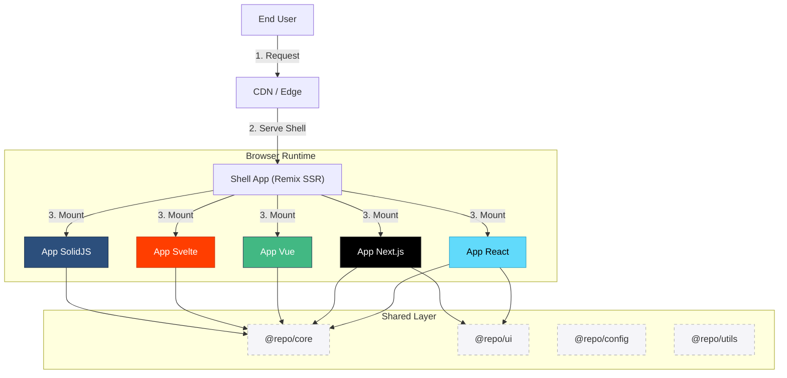
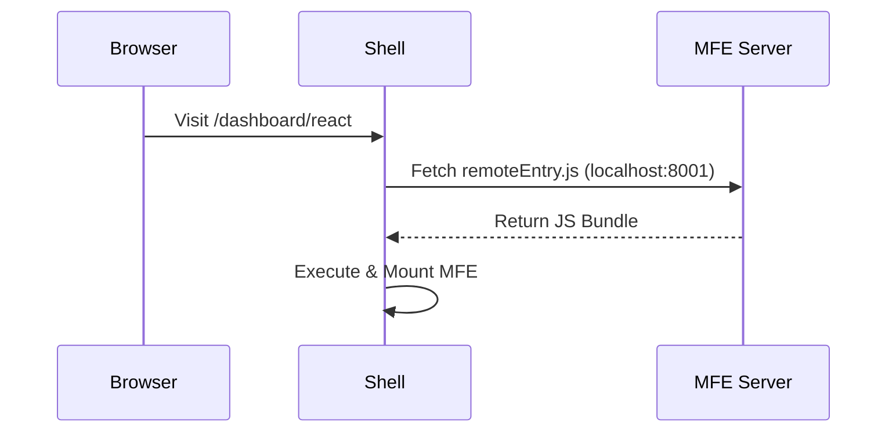
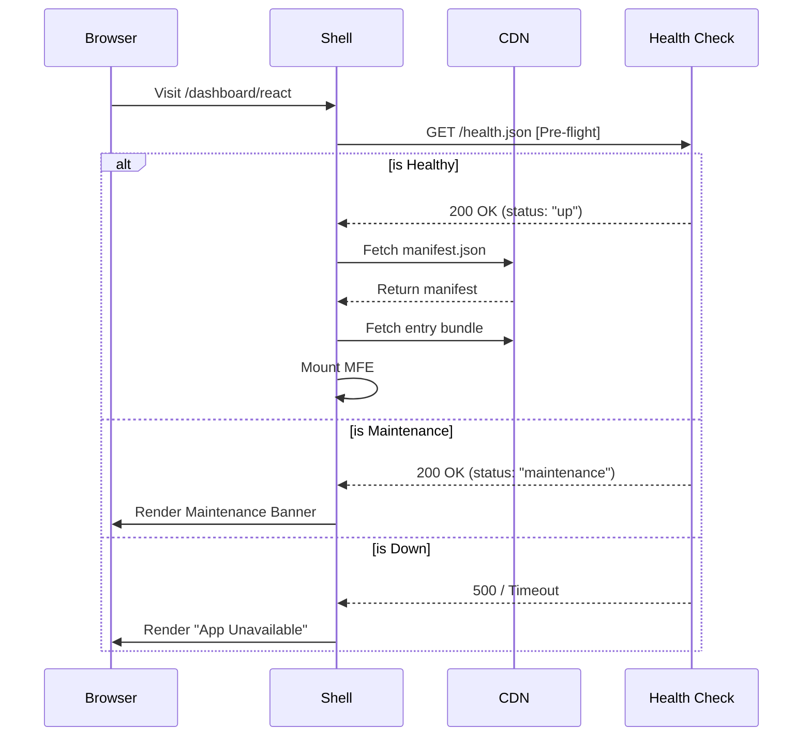
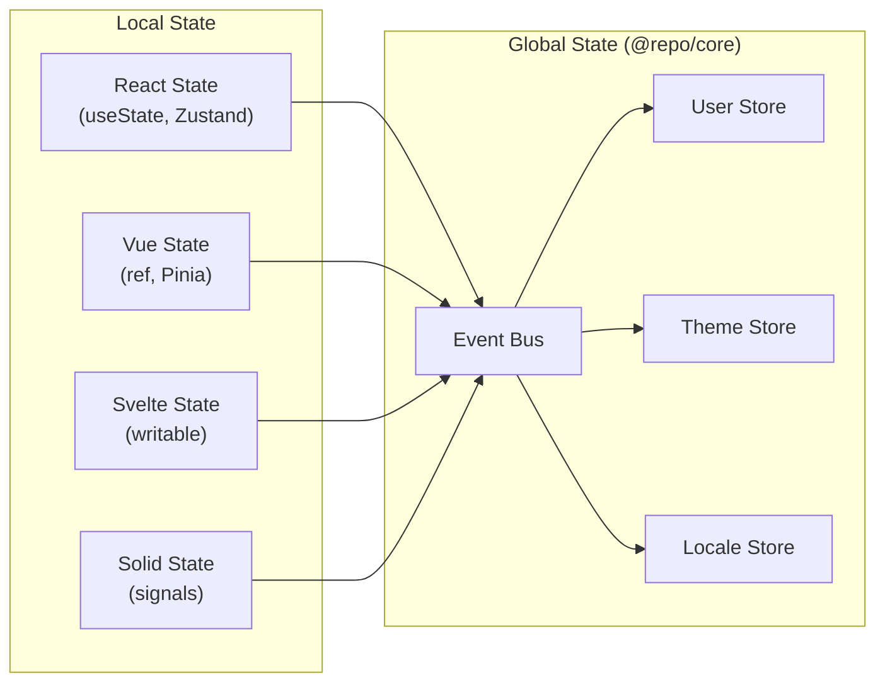
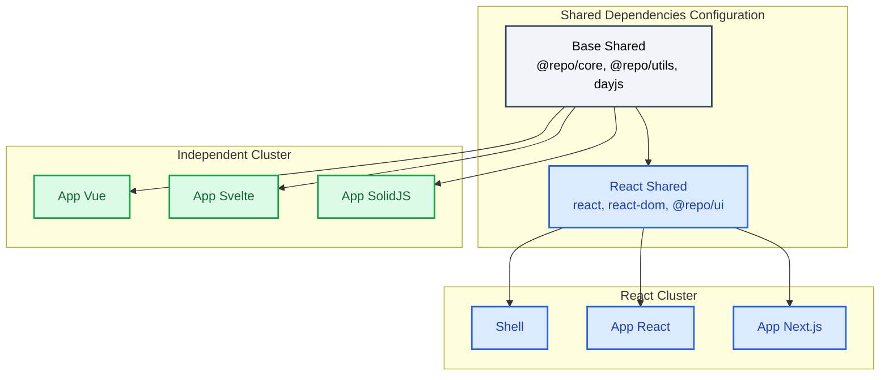
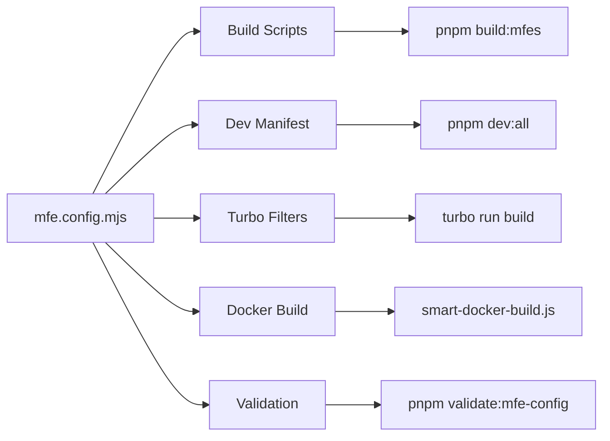
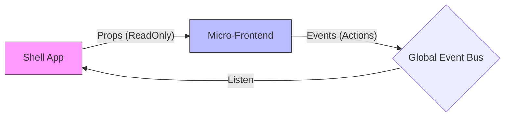

# Architecture & System Design

This document outlines the core technical decisions, patterns, and optimization strategies of the **Orbit** Micro-Frontend Platform.

---

## Table of Contents

1. [High-Level Architecture](#1-high-level-architecture)
2. [Loading Strategies](#2-loading-strategies)
3. [State Management](#3-state-management)
4. [Bundle Optimization](#4-bundle-optimization)
5. [MFE Configuration](#5-mfe-configuration)
6. [Communication Patterns](#6-communication-patterns)
7. [Directory Structure](#7-directory-structure)
8. [Security Considerations](#8-security-considerations)

---

## 1. High-Level Architecture

The platform follows a **Hub-and-Spoke** architecture where the **Shell** (Remix) orchestrates multiple **Micro-Frontends (MFEs)** built with different frameworks.

### System Overview



### Core Components

| Component        | Role                                      | Technology             |
| ---------------- | ----------------------------------------- | ---------------------- |
| **Shell**        | Authentication, Routing, Global Layout    | Remix + React          |
| **MFEs**         | Feature-specific applications             | React/Vue/Svelte/Solid |
| **@repo/core**   | State management, EventBus, MFE utilities | TypeScript + Zustand   |
| **@repo/ui**     | Multi-framework design system             | Tailwind + CVA         |
| **@repo/config** | Centralized configurations                | TypeScript             |
| **@repo/utils**  | Shared utilities                          | TypeScript             |

### Key Design Principles

1. **Framework Agnostic**: Each MFE can use its optimal framework
2. **Independent Deployment**: MFEs can be deployed without affecting others
3. **Shared Dependencies**: Common code is shared to reduce bundle size
4. **Loose Coupling**: MFEs communicate via events, not direct imports
5. **Progressive Loading**: MFEs load on-demand when needed

---

## 2. Loading Strategies

We utilize a **Hybrid Loading Strategy** to balance Developer Experience (DX) and Production Stability.

### Development: Module Federation



- **Mechanism**: Vite Plugin Federation
- **Benefit**: Hot Module Replacement (HMR) and instant updates
- **Flow**: Shell loads `remoteEntry.js` from localhost ports

### Production: Manifest-based Loading



- **Mechanism**: Native Fetch + Dynamic Import
- **Benefit**: Stability, Cacheability, Independent Deployments

### Framework-Specific Mounting

Each framework handles mounting differently:

#### React (Root API)

```typescript
// entry-mfe.tsx
mount: (container, props) => {
  const root = createRoot(container);
  root.render(<App {...props} />);
  container._reactRoot = root;
},
unmount: (container) => {
  container._reactRoot?.unmount();
}
```

#### Vue 3 (Create App)

```typescript
// entry-mfe.ts
mount: (container, props) => {
  const app = createApp(App, props);
  app.mount(container);
  container._vueApp = app;
},
unmount: (container) => {
  container._vueApp?.unmount();
}
```

#### Svelte (Component API)

```typescript
// entry-mfe.ts
mount: (container, props) => {
  const app = new App({ target: container, props });
  container._svelteApp = app;
},
unmount: (container) => {
  container._svelteApp?.$destroy();
}
```

#### SolidJS (Render/Dispose)

```typescript
// entry-mfe.tsx
mount: (container, props) => {
  const dispose = render(() => <App {...props} />, container);
  container._solidDispose = dispose;
},
unmount: (container) => {
  container._solidDispose?.();
}
```

### Multiple Instance Handling

**Same App, Multiple Places:**

- `mount()` creates independent instances
- Each call to `createApp()` or `createRoot()` is isolated
- Result: Safe. No conflict.

**Different Apps, Same Framework:**

- Each app must register with unique ID
- The `AppRegistry` validates for duplicates

> ⚠️ **Warning**: Duplicate APP_ID will cause silent failures. Run `pnpm validate:app-ids` to verify.

---

## 3. State Management

We use a **Distributed State Pattern** combining local and global state.

### Architecture Overview



### Local State

Each MFE manages its own UI state using framework-native tools:

| Framework | State Tools                   |
| --------- | ----------------------------- |
| React     | useState, useReducer, Zustand |
| Vue       | ref, reactive, Pinia          |
| Svelte    | writable, readable stores     |
| SolidJS   | createSignal, createStore     |

### Global State (`@repo/core`)

For cross-MFE state, use the shared stores via **framework-specific imports**:

```typescript
// React/Next.js
import { useUserStore, useThemeStore, useLocaleStore } from "@repo/core/react";
// Vue: @repo/core/vue, SolidJS: @repo/core/solid, Svelte: @repo/core/svelte

// Get current state
const user = useUserStore.getState().user;
const theme = useThemeStore.getState().theme;

// Update state
useUserStore.getState().setUser({ id: "123", name: "John" });

// Subscribe to changes
useUserStore.subscribe((state) => {
  console.log("User changed:", state.user);
});
```

### Event Bus

Framework-agnostic pub/sub for cross-app communication:

```typescript
// Use framework-specific import
import { EventBus } from "@repo/core/react"; // or /vue, /solid, /svelte

// Publish
EventBus.emit("user:login", { userId: "123" });

// Subscribe
const unsubscribe = EventBus.on("user:login", (data) => {
  console.log("User logged in:", data);
});

// Cleanup
unsubscribe();
```

---

## 4. Bundle Optimization

We achieve significant size reduction (~550KB+ per non-React app) through intelligent dependency sharing.

### Strategy



### Dependency Matrix

| App Type    | Shared Dependencies                    | Bundled Dependencies         |
| :---------- | :------------------------------------- | :--------------------------- |
| **React**   | react, react-dom, @repo/ui, @repo/core | Feature-specific libs        |
| **Next.js** | react, react-dom, @repo/ui, @repo/core | Feature-specific libs        |
| **Vue**     | @repo/core, @repo/utils                | Vue Runtime, Feature libs    |
| **Svelte**  | @repo/core, @repo/utils                | Svelte Runtime, Feature libs |
| **SolidJS** | @repo/core, @repo/utils                | Solid Runtime, Feature libs  |

### Optimization Techniques

1. **Framework Segregation**: Non-React apps don't download React
2. **Tree-Shaking**: `sideEffects: false` in all packages
3. **Code Splitting**: Dynamic imports for routes
4. **Shared Configs**: Defined in `packages/config/src/shared-deps.ts`

---

## 5. MFE Configuration

### Central Configuration

All MFE apps are defined in `scripts/mfe.config.mjs`:

```javascript
export const MFE_APPS = [
  {
    name: "app-react",
    framework: "react",
    port: 8001,
    entryFile: "entry-mfe.tsx",
    outputDir: "dist",
  },
  {
    name: "app-nextjs",
    framework: "nextjs",
    port: 8002,
    entryFile: "entry-mfe.tsx",
    outputDir: "public",
  },
  {
    name: "app-vue",
    framework: "vue",
    port: 8003,
    entryFile: "entry-mfe.ts",
    outputDir: "dist",
  },
  // ... more apps
];
```

### Configuration Flow



### Helper Functions

```javascript
import {
  getMfeApps,
  getMfeAppByName,
  getMfeAppNames,
  getTurboFilters,
  validateMfeApps,
  autoDetectMfeApps,
} from "./mfe.config.mjs";

// Get all enabled apps
const apps = getMfeApps();

// Get specific app config
const reactApp = getMfeAppByName("app-react");

// Generate turbo filters
const filters = getTurboFilters(); // "--filter=app-react --filter=app-vue ..."

// Validate configuration
const { valid, missing, extra } = validateMfeApps();
```

---

## 6. Communication Patterns

### Props vs Events



| Pattern    | Use Case                  | Example                   |
| ---------- | ------------------------- | ------------------------- |
| **Props**  | Passing read-only context | Session, Theme, Locale    |
| **Events** | Triggering side effects   | Navigation, Notifications |

### Event Naming Convention

```
namespace:action
```

| Event               | Description        |
| ------------------- | ------------------ |
| `user:login`        | User logged in     |
| `user:logout`       | User logged out    |
| `nav:navigate`      | Navigation request |
| `notification:show` | Show notification  |
| `mfe:mounted`       | MFE mounted        |
| `mfe:unmounted`     | MFE unmounted      |
| `theme:change`      | Theme changed      |

### Communication Examples

```typescript
// MFE requesting navigation
EventBus.emit("nav:navigate", { path: "/settings" });

// MFE showing notification
EventBus.emit("notification:show", {
  type: "success",
  message: "Data saved!",
});

// Shell listening for events
EventBus.on("nav:navigate", ({ path }) => {
  navigate(path);
});
```

---

## 7. Directory Structure

```text
micro-frontend-base/
├── apps/
│   ├── shell/                 # Host Application (Remix)
│   │   ├── app/               # Remix app directory
│   │   │   ├── routes/        # File-based routing
│   │   │   └── components/    # Shell components
│   │   ├── public/            # Static assets
│   │   └── Dockerfile         # Shell Docker config
│   │
│   ├── app-react/             # React MFE
│   │   ├── src/
│   │   │   ├── entry-mfe.tsx  # MFE entry point
│   │   │   ├── App.tsx        # Main component
│   │   │   └── features/      # Feature modules
│   │   └── public/
│   │       ├── health.json    # Health check
│   │       └── manifest.json  # MFE manifest
│   │
│   ├── app-vue/               # Vue MFE
│   ├── app-svelte/            # Svelte MFE
│   ├── app-solidjs/           # SolidJS MFE
│   └── app-nextjs/            # Next.js MFE
│
├── packages/
│   ├── config/                # Shared Configurations
│   │   └── src/
│   │       ├── vite/          # Vite config factory
│   │       └── constants/     # Constants (ports, APP_IDS)
│   │
│   ├── core/                  # Runtime Utilities
│   │   └── src/
│   │       ├── registry/      # AppRegistry
│   │       ├── events/        # EventBus
│   │       ├── stores/        # Zustand stores
│   │       └── mfe/           # MFE factories
│   │
│   ├── ui/                    # Design System
│   │   ├── src/
│   │   │   ├── components/    # Framework-specific
│   │   │   │   ├── react/
│   │   │   │   ├── vue/
│   │   │   │   ├── solid/
│   │   │   │   └── svelte/
│   │   │   ├── shared/        # Shared variants (CVA)
│   │   │   └── styles/        # Global CSS
│   │   ├── .storybook-react/
│   │   ├── .storybook-vue/
│   │   ├── .storybook-solid/
│   │   └── .storybook-svelte/
│   │
│   └── utils/                 # Helper Functions
│       └── src/
│           └── cn.ts          # Class name utility
│
├── scripts/
│   ├── mfe.config.mjs         # Central MFE configuration
│   ├── cli.mjs                # Interactive CLI
│   ├── create-app.mjs         # App scaffolding
│   ├── build-all-mfes.mjs     # Build script
│   └── smart-docker-build.js  # Smart Docker builds
│
├── docs/                      # Documentation
└── docker-compose.yml         # Docker orchestration
```

---

## 8. Security Considerations

### Content Security Policy

```nginx
# nginx.conf
add_header Content-Security-Policy "
  default-src 'self';
  script-src 'self' 'unsafe-inline' 'unsafe-eval';
  style-src 'self' 'unsafe-inline';
  img-src 'self' data: https:;
  connect-src 'self' https://api.example.com;
";
```

### Cross-Origin Resource Sharing

```javascript
// Shell fetching MFE manifests
const response = await fetch(manifestUrl, {
  credentials: "same-origin",
  headers: {
    "Content-Type": "application/json",
  },
});
```

### Sandboxing Considerations

- MFEs run in the same browser context (not iframe)
- Trust boundary is at the organizational level
- Use CSP to restrict capabilities
- Validate all inter-MFE data

### Secret Management

```bash
# Never commit secrets
# Use environment variables
SESSION_SECRET=your-secret-here

# Or use a secret manager
# AWS Secrets Manager, Vault, etc.
```

---

## Related Documentation

- [Getting Started](./GETTING_STARTED.md) - Local development setup
- [Tutorial](./TUTORIAL.md) - Hands-on development guide
- [Standards](./STANDARDS.md) - Coding standards and conventions
- [Deployment](./DEPLOYMENT.md) - CI/CD and production setup
