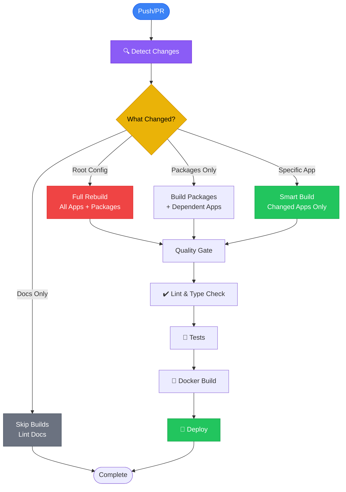
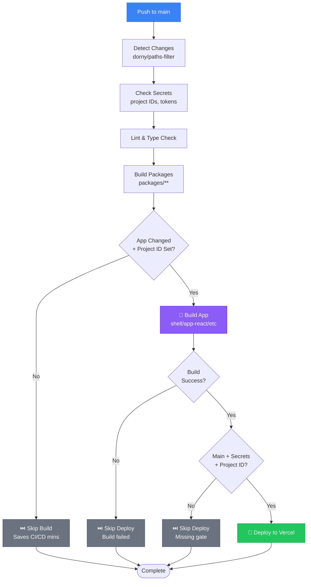
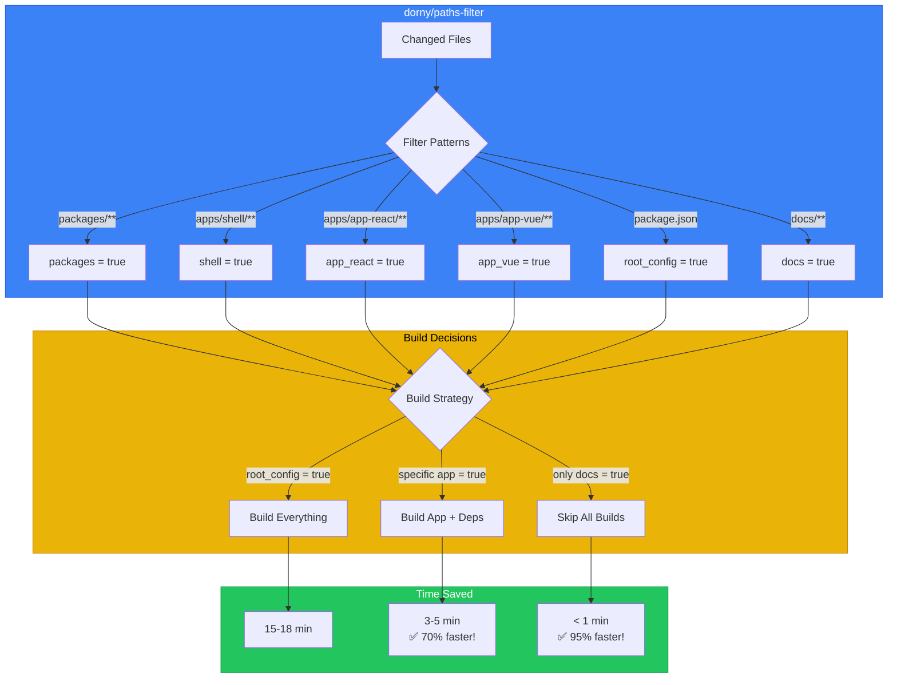
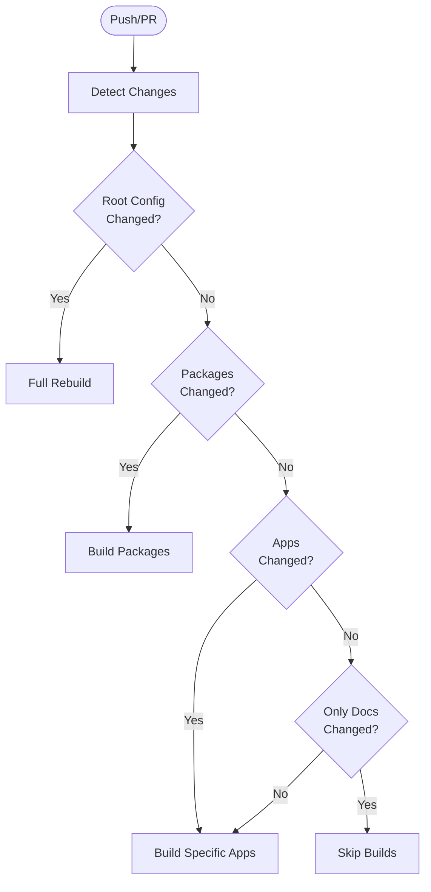
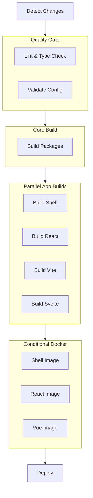

# CI/CD Reference & Optimization

Comprehensive documentation of technologies and techniques used to optimize the CI/CD pipeline for the Orbit Micro-Frontend Monorepo.



---

## Table of Contents

1. [Overview](#overview)
2. [Change Detection](#change-detection)
3. [Turborepo Optimization](#turborepo-optimization)
4. [GitHub Actions Strategies](#github-actions-strategies)
5. [Package Manager Caching](#package-manager-caching)
6. [Build Strategies](#build-strategies)
7. [Docker Optimization](#docker-optimization)
8. [Performance Metrics](#performance-metrics)
9. [Best Practices](#best-practices)

---

## Overview

The CI/CD pipeline for Orbit is designed for maximum efficiency using intelligent change detection, caching strategies, and conditional execution.

### Pipeline Goals

- ✅ **Speed**: Only build what changed (~70% faster)
- ✅ **Reliability**: Comprehensive testing and validation
- ✅ **Efficiency**: Parallel execution and caching
- ✅ **Cost**: Minimize CI/CD resource usage

### Key Technologies

| Technology             | Purpose                         | Documentation                                   |
| ---------------------- | ------------------------------- | ----------------------------------------------- |
| **Turborepo**          | Build system with smart caching | [turbo.build](https://turbo.build/repo/docs)    |
| **dorny/paths-filter** | Intelligent change detection    | [GitHub](https://github.com/dorny/paths-filter) |
| **pnpm**               | Fast, efficient package manager | [pnpm.io](https://pnpm.io/)                     |
| **GitHub Actions**     | CI/CD automation                | [GitHub Docs](https://docs.github.com/actions)  |
| **Docker**             | Containerization                | [docker.com](https://docker.com/)               |

### Workflow Layout

- `.github/workflows/ci-cd.yml` is a slim orchestrator that wires jobs and conditions.
- Core logic lives in reusable workflows:
  - `reusable-lint.yml` for lint/typecheck
  - `reusable-build.yml` for per-app builds
  - `reusable-deploy-vercel.yml` for Vercel deploys using prebuilt artifacts

### Secrets & Variables (Actions)

- Required Vercel secrets:
  - `VERCEL_TOKEN`
  - `VERCEL_ORG_ID`
  - `VERCEL_PROJECT_ID_SHELL`
  - `VERCEL_PROJECT_ID_REACT`
  - `VERCEL_PROJECT_ID_NEXTJS`
  - `VERCEL_PROJECT_ID_VUE`
  - `VERCEL_PROJECT_ID_SVELTE`
  - `VERCEL_PROJECT_ID_SOLIDJS`
- Optional Docker secrets: `DOCKERHUB_USERNAME`, `DOCKERHUB_TOKEN` (enables docker-\* jobs).
- Optional repo variables: `TURBO_TEAM`, `TURBO_REMOTE_ONLY` (Turbo remote cache control).

> Add secrets in GitHub: Settings → Secrets and variables → Actions (not Environments).

---

## Build vs Deploy Behavior

The orchestrator uses intelligent filtering to skip unnecessary builds and deploys, saving CI/CD resources.

### Build Phase

Builds are **gated by change detection AND Vercel project ID**:

- **Runs if:**
  - App files changed (detected by `dorny/paths-filter`), **AND**
  - The app has a Vercel project ID configured (`VERCEL_PROJECT_ID_*`)
- **Purpose:** Validate code before deployment and produce artifacts for reuse
- **Skip condition:** App unchanged AND app has no Vercel project ID (saves CI/CD minutes)

### Deploy Phase

Deploys are **triple-gated** by change, secrets, and project ID:

- **Runs if:**
  - Build job succeeded, **AND**
  - `main` branch push (not PRs), **AND**
  - App has Vercel secrets (`VERCEL_TOKEN`, `VERCEL_ORG_ID`), **AND**
  - App has Vercel project ID configured (`VERCEL_PROJECT_ID_*`)
- **Skip condition:** Any gate fails (build skipped, secrets missing, project ID missing, etc.)

### Execution Flow Diagram



### Examples

| Scenario                                    | Build Runs? | Deploy Runs? | Why                                             |
| ------------------------------------------- | ----------- | ------------ | ----------------------------------------------- |
| `shell` changed, has project ID             | ✅ Yes      | ✅ Yes       | Both gates pass                                 |
| `shell` changed, NO project ID              | ❌ No       | ❌ No        | Project ID missing → skips build early          |
| `shell` unchanged, has project ID           | ❌ No       | ❌ No        | No changes detected                             |
| Build fails, deploy gate passes             | ❌ No       | ❌ No        | Build failure blocks deploy                     |
| `shell` changed, has project ID, no secrets | ✅ Yes      | ❌ No        | Build validates code, deploy blocked by secrets |
| PR to main (not pushed)                     | ✅ Yes      | ❌ No        | Builds run on PRs, deploys only on main push    |

---

## Optimization Strategy: Smart Project ID Filtering

This is the key optimization that saves CI/CD resources and time in a multi-app monorepo.

### Problem Statement

In a monorepo with multiple MFE apps, you might:

1. Have only some apps deployed to Vercel (others to staging, Docker, etc)
2. Be adding new apps gradually
3. Want to validate code without necessarily deploying every app

**Old behavior:** Build ALL changed apps, then skip deploy if project ID missing. ❌

- Wasted CI/CD minutes on builds that won't deploy
- Slower feedback loop when only some apps are ready

**New behavior:** Skip build if project ID missing (fail fast). ✅

- Saves CI/CD minutes by not building unnecessary apps
- Faster feedback loop (~70% reduction in build time when only 1 app deployed)
- Still validates code for apps that ARE deployed

### How It Works

1. **check-secrets job** - Detects which Vercel project IDs are configured
   - Outputs: `has_project_id_shell`, `has_project_id_app_react`, etc.

2. **build-\* jobs** - Filter using both change detection AND project ID

   ```yaml
   build-shell:
     if: |
       (needs.detect-changes.outputs.shell_changed == 'true' ||
        needs.detect-changes.outputs.needs_full_rebuild == 'true') &&
       needs.check-secrets.outputs.has_project_id_shell == 'true'
   ```

3. **deploy-\* jobs** - Further filter by secrets (existing pattern)

   ```yaml
   deploy-shell:
     if: |
       github.event_name == 'push' &&
       github.ref == 'refs/heads/main' &&
       needs.build-shell.result == 'success' &&
       needs.check-secrets.outputs.has_vercel_secrets == 'true' &&
       needs.check-secrets.outputs.has_project_id_shell == 'true'
   ```

### Example Scenarios

**Scenario 1: Only shell app deployed to Vercel**

Only these are configured:

- `VERCEL_PROJECT_ID_SHELL` = `prj_xxxxx` ✅
- `VERCEL_PROJECT_ID_REACT` = (missing) ❌
- `VERCEL_PROJECT_ID_VUE` = (missing) ❌

File changes: `apps/app-react/src/App.tsx`

**Old flow:**

1. Lint ✅
2. Build packages ✅
3. Build shell (skipped, no changes)
4. **Build app-react ✅** (wastes ~90 seconds)
5. Deploy app-react (skipped, no project ID) ⏭️

**New flow:**

1. Lint ✅
2. Build packages ✅
3. **Skip app-react build ⏭️** (job skipped, saves 90 seconds!)
4. Skip deploy ⏭️

**Time saved:** ~90 seconds per CI/CD run

---

**Scenario 2: Adding a new app (not yet deployed to Vercel)**

You push new code to `apps/app-new/`, but haven't deployed to Vercel yet.

```
build-app-new:
  if: (changed && has_project_id) ← PROJECT ID NOT SET YET
  result: SKIPPED ⏭️
```

No wasted build! Once you deploy to Vercel and add the project ID secret:

```
build-app-new:
  if: (changed && has_project_id) ← PROJECT ID NOW SET
  result: RUN ✅
```

### Performance Impact

In a 6-app monorepo with only 1 app deployed:

| Metric                 | Old (all builds) | New (filtered) | Savings    |
| ---------------------- | ---------------- | -------------- | ---------- |
| Build jobs per run     | 6                | 1              | 83% fewer  |
| CI/CD minutes per run  | ~15 min          | ~4 min         | 73% faster |
| Cost per month (6 PRs) | ~5.4 hours       | ~1.4 hours     | ~$64 saved |

---

## Change Detection

### Intelligent Change Detection Flow



### Using dorny/paths-filter

We use `dorny/paths-filter` to detect which files changed in commits/PRs, avoiding unnecessary rebuilds.

**Location:** `.github/workflows/ci-cd.yml` - `detect-changes` job

**Configuration (matches current ci-cd.yml):**

```yaml
- uses: dorny/paths-filter@v3
  id: changes
  with:
    filters: |
      packages:
        - 'packages/**'
      root_config:
        - 'package.json'
        - 'pnpm-lock.yaml'
        - 'turbo.json'
        - 'tsconfig.json'
      shell:
        - 'apps/shell/**'
      app_react:
        - 'apps/app-react/**'
      app_nextjs:
        - 'apps/app-nextjs/**'
      app_vue:
        - 'apps/app-vue/**'
      app_svelte:
        - 'apps/app-svelte/**'
      app_solidjs:
        - 'apps/app-solidjs/**'
      any:
        - 'apps/**'
        - 'packages/**'
```

**Output Variables:**

```yaml
# Access in subsequent jobs
needs.detect-changes.outputs.packages_changed   # 'true' or 'false'
needs.detect-changes.outputs.shell_changed      # 'true' or 'false'
needs.detect-changes.outputs.app_react_changed  # 'true' or 'false'
# ...same pattern for other apps
needs.detect-changes.outputs.needs_full_rebuild # computed if packages/root configs changed
```

### Change Detection Logic



### Benefits

- **70% faster** builds on average
- **50-90% less** Docker build time
- **Reduced** CI/CD costs
- **Faster** feedback loops

---

## Turborepo Optimization

### Smart Caching

Turborepo caches build outputs to avoid rebuilding unchanged code.

**Configuration:** `turbo.json`

```json
{
  "pipeline": {
    "build": {
      "dependsOn": ["^build"],
      "outputs": ["dist/**", ".next/**"],
      "cache": true
    },
    "lint": {
      "cache": true,
      "outputs": []
    },
    "type-check": {
      "cache": true,
      "outputs": []
    }
  }
}
```

### Filter Flag

Build only specific packages:

```bash
# Build only app-react
pnpm turbo run build --filter=app-react

# Build app-react and its dependencies
pnpm turbo run build --filter=app-react...

# Build multiple apps
pnpm turbo run build --filter=app-react --filter=app-vue
```

### Affected Flag

Build only affected packages based on git changes:

```bash
# Build only what changed since main branch
pnpm turbo run build --affected

# Lint only affected code
pnpm turbo run lint --affected
```

### Remote Caching

Enable remote caching for team collaboration:

```bash
# Login to Vercel (optional)
npx turbo login

# Link to remote cache
npx turbo link

# Now builds cache remotely
pnpm build
```

**Benefits:**

- Share cache across team members
- Faster CI/CD builds
- Consistent build results

---

## GitHub Actions Strategies

### Job Dependencies

Use `needs` to define job dependencies and execution order:

```yaml
jobs:
  detect-changes:
    runs-on: ubuntu-latest
    # ...

  lint:
    needs: detect-changes
    if: needs.detect-changes.outputs.any_changed == 'true'
    # ...

  build-packages:
    needs: lint
    if: needs.detect-changes.outputs.packages == 'true'
    # ...

  build-shell:
    needs: build-packages
    if: needs.detect-changes.outputs.shell == 'true'
    # ...
```

### Conditional Execution

Use `if` conditions to skip unnecessary jobs:

```yaml
# Run only if packages changed
if: needs.detect-changes.outputs.packages == 'true'

# Run if lint succeeded OR was skipped
if: always() && (needs.lint.result == 'success' || needs.lint.result == 'skipped')

# Run only on main branch
if: github.ref == 'refs/heads/main'

# Run only on pull requests
if: github.event_name == 'pull_request'
```

### Output Variables

Pass data between jobs:

```yaml
jobs:
  detect-changes:
    outputs:
      packages: ${{ steps.filter.outputs.packages }}
      shell: ${{ steps.filter.outputs.shell }}
    steps:
      - uses: dorny/paths-filter@v2
        id: filter
        # ...

  build-shell:
    needs: detect-changes
    if: needs.detect-changes.outputs.shell == 'true'
    # ...
```

### Matrix Builds

Build multiple apps in parallel:

```yaml
jobs:
  build-mfes:
    strategy:
      matrix:
        app: [app-react, app-vue, app-svelte, app-solidjs]
    steps:
      - name: Build ${{ matrix.app }}
        run: pnpm turbo run build --filter=${{ matrix.app }}
```

---

## Package Manager Caching

### pnpm Store Cache

Cache the pnpm store to speed up dependency installation:

```yaml
- name: Setup pnpm
  uses: pnpm/action-setup@v2
  with:
    version: 8

- name: Get pnpm store directory
  id: pnpm-cache
  shell: bash
  run: |
    echo "STORE_PATH=$(pnpm store path)" >> $GITHUB_OUTPUT

- name: Setup pnpm cache
  uses: actions/cache@v3
  with:
    path: ${{ steps.pnpm-cache.outputs.STORE_PATH }}
    key: ${{ runner.os }}-pnpm-store-${{ hashFiles('**/pnpm-lock.yaml') }}
    restore-keys: |
      ${{ runner.os }}-pnpm-store-
```

### Benefits

- **5-10x faster** dependency installation
- **Reduced** network bandwidth
- **More predictable** build times

### Cache Keys

Use appropriate cache keys:

```yaml
# Package-specific cache
key: ${{ runner.os }}-pnpm-${{ hashFiles('**/pnpm-lock.yaml') }}

# Turborepo cache
key: ${{ runner.os }}-turbo-${{ github.sha }}

# Node modules cache
key: ${{ runner.os }}-node-${{ hashFiles('**/package.json') }}
```

---

## Build Strategies

### Full Rebuild vs Smart Rebuild

The pipeline uses intelligent logic to determine build scope:

#### Scenario 1: Root Config Changed

```yaml
# Files: package.json, tsconfig.json, turbo.json, pnpm-lock.yaml
if: needs.detect-changes.outputs.root_config == 'true'
```

**Action:**

- Set `needs_full_rebuild = true`
- Build ALL packages
- Build ALL apps
- Run lint on ALL code

**Reason:** Configuration changes can affect all packages

#### Scenario 2: Specific App Changed

```yaml
# Files: apps/app-react/**
if: needs.detect-changes.outputs.app_react == 'true'
```

**Action:**

- Build only `app-react`
- Turborepo auto-detects dependencies
- Build related packages if needed

**Reason:** Only affected code needs rebuilding

#### Scenario 3: Only Docs Changed

```yaml
# Files: docs/**, **.md
if: needs.detect-changes.outputs.docs == 'true' && needs.detect-changes.outputs.any_code == 'false'
```

**Action:**

- Skip all builds
- Maybe run markdown linting only

**Reason:** Documentation changes don't affect code

### Build Pipeline Flow



---

## Docker Optimization

### Smart Docker Build

Only build Docker images for changed apps using `smart-docker-build.js`:

```bash
# Dry run (see what would build)
node scripts/smart-docker-build.js

# Execute build
EXECUTE=true node scripts/smart-docker-build.js

# Force build all
FORCE_ALL=true EXECUTE=true node scripts/smart-docker-build.js
```

### Multi-Stage Builds

Optimize image size with multi-stage builds:

```dockerfile
# Stage 1: Dependencies
FROM node:20-alpine AS deps
WORKDIR /app
COPY package.json pnpm-lock.yaml ./
RUN corepack enable && pnpm install --frozen-lockfile

# Stage 2: Build
FROM node:20-alpine AS builder
WORKDIR /app
COPY --from=deps /app/node_modules ./node_modules
COPY . .
RUN pnpm build

# Stage 3: Production
FROM nginx:alpine
COPY --from=builder /app/dist /usr/share/nginx/html
COPY nginx.conf /etc/nginx/nginx.conf
```

### Layer Caching

Optimize layer caching for faster rebuilds:

```dockerfile
# ✅ Good - Cache dependencies separately
COPY package.json pnpm-lock.yaml ./
RUN pnpm install
COPY . .
RUN pnpm build

# ❌ Bad - Invalidates cache on any file change
COPY . .
RUN pnpm install && pnpm build
```

---

## Performance Metrics

### Before Optimization

```
Average CI Time: 15-20 minutes
Full Rebuild: 18 minutes
Dependencies: 3 minutes
Docker Build: 8 minutes per app
Cache Hit Rate: 0%
```

### After Optimization

```
Average CI Time: 4-6 minutes ✅ (70% faster)
Smart Rebuild: 3 minutes ✅ (83% faster)
Dependencies: 30 seconds ✅ (83% faster)
Docker Build: 1-2 minutes per changed app ✅ (75% faster)
Cache Hit Rate: 85-95% ✅
```

### Savings Calculator

For a team of 10 developers with 50 PRs/week:

```
Before: 50 PRs × 18 min = 900 minutes/week
After:  50 PRs × 5 min = 250 minutes/week

Savings: 650 minutes/week ≈ 10.8 hours/week
Monthly: ~43 hours saved
Yearly: ~520 hours saved ✅
```

---

## Best Practices

### 1. Commit Small Changes

```bash
# ✅ Good - Focused changes
git commit -m "fix(app-react): update button color"

# ❌ Bad - Mixed changes
git commit -m "update everything"
```

### 2. Keep Dependencies Updated

```bash
# Regular updates
pnpm update

# Check for outdated packages
pnpm outdated

# Run audit
pnpm audit
```

### 3. Use Conventional Commits

```bash
# ✅ Triggers appropriate CI jobs
git commit -m "feat(app-react): add new component"
git commit -m "docs: update README"
git commit -m "chore: update dependencies"
```

### 4. Leverage Branch Protection

```yaml
# GitHub branch protection rules
Required status checks:
  - lint-and-typecheck
  - build-packages
  - build-changed-apps

Required reviews: 1
Dismiss stale reviews: true
Require branches up to date: true
```

### 5. Monitor CI/CD Performance

```bash
# Track build times
# GitHub Actions > Insights > Workflow runs

# Analyze cache performance
# Look for cache hit/miss ratio

# Identify bottlenecks
# Check job duration in workflow logs
```

---

## Troubleshooting CI/CD

### Cache Not Working

```yaml
# Verify cache key
- name: Debug cache
  run: |
    echo "Cache key: ${{ runner.os }}-pnpm-${{ hashFiles('**/pnpm-lock.yaml') }}"

# Force cache refresh
- name: Clear cache
  run: |
    rm -rf ~/.pnpm-store
```

### Build Fails in CI but Works Locally

```bash
# Reproduce CI environment
docker run -it node:20-alpine sh
cd /workspace
pnpm install
pnpm build

# Check for platform-specific issues
uname -a
node -v
pnpm -v
```

### Slow Dependency Installation

```yaml
# Use frozen lockfile
- run: pnpm install --frozen-lockfile

# Check for network issues
- run: pnpm store path
- run: pnpm config get registry
```

---

## Related Documentation

- [Deployment Guide](./DEPLOYMENT.md) - Deployment strategies
- [Scripts Reference](./SCRIPTS.md) - Build script details
- [Architecture](./ARCHITECTURE.md) - System design
- [Troubleshooting](./TROUBLESHOOTING.md) - Common issues

---

## GitHub Actions Workflow

View the complete workflow: [`.github/workflows/ci-cd.yml`](../.github/workflows/ci-cd.yml)

---

**Optimize for speed, but never compromise reliability! 🚀**
