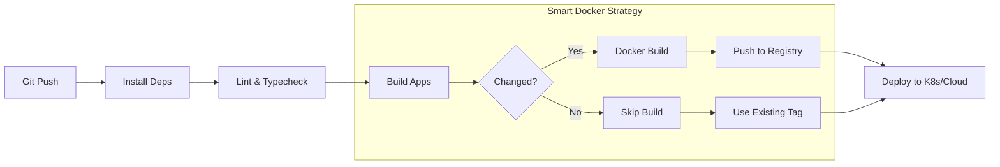
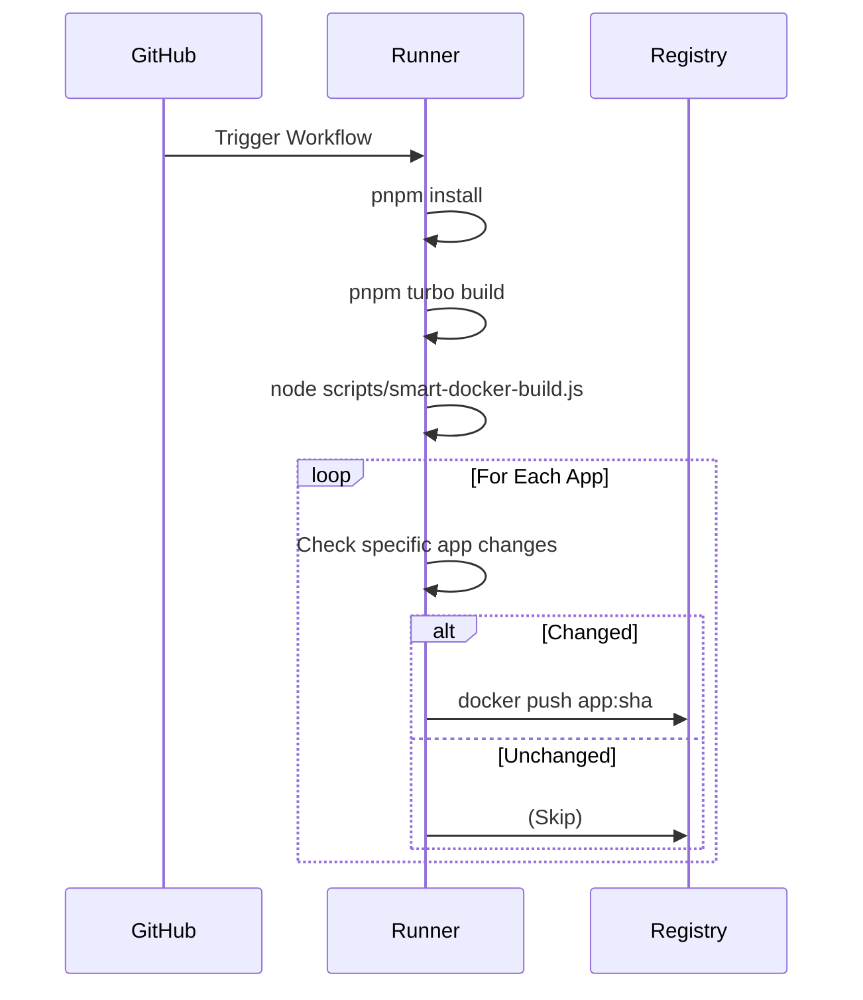

# Deployment & CI/CD Guide

This guide details the High-Performance CI/CD strategy for our Micro-Front-End Monorepo.

## 🏗️ Architecture

We use a **Smart Build System** powered by [Turborepo](https://turbo.build/).

### CI/CD Pipeline



### The Build Matrix

| Application | Type                  | Docker Environment | Dockerfile                                        |
| :---------- | :-------------------- | :----------------- | :------------------------------------------------ |
| **Shell**   | Node.js (Remix SSR)   | `node:18-alpine`   | `apps/shell/Dockerfile`                           |
| **App A**   | Static (React/Vite)   | `nginx:alpine`     | `Dockerfile.mfe`                                  |
| **App B**   | Static (Next.js/Vite) | `nginx:alpine`     | `Dockerfile.mfe` (Arg: `BUILD_OUTPUT_DIR=public`) |

---

## 🚀 Smart Docker Build Script

Located at `scripts/smart-docker-build.js`.

### Usage

```bash
# Dry Run (Check what would be built)
node scripts/smart-docker-build.js

# Execute Building of CHANGED apps
EXECUTE=true node scripts/smart-docker-build.js
```

### Configuration

Add an `mfe` section to `package.json` to customize behavior:

```json
{
  "mfe": {
    "dockerfile": "Dockerfile.custom",
    "imageName": "custom-service-name"
  }
}
```

---

## 🤖 GitHub Actions Workflow

Example conceptual workflow:



See `scripts/smart-docker-build.js` for implementation details.
