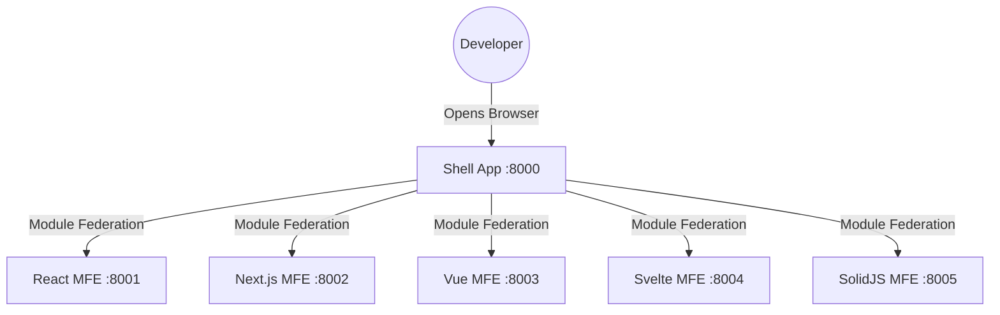
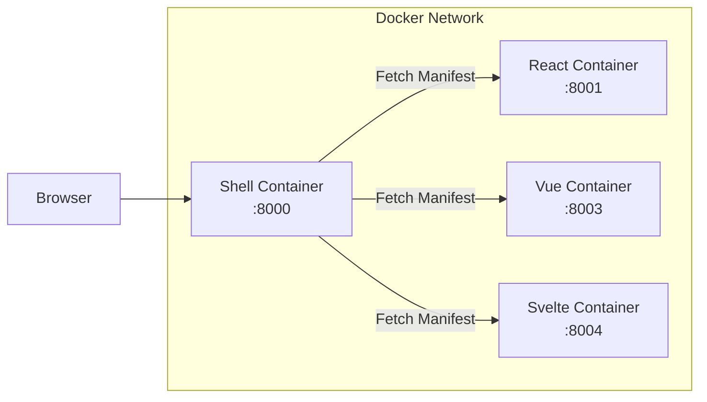

# Getting Started

Welcome to **Orbit**! This comprehensive guide will get you up and running with your Micro-Frontend development environment in minutes.

---

## Table of Contents

1. [Prerequisites](#prerequisites)
2. [Quick Setup](#quick-setup)
3. [Development Workflow](#development-workflow)
4. [CLI Tools](#cli-tools)
5. [MFE Configuration](#mfe-configuration)
6. [Production Simulation](#production-simulation)
7. [Troubleshooting](#troubleshooting)
8. [Next Steps](#next-steps)

---

## Prerequisites

Before you start, make sure you have the following installed:

### Required Tools

| Tool        | Version | Installation                                        | Verify          |
| ----------- | ------- | --------------------------------------------------- | --------------- |
| **Node.js** | v18+    | [Download](https://nodejs.org/) or `nvm install 18` | `node -v`       |
| **pnpm**    | v8+     | `npm install -g pnpm` or `corepack enable`          | `pnpm -v`       |
| **Git**     | Latest  | [Download](https://git-scm.com/)                    | `git --version` |

### Optional (Recommended)

| Tool        | Purpose                            | Installation                                   |
| ----------- | ---------------------------------- | ---------------------------------------------- |
| **Docker**  | Production simulation & deployment | [Download](https://docker.com/)                |
| **VS Code** | Recommended IDE with extensions    | [Download](https://code.visualstudio.com/)     |
| **nvm**     | Node version management            | [Install Guide](https://github.com/nvm-sh/nvm) |

### VS Code Extensions (Recommended)

Install these extensions for the best development experience:

- **ESLint** - Code linting
- **Prettier** - Code formatting
- **Tailwind CSS IntelliSense** - Tailwind autocomplete
- **TypeScript Vue Plugin (Volar)** - Vue 3 support
- **Svelte for VS Code** - Svelte support

### Verify Installation

```bash
# Run this to check all prerequisites
node -v    # Should be v18.x or higher
pnpm -v    # Should be v8.x or higher
git --version
docker -v  # Optional - for production simulation
```

---

## Quick Setup

### Step 1: Clone the Repository

```bash
git clone <repository-url>
cd micro-frontend-base
```

### Step 2: Install Dependencies

```bash
pnpm install
```

**What happens:**

- ✅ Installs all workspace dependencies
- ✅ Builds shared packages (`@repo/config`, `@repo/utils`, `@repo/core`, `@repo/ui`)
- ✅ Sets up git hooks (husky) for linting and commit validation

### Step 3: Initialize Environment

**Option A: Automated (Recommended)**

```bash
bash scripts/onboard.sh
```

This script:

- ✅ Checks Node.js and pnpm versions
- ✅ Copies `.env.example` to `.env`
- ✅ Copies `apps/shell/.env.example` to `apps/shell/.env`
- ✅ Verifies workspace structure
- ✅ Runs initial validation

**Option B: Manual**

```bash
cp .env.example .env
cp apps/shell/.env.example apps/shell/.env
```

### Step 4: Verify Setup

```bash
# Check MFE configuration
pnpm validate:mfe-config

# Check APP_IDS consistency
pnpm validate:app-ids

# Type check all packages
pnpm type-check
```

### Step 5: Start Development

```bash
pnpm dev
```

**You're ready!** Open [http://localhost:8000](http://localhost:8000)

---

## Development Workflow

### Understanding the Architecture



### Development Modes

#### Mode 1: Full Development (Recommended)

Runs Shell and all MFEs together:

```bash
pnpm dev
```

| App         | URL                     |
| ----------- | ----------------------- |
| Shell       | <http://localhost:8000> |
| React MFE   | <http://localhost:8001> |
| Next.js MFE | <http://localhost:8002> |
| Vue MFE     | <http://localhost:8003> |
| Svelte MFE  | <http://localhost:8004> |
| SolidJS MFE | <http://localhost:8005> |

#### Mode 2: Shell Only

When working primarily on the Shell:

```bash
pnpm dev:shell
```

#### Mode 3: MFEs Only

When working on MFEs without the Shell:

```bash
pnpm dev:mfes
```

#### Mode 4: Single App

Focus on one specific app:

```bash
pnpm dev --filter=app-react
pnpm dev --filter=app-vue
pnpm dev --filter=shell
```

### Command Reference

#### Development Commands

| Command                   | Description                               |
| :------------------------ | :---------------------------------------- |
| `pnpm dev`                | Start all apps (Shell + MFEs)             |
| `pnpm dev:shell`          | Start only the Shell                      |
| `pnpm dev:mfes`           | Start only MFE apps                       |
| `pnpm dev:all`            | Start everything with manifest generation |
| `pnpm dev --filter=<app>` | Start specific app                        |

#### Build Commands

| Command                | Description                      |
| :--------------------- | :------------------------------- |
| `pnpm build`           | Build all packages and apps      |
| `pnpm build:packages`  | Build only shared packages       |
| `pnpm build:mfes`      | Build all MFE apps (development) |
| `pnpm build:mfes:prod` | Production build for all MFEs    |

#### Validation Commands

| Command                    | Description                      |
| :------------------------- | :------------------------------- |
| `pnpm validate:mfe-config` | Check MFE configuration validity |
| `pnpm validate:app-ids`    | Validate APP_IDS consistency     |
| `pnpm type-check`          | TypeScript type checking         |
| `pnpm lint`                | Run ESLint on all packages       |
| `pnpm lint:fix`            | Fix auto-fixable lint issues     |

#### Testing & Tools

| Command          | Description                     |
| :--------------- | :------------------------------ |
| `pnpm test`      | Run all tests                   |
| `pnpm storybook` | Run Storybook for UI components |
| `pnpm clean`     | Clean all build artifacts       |

---

## CLI Tools

### The Interactive CLI

The easiest way to perform common tasks:

```bash
pnpm cli
```

```
==========================================
   🚀 MICRO-FRONTEND BASE PLATFORM CLI
==========================================

Please choose an action:
1. create-app       Scaffold a new Micro-App
2. generate-ui      Create a new UI Component
3. onboard-check    Verify development environment
4. docker-build     Smart Docker Build (Dry Run)
5. docker-exec      Smart Docker Build (EXECUTE)
0. exit             Quit CLI
```

### CLI: Create New App

Scaffolds a new micro-frontend with your chosen framework:

```bash
pnpm cli
# Select: 1. create-app
```

Or directly:

```bash
node scripts/create-app.mjs
```

**Supported Frameworks:**

- React (Vite + TypeScript)
- Vue 3 (Vite + Composition API)
- Svelte (Vite + SvelteKit)
- SolidJS (Vite + Solid)

**What gets generated:**

- ✅ App directory with template files
- ✅ Configured `package.json`
- ✅ Vite configuration with Module Federation
- ✅ Entry MFE file (`entry-mfe.tsx`)
- ✅ Health check and manifest files
- ✅ Tailwind CSS configuration

### CLI: Generate UI Component

Creates a new component across multiple frameworks:

```bash
pnpm cli
# Select: 2. generate-ui
```

Or directly:

```bash
cd packages/ui && pnpm generate
```

**What gets generated:**

- ✅ Component files for selected frameworks
- ✅ Storybook stories
- ✅ Shared variants (CVA)
- ✅ TypeScript types
- ✅ Export statements

### CLI: Smart Docker Build

Intelligently builds only changed apps:

```bash
# Dry run - see what would be built
pnpm docker:build:smart

# Execute build
EXECUTE=true pnpm docker:build:smart
```

---

## MFE Configuration

All MFE apps are configured in a single source of truth:

```javascript
// scripts/mfe.config.mjs

export const MFE_APPS = [
  {
    name: "app-react", // Folder name in apps/
    framework: "react", // Framework type
    port: 8001, // Dev server port
    entryFile: "entry-mfe.tsx",
    outputDir: "dist",
  },
  {
    name: "app-nextjs",
    framework: "nextjs",
    port: 8002,
    entryFile: "entry-mfe.tsx",
    outputDir: "public", // Next.js uses public for static
  },
  {
    name: "app-vue",
    framework: "vue",
    port: 8003,
    entryFile: "entry-mfe.ts",
    outputDir: "dist",
  },
  {
    name: "app-svelte",
    framework: "svelte",
    port: 8004,
    entryFile: "entry-mfe.ts",
    outputDir: "dist",
  },
  {
    name: "app-solidjs",
    framework: "solid",
    port: 8005,
    entryFile: "entry-mfe.tsx",
    outputDir: "dist",
  },
];
```

### Adding a New MFE

1. **Create the app** using CLI or manually
2. **Add to config:**

```javascript
// scripts/mfe.config.mjs
export const MFE_APPS = [
  // ... existing apps
  {
    name: "app-my-dashboard",
    framework: "react",
    port: 8006,
    entryFile: "entry-mfe.tsx",
    outputDir: "dist",
  },
];
```

1. **Validate:**

```bash
pnpm validate:mfe-config
```

1. **Start development:**

```bash
pnpm dev --filter=app-my-dashboard
```

### Configuration Options

| Property    | Type    | Description                                 |
| ----------- | ------- | ------------------------------------------- |
| `name`      | string  | Folder name in `apps/` directory            |
| `framework` | string  | `react`, `vue`, `svelte`, `solid`, `nextjs` |
| `port`      | number  | Development server port                     |
| `entryFile` | string  | Entry file name                             |
| `outputDir` | string  | Build output directory                      |
| `disabled`  | boolean | Set `true` to exclude from builds           |

---

## Production Simulation

Test the full production setup locally using Docker:

### Start All Services

```bash
docker-compose up --build
```

### Start Specific Services

```bash
docker-compose up shell app-react app-vue
```

### Architecture



### Useful Docker Commands

```bash
# Rebuild a specific service
docker-compose build app-react

# View logs
docker-compose logs -f shell

# Stop all services
docker-compose down

# Clean up everything
docker-compose down -v --rmi all
```

---

## Troubleshooting

### Common Issues

| Issue                  | Solution                                              |
| :--------------------- | :---------------------------------------------------- |
| **Ports in use**       | Kill processes: `lsof -ti:8000 \| xargs kill -9`      |
| **MFE not loading**    | Ensure the MFE is running. Check terminal for errors. |
| **UI styles missing**  | Import `@repo/ui/globals.css` in your entry file.     |
| **Module not found**   | Run `pnpm install` and `pnpm build:packages`.         |
| **Type errors**        | Run `pnpm type-check` to see all errors.              |
| **Build cache issues** | Run `pnpm clean` then `pnpm install`.                 |

### Port Conflicts

Default ports used by Orbit:

| Port | App              |
| ---- | ---------------- |
| 8000 | Shell            |
| 8001 | React MFE        |
| 8002 | Next.js MFE      |
| 8003 | Vue MFE          |
| 8004 | Svelte MFE       |
| 8005 | SolidJS MFE      |
| 6006 | Storybook React  |
| 6007 | Storybook Vue    |
| 6008 | Storybook Solid  |
| 6009 | Storybook Svelte |

### Clear All Caches

```bash
# Clean turbo cache
pnpm clean

# Remove node_modules (nuclear option)
rm -rf node_modules apps/*/node_modules packages/*/node_modules
pnpm install
```

### Check for Issues

```bash
# Validate configuration
pnpm validate:mfe-config
pnpm validate:app-ids

# Type check
pnpm type-check

# Lint
pnpm lint
```

### Debug Mode

For verbose output, set the DEBUG environment variable:

```bash
DEBUG=* pnpm dev
```

---

## Next Steps

Now that you're set up, explore these resources:

### Tutorials & Guides

- **[Tutorial](./TUTORIAL.md)**: Step-by-step guide to building your first MFE
- **[Architecture](./ARCHITECTURE.md)**: System design and patterns
- **[Standards](./STANDARDS.md)**: Coding conventions and best practices
- **[Deployment](./DEPLOYMENT.md)**: CI/CD and production setup

### Package Documentation

- **[@repo/ui](../packages/ui/README.md)**: Multi-framework UI component library
- **[@repo/core](../packages/core/README.md)**: Core utilities and state management
- **[@repo/config](../packages/config/README.md)**: Shared configurations

### Quick Links

| Task                 | Command                       |
| -------------------- | ----------------------------- |
| Create new MFE       | `pnpm cli` → `1. create-app`  |
| Generate component   | `pnpm cli` → `2. generate-ui` |
| Run Storybook        | `pnpm storybook`              |
| Build for production | `pnpm build:mfes:prod`        |
| Docker simulation    | `docker-compose up --build`   |

---

## Need Help?

- Check the [Tutorial](./TUTORIAL.md)
- Report issues on GitHub
- Contact: [phamtuandev0907@gmail.com](mailto:phamtuandev0907@gmail.com)
