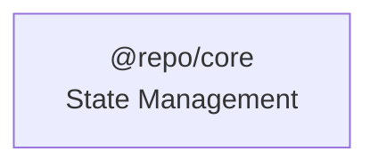
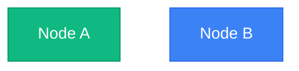
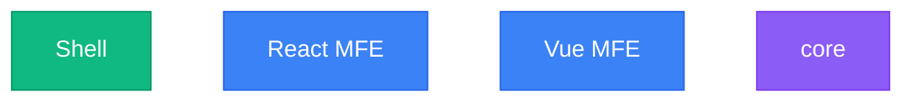
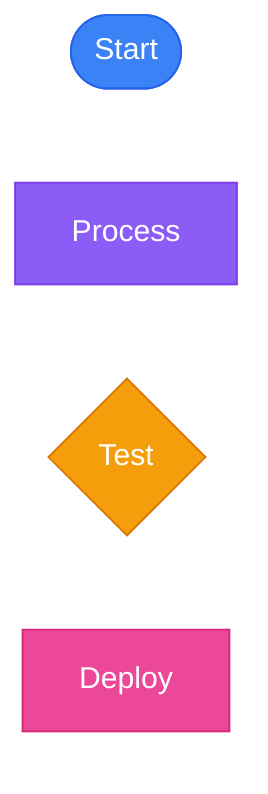
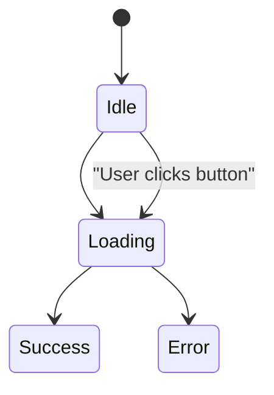

# Mermaid Diagram Style Guide

## Standard Color Palette

Use this consistent color palette across all Mermaid diagrams in the project:

### Primary Colors

```
Green (Success/Primary)     : fill:#10b981, stroke:#059669, color:#fff
Blue (Info/Secondary)       : fill:#3b82f6, stroke:#2563eb, color:#fff
Purple (Packages/Shared)    : fill:#8b5cf6, stroke:#7c3aed, color:#fff
Amber (Warning/Test)        : fill:#f59e0b, stroke:#d97706, color:#fff
Pink (Deploy/Critical)      : fill:#ec4899, stroke:#db2777, color:#fff
Red (Error/Failure)         : fill:#ef4444, stroke:#dc2626, color:#fff
Gray (Neutral/Disabled)     : fill:#6b7280, stroke:#4b5563, color:#fff
```

### Usage Guidelines

- **Shell/Primary Actions**: Green (#10b981)
- **MFE/Secondary Items**: Blue (#3b82f6)
- **Packages/Shared Code**: Purple (#8b5cf6)
- **Tests/Warnings**: Amber (#f59e0b)
- **Deploy/Critical Actions**: Pink (#ec4899)
- **Errors/Failures**: Red (#ef4444)
- **Disabled/Inactive**: Gray (#6b7280)

## Best Practices

### 1. Node IDs and Labels



**Rules:**

- Use simple alphanumeric IDs (e.g., `NodeA`, `Shell`, `Core`)
- Put special characters (@, /, :) in quoted labels only
- Avoid emojis in both IDs and labels

### 2. Styling Methods



**Preferred:** Use `classDef` for reusable styles  
**Acceptable:** Use `style` for one-off customizations

### 3. Common Patterns

#### Application Architecture



#### Workflow/Pipeline



#### State Diagram



## Checklist

Before committing Mermaid diagrams:

- [ ] No emojis in node IDs or labels
- [ ] No special characters (@, /, :) in node IDs
- [ ] Special characters in labels are quoted
- [ ] Consistent color palette applied
- [ ] Uses `classDef` for reusable styles
- [ ] Diagram renders without parse errors
- [ ] Theme matches other diagrams in the project

## Migration Guide

When updating old diagrams:

1. **Remove emojis**: Replace `[🏠 Shell]` with `[Shell]`
2. **Fix node IDs**: Change `@repo/core` to `Core["@repo/core"]`
3. **Standardize colors**: Apply palette from this guide
4. **Test rendering**: Verify on GitHub or Mermaid Live Editor

## Examples

See standardized diagrams in:

- [README.md](../README.md)
- [.github/CONTRIBUTING.md](../.github/CONTRIBUTING.md)
- [.github/SECURITY.md](../.github/SECURITY.md)
