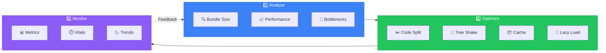
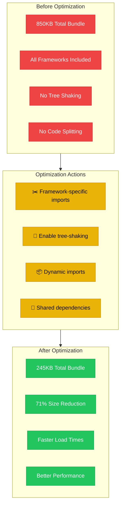
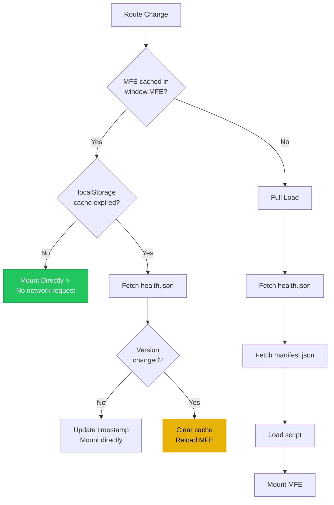

# Performance Optimization Guide

Strategies and best practices for optimizing the Orbit Micro-Frontend Platform.



---

## Table of Contents

1. [Bundle Size Optimization](#bundle-size-optimization)
2. [Loading Performance](#loading-performance)
3. [Runtime Performance](#runtime-performance)
4. [Build Performance](#build-performance)
5. [Monitoring & Metrics](#monitoring--metrics)
6. [Performance Budget](#performance-budget)
7. [Best Practices](#best-practices)

---

## Bundle Size Optimization

### Optimization Strategy



### Analyzing Bundle Size

#### Using Rollup Plugin Visualizer

```bash
# Build with analysis
ANALYZE=true pnpm build --filter app-react

# Opens browser with bundle visualization
```

#### Check Bundle Sizes

```bash
# List all bundles
ls -lh apps/app-react/dist/assets/

# Get total size
du -sh apps/app-react/dist/

# Detailed breakdown
npx vite-bundle-visualizer apps/app-react/dist
```

### Tree-Shaking Configuration

Ensure proper tree-shaking in all packages:

```json
// package.json
{
  "sideEffects": false,
  "type": "module",
  "exports": {
    ".": {
      "types": "./src/index.ts",
      "import": "./dist/index.js"
    }
  }
}
```

**Packages with side effects:**

```json
// If your package has side effects
{
  "sideEffects": ["*.css", "*.scss", "./src/polyfills.ts"]
}
```

### Code Splitting

#### Dynamic Imports

```typescript
// ✅ Good - Lazy load routes
const Dashboard = lazy(() => import("./routes/Dashboard"));
const Settings = lazy(() => import("./routes/Settings"));

// ✅ Good - Lazy load heavy libraries
const loadChartLibrary = () => import("chart.js");

// ❌ Bad - Static import for heavy library
import Chart from "chart.js";
```

#### Route-Based Splitting

```typescript
// React Router
const routes = [
  {
    path: "/dashboard",
    component: lazy(() => import("./Dashboard")),
  },
  {
    path: "/analytics",
    component: lazy(() => import("./Analytics")),
  },
];

// Vue Router
const routes = [
  {
    path: "/dashboard",
    component: () => import("./Dashboard.vue"),
  },
];
```

### Optimizing Dependencies

#### Use Subpath Imports

```typescript
// ❌ Bad - Imports entire lodash
import _ from "lodash";
const result = _.debounce(fn, 300);

// ✅ Good - Imports only debounce
import debounce from "lodash-es/debounce";
const result = debounce(fn, 300);

// ✅ Better - Use lightweight alternative
import { debounce } from "@repo/utils";
```

#### Framework-Specific Builds

```typescript
// ✅ Import framework-specific version
import { Button } from "@repo/ui/react"; // React version only
import { Button } from "@repo/ui/vue"; // Vue version only

// ❌ Never import all frameworks
import { Button } from "@repo/ui"; // Includes all frameworks!
```

**Bundle Size Savings:**

| Import Method  | Bundle Size | Savings  |
| -------------- | ----------- | -------- |
| All frameworks | ~850KB      | -        |
| React only     | ~180KB      | 670KB ✅ |
| Vue only       | ~165KB      | 685KB ✅ |
| Svelte only    | ~120KB      | 730KB ✅ |

### Shared Dependencies

Configure shared dependencies in Module Federation:

```typescript
// vite.config.ts
import { baseShared } from "@repo/config";

federation({
  shared: {
    ...baseShared,
    react: {
      singleton: true,
      requiredVersion: "^18.0.0",
    },
    "react-dom": {
      singleton: true,
      requiredVersion: "^18.0.0",
    },
  },
});
```

**Benefits:**

- Single React instance across all MFEs
- Reduced duplicate code
- ~200KB+ savings per additional MFE

---

## Loading Performance

### MFE Caching & Version Check

The `MfeHost` component implements intelligent caching to minimize network requests:



**Cache Configuration:**

| Setting                  | Value               | Description                           |
| ------------------------ | ------------------- | ------------------------------------- |
| `VERSION_CHECK_INTERVAL` | 1 hour              | TTL for version cache in localStorage |
| `VERSION_CACHE_KEY`      | `mfe_version_cache` | localStorage key                      |

**localStorage Structure:**

```json
// localStorage.getItem('mfe_version_cache')
{
  "app-react": { "version": "a1b2c3d4", "checkedAt": 1737500000000 },
  "app-vue": { "version": "b2c3d4e5", "checkedAt": 1737500000000 }
}
```

**Benefits:**

- ✅ **Fast route changes**: No network request when cache is valid
- ✅ **Auto-update**: Detects new deployments via version hash
- ✅ **User control**: Clear localStorage to force refresh

**Force Reload:**

```javascript
// Clear version cache to force re-fetch
localStorage.removeItem("mfe_version_cache");
location.reload();
```

---

### Initial Load Optimization

#### Preload Critical Resources

```html
<!-- apps/shell/app/root.tsx -->
<head>
  {/* Preload critical fonts */}
  <link
    rel="preload"
    href="/fonts/inter.woff2"
    as="font"
    type="font/woff2"
    crossorigin
  />

  {/* Preconnect to MFE origins */}
  <link rel="preconnect" href="http://localhost:8001" />
  <link rel="dns-prefetch" href="http://localhost:8001" />
</head>
```

#### Lazy Load MFEs

```typescript
// Shell - Load MFEs on demand
const loadMFE = async (appId: string) => {
  const manifest = await fetchManifest();
  const config = manifest[appId];

  // Only load when route is accessed
  return import(/* @vite-ignore */ config.url);
};
```

#### Resource Hints

```html
<!-- Prefetch non-critical resources -->
<link rel="prefetch" href="/assets/dashboard-chunk.js" />

<!-- Preload critical chunks -->
<link rel="modulepreload" href="/assets/vendor.js" />
```

### Image Optimization

```typescript
// Use modern formats with fallbacks
<picture>
  <source srcset="/hero.webp" type="image/webp" />
  <source srcset="/hero.jpg" type="image/jpeg" />
  
</picture>

// Responsive images

```

### CSS Optimization

```typescript
// Critical CSS inline
<style>{criticalCSS}</style>

// Defer non-critical CSS
<link rel="preload" href="/styles.css" as="style" onload="this.onload=null;this.rel='stylesheet'" />
<noscript><link rel="stylesheet" href="/styles.css" /></noscript>
```

---

## Runtime Performance

### React Performance

#### Memoization

```typescript
// Memoize expensive components
const ExpensiveComponent = memo(({ data }) => {
  return <div>{/* Heavy rendering */}</div>;
});

// Memoize callbacks
const handleClick = useCallback(() => {
  // Handler logic
}, [dependencies]);

// Memoize computed values
const expensiveValue = useMemo(() => {
  return computeExpensiveValue(data);
}, [data]);
```

#### Virtual Scrolling

```typescript
// For long lists - use react-window or react-virtualized
import { FixedSizeList } from "react-window";

<FixedSizeList
  height={600}
  itemCount={1000}
  itemSize={50}
  width="100%"
>
  {({ index, style }) => (
    <div style={style}>Item {index}</div>
  )}
</FixedSizeList>
```

#### Avoid Unnecessary Re-renders

```typescript
// ❌ Bad - Creates new object every render
<Component style={{ padding: 10 }} />

// ✅ Good - Stable reference
const style = { padding: 10 };
<Component style={style} />

// ❌ Bad - Creates new function every render
<Button onClick={() => handleClick(id)} />

// ✅ Good - Memoized handler
const onClick = useCallback(() => handleClick(id), [id]);
<Button onClick={onClick} />
```

### State Management Performance

#### Selective Subscriptions

```typescript
// ❌ Bad - Subscribes to entire store
const state = useUserStore();

// ✅ Good - Subscribe to specific fields
const user = useUserStore((state) => state.user);
const isLoading = useUserStore((state) => state.isLoading);
```

#### Batched Updates

```typescript
// Zustand automatically batches, but be aware
import { useUserStore } from "@repo/core/react";

// Multiple updates in same function are batched
const updateMultiple = () => {
  useUserStore.setState({ field1: "value1" });
  useUserStore.setState({ field2: "value2" });
  // Only triggers one re-render
};
```

### Event Bus Optimization

```typescript
// ✅ Always cleanup event listeners
useEffect(() => {
  const unsubscribe = EventBus.on("user:updated", handleUpdate);
  return () => unsubscribe(); // Prevent memory leaks
}, []);

// ✅ Use specific event names
EventBus.emit("user:profile:updated", data); // Specific

// ❌ Avoid generic events
EventBus.emit("update", data); // Too generic
```

---

## Build Performance

### Turborepo Caching

```json
// turbo.json
{
  "pipeline": {
    "build": {
      "dependsOn": ["^build"],
      "outputs": ["dist/**"],
      "cache": true // Enable caching
    },
    "dev": {
      "cache": false, // Don't cache dev
      "persistent": true
    }
  }
}
```

**Cache Efficiency:**

```bash
# First build
pnpm build
# 10-15 seconds

# Cached build (no changes)
pnpm build
# <1 second ✅

# Partial changes (only affected packages rebuild)
# Edit apps/app-react/src/App.tsx
pnpm build
# ~3 seconds (only app-react rebuilds)
```

### Parallel Builds

```json
// package.json
{
  "scripts": {
    "build": "turbo run build", // Automatic parallelization
    "build:seq": "turbo run build --concurrency=1" // Sequential
  }
}
```

### Vite Build Optimization

```typescript
// vite.config.ts
export default defineConfig({
  build: {
    // Increase chunk size warning limit
    chunkSizeWarningLimit: 1000,

    // Optimize chunk splitting
    rollupOptions: {
      output: {
        manualChunks: {
          // Vendor chunks
          vendor: ["react", "react-dom"],
          ui: ["@repo/ui/react"],
        },
      },
    },

    // Enable minification
    minify: "terser",
    terserOptions: {
      compress: {
        drop_console: true, // Remove console.logs in production
        drop_debugger: true,
      },
    },
  },
});
```

---

## Monitoring & Metrics

### Web Vitals

```typescript
// apps/shell/app/root.tsx
import { onCLS, onFID, onLCP, onFCP, onTTFB } from "web-vitals";

// Log performance metrics
onCLS(console.log); // Cumulative Layout Shift
onFID(console.log); // First Input Delay
onLCP(console.log); // Largest Contentful Paint
onFCP(console.log); // First Contentful Paint
onTTFB(console.log); // Time to First Byte
```

### Performance Marks

```typescript
// Measure MFE load time
performance.mark("mfe-load-start");

// ... load MFE

performance.mark("mfe-load-end");
performance.measure("mfe-load-time", "mfe-load-start", "mfe-load-end");

const measure = performance.getEntriesByName("mfe-load-time")[0];
console.log(`MFE loaded in ${measure.duration}ms`);
```

### Bundle Analysis

```bash
# Analyze production bundle
pnpm build --filter app-react
npx vite-bundle-visualizer apps/app-react/dist

# Check for duplicate dependencies
pnpm list react
pnpm list react-dom

# Find heavy packages
npx npkill  # Interactive package size viewer
```

---

## Performance Budget

### Recommended Budgets

| Metric                       | Target  | Maximum |
| ---------------------------- | ------- | ------- |
| **Initial Bundle**           | < 200KB | < 300KB |
| **First Contentful Paint**   | < 1.5s  | < 2.5s  |
| **Largest Contentful Paint** | < 2.5s  | < 4s    |
| **Time to Interactive**      | < 3s    | < 5s    |
| **Cumulative Layout Shift**  | < 0.1   | < 0.25  |
| **First Input Delay**        | < 100ms | < 300ms |

### Enforce Budget

```javascript
// vite.config.ts
export default defineConfig({
  build: {
    rollupOptions: {
      output: {
        // Warn on large chunks
        manualChunks: (id) => {
          if (id.includes("node_modules")) {
            return "vendor";
          }
        },
      },
    },
    // Warning at 500KB
    chunkSizeWarningLimit: 500,
  },
});
```

### CI/CD Budget Checks

```yaml
# .github/workflows/ci-cd.yml
- name: Bundle Size Check
  run: |
    pnpm build --filter app-react
    SIZE=$(du -sk apps/app-react/dist | cut -f1)
    if [ $SIZE -gt 300 ]; then
      echo "Bundle size $SIZE KB exceeds limit!"
      exit 1
    fi
```

---

## Best Practices

### 1. Lazy Load Everything Possible

```typescript
// ✅ Routes
const Dashboard = lazy(() => import("./Dashboard"));

// ✅ Heavy components
const Chart = lazy(() => import("./Chart"));

// ✅ Third-party libraries
const loadPDF = () => import("pdfjs-dist");
```

### 2. Use Proper Import Paths

```typescript
// ✅ Framework-specific imports
import { Button } from "@repo/ui/react";
import { EventBus } from "@repo/core/react";

// ✅ Specific lodash imports
import debounce from "lodash-es/debounce";

// ❌ Barrel imports (imports everything)
import * as UI from "@repo/ui";
```

### 3. Optimize Images

```bash
# Use modern formats
convert image.jpg image.webp

# Compress images
imagemin image.jpg --plugin=mozjpeg > compressed.jpg

# Use CDN for images

```

### 4. Enable HTTP/2 or HTTP/3

```nginx
# nginx.conf
server {
  listen 443 ssl http2;
  # or
  listen 443 ssl http3;
}
```

### 5. Use Production Builds

```bash
# ❌ Never deploy development builds
NODE_ENV=development pnpm build

# ✅ Always use production mode
NODE_ENV=production pnpm build:mfes:prod
```

### 6. Monitor Bundle Size

```json
// package.json
{
  "scripts": {
    "build": "pnpm build:packages && pnpm build:apps",
    "postbuild": "bundlesize"
  },
  "bundlesize": [
    {
      "path": "apps/app-react/dist/assets/*.js",
      "maxSize": "300kb"
    }
  ]
}
```

### 7. Cache Aggressively

```nginx
# nginx.conf - Cache static assets
location /assets/ {
  expires 1y;
  add_header Cache-Control "public, immutable";
}

# Don't cache HTML
location / {
  expires -1;
  add_header Cache-Control "no-cache";
}
```

---

## Quick Wins Checklist

- [ ] Enable gzip/brotli compression
- [ ] Use production builds
- [ ] Implement code splitting
- [ ] Lazy load routes
- [ ] Optimize images (WebP, lazy loading)
- [ ] Remove unused dependencies
- [ ] Use framework-specific imports
- [ ] Enable Turborepo caching
- [ ] Configure shared dependencies
- [ ] Add resource hints (preload, prefetch)
- [ ] Minify CSS and JS
- [ ] Use CDN for static assets
- [ ] Implement virtual scrolling for long lists
- [ ] Memoize expensive components
- [ ] Clean up event listeners
- [ ] Monitor Web Vitals

---

## Benchmarking

### Before Optimization

```
Bundle Size: 850KB
FCP: 3.2s
LCP: 4.5s
TTI: 6.1s
CLS: 0.15
```

### After Optimization

```
Bundle Size: 245KB  (-71% ✅)
FCP: 1.4s          (-56% ✅)
LCP: 2.1s          (-53% ✅)
TTI: 2.8s          (-54% ✅)
CLS: 0.05          (-67% ✅)
```

---

## Related Documentation

- [Architecture](./ARCHITECTURE.md) - Bundle optimization details
- [Deployment](./DEPLOYMENT.md) - Production optimization
- [Troubleshooting](./TROUBLESHOOTING.md) - Performance issues

---

**Performance is a feature. Make it a priority! 🚀**
