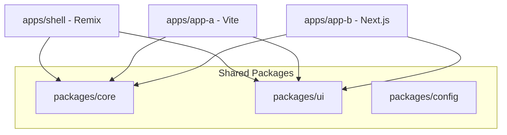

# Project Structure & File Guide

This document provides a detailed breakdown of the monorepo structure and the purpose of key files.

## 🗺️ Architectural Overview

---

## 📂 Root Directory

| File | Purpose |
|------|---------|
| `pnpm-workspace.yaml` | Defines the workspace structure (`apps/*`, `packages/*`). |
| `turbo.json` | Configures the **Turborepo** build pipeline (cache, dependencies). |
| `scripts/` | Project-wide utility scripts (e.g., `create-app.js`). |
| `package.json` | Root scripts for `dev`, `build`, `lint` acting as the command center. |

## 📁 apps/

### `apps/shell/` (Remix App Shell)
The brain of the platform. Orchestrates loading and mounting MFEs.

| Path | Purpose |
|------|---------|
| `app/components/MicroFrontendHost.tsx` | **CRITICAL**: Logic for Health Check, Manifest Load, and Script Injection. |
| `app/routes/` | Defines the main navigation routes and entry points for MFEs. |
| `app/server/config.server.ts` | Loader for Environment Variables (security boundary). |

### `apps/app-a/` (Vite React SPA)
A standard, lightweight Micro-Frontend.

| Path | Purpose |
|------|---------|
| `public/health.json` | Required status endpoint for the Shell to verify availability. |
| `public/manifest.json` | Asset map used to find the latest bundled scripts. |
| `src/entry-mfe.tsx` | The **Public API** contract (mount/unmount) exposed to the Shell. |

### `apps/app-b/` (Next.js)
A complex example showing Next.js + Vite MFE Build coexistence.

## 📁 packages/ (Shared Resources)

### `packages/core/`
The backbone of communication and shared logic.
- **Event Bus**: Singleton for cross-app messaging.
- **Contracts**: Shared interfaces and constants.

### `packages/ui/`
The **Single Source of Truth** for UI.
- **shadcn/ui**: Component library.
- **Tailwind Config**: Shared styles, colors, and typography.

### `packages/config/`
Tooling configurations (`eslint`, `tsconfig`).

---

## ⚡ Data Flow

1. **Discovery**: Shell reads configuration (MFE URLs).
2. **Validation**: Shell performs a health check on the MFE endpoint.
3. **Injection**: Shell loads the MFE's `manifest.json` and injects the script.
4. **Mounting**: Shell calls the globally exposed `mount` function from the MFE.
