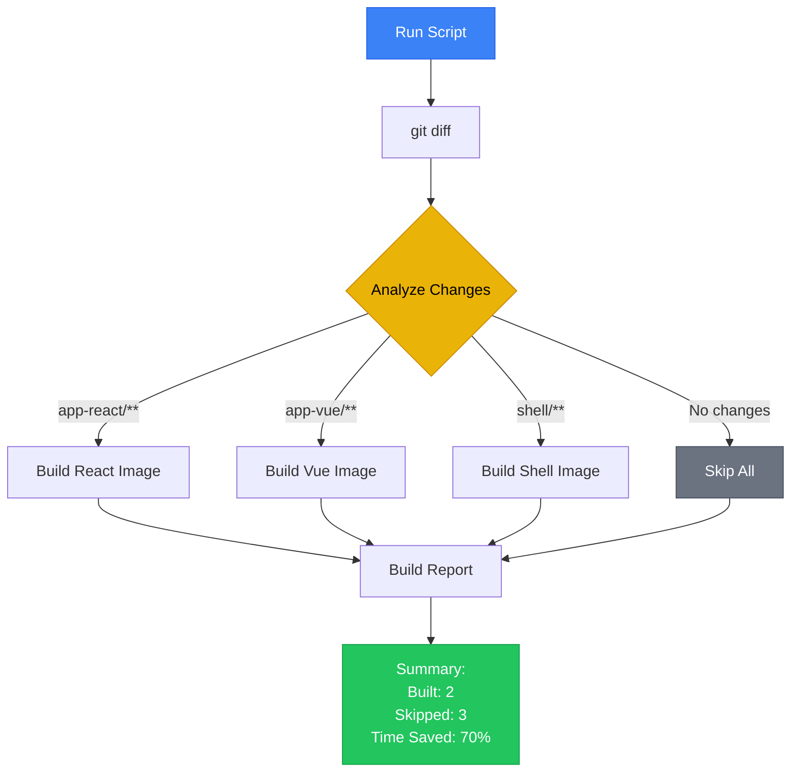

# Scripts Reference

Documentation for all automation scripts in the Orbit Micro-Frontend Platform.

```mermaid
graph TB
    subgraph Build ["Build Scripts"]
        B1[🔨 build-all-mfes.mjs]:::build
        B2[🏭 build-all-mfes-prod.mjs]:::build
    end

    subgraph Dev ["Development Scripts"]
        D1[📡 generate-dev-manifest.mjs]:::dev
        D2[🎯 get-mfe-filters.mjs]:::dev
    end

    subgraph Gen ["Generators"]
        G1[✨ cli.mjs]:::gen
        G2[🏠 create-app.mjs]:::gen
        G3[🎨 generate-ui.mjs]:::gen
    end

    subgraph Val ["Validation"]
        V1[✔️ validate-app-ids.mjs]:::val
        V2[⚙️ mfe.config.mjs]:::val
    end

    subgraph Docker ["Docker"]
        DK1[🐳 smart-docker-build.js]:::docker
    end

    Config[📝 mfe.config.mjs]:::config

    Config -.-> B1 & B2 & D1 & D2 & G2 & V1 & DK1

    classDef build fill:#3b82f6,stroke:#2563eb,color:#fff
    classDef dev fill:#22c55e,stroke:#16a34a,color:#fff
    classDef gen fill:#8b5cf6,stroke:#6d28d9,color:#fff
    classDef val fill:#eab308,stroke:#ca8a04,color:#000
    classDef docker fill:#06b6d4,stroke:#0891b2,color:#fff
    classDef config fill:#ec4899,stroke:#db2777,color:#fff
```



---

## Table of Contents

1. [Overview](#overview)
2. [Build Scripts](#build-scripts)
3. [Development Scripts](#development-scripts)
4. [Generator Scripts](#generator-scripts)
5. [Validation Scripts](#validation-scripts)
6. [Docker Scripts](#docker-scripts)
7. [Configuration](#configuration)

---

## Overview

All scripts are located in the `scripts/` directory and are written in modern JavaScript (ESM).

### Quick Reference

| Script                      | Purpose                          | Usage                         |
| --------------------------- | -------------------------------- | ----------------------------- |
| `build-all-mfes.mjs`        | Build all MFEs for development   | `pnpm build:mfes`             |
| `build-all-mfes-prod.mjs`   | Build all MFEs for production    | `pnpm build:mfes:prod`        |
| `cli.mjs`                   | Interactive CLI tool             | `pnpm cli`                    |
| `create-app.mjs`            | Generate new MFE app             | `pnpm create-app`             |
| `generate-ui.mjs`           | Generate UI component            | `pnpm generate-ui`            |
| `generate-dev-manifest.mjs` | Generate manifest for dev        | Auto-run with `pnpm dev`      |
| `generate-manifest.mjs`     | Generate manifest for production | Auto-run during build         |
| `validate-app-ids.mjs`      | Validate APP_IDS consistency     | `pnpm validate:app-ids`       |
| `smart-docker-build.js`     | Conditional Docker builds        | `pnpm docker:build:smart`     |
| `get-mfe-filters.mjs`       | Get Turborepo filters            | Auto-run with `pnpm dev:mfes` |
| `mfe.config.mjs`            | Central MFE configuration        | Imported by other scripts     |
| `onboard.sh`                | Initial setup script             | `bash scripts/onboard.sh`     |

---

## Build Scripts

### build-all-mfes.mjs

Builds all micro-frontends for **development** with Module Federation enabled.

**Location:** `scripts/build-all-mfes.mjs`

**Usage:**

```bash
# Via package.json script
pnpm build:mfes

# Direct execution
node scripts/build-all-mfes.mjs
```

**What it does:**

1. Reads app configurations from `mfe.config.mjs`
2. Builds each MFE with `MODE=development`
3. Enables Module Federation with remoteEntry
4. Runs builds in parallel using Turborepo

**Environment Variables:**

- `FILTER` - Build specific apps only (e.g., `FILTER=app-react`)

**Example:**

```bash
# Build only React app
FILTER=app-react pnpm build:mfes

# Build React and Vue apps
FILTER="app-react app-vue" pnpm build:mfes
```

**Output:**

```
Building MFEs for development...
✓ app-react built successfully
✓ app-vue built successfully
✓ app-svelte built successfully
```

---

### build-all-mfes-prod.mjs

Builds all micro-frontends for **production** with optimized bundles.

**Location:** `scripts/build-all-mfes-prod.mjs`

**Usage:**

```bash
# Via package.json script
pnpm build:mfes:prod

# Direct execution
NODE_ENV=production node scripts/build-all-mfes-prod.mjs
```

**What it does:**

1. Builds MFEs with `MODE=production`
2. Generates `manifest.json` for each MFE
3. Enables all production optimizations (minification, tree-shaking)
4. Generates health check files

**Differences from dev build:**

| Feature              | Development       | Production     |
| -------------------- | ----------------- | -------------- |
| **Loading Strategy** | Module Federation | Manifest-based |
| **Minification**     | No                | Yes            |
| **Source Maps**      | Inline            | Separate files |
| **remoteEntry.js**   | Generated         | Not used       |
| **manifest.json**    | Not generated     | Generated      |
| **Bundle Size**      | Larger            | Optimized      |

**Example:**

```bash
# Build for production
pnpm build:mfes:prod

# Check output
ls apps/app-react/dist/
# manifest.json, assets/, index.html, health.json
```

---

## Development Scripts

### generate-dev-manifest.mjs

Generates development `manifest.json` at project root for Module Federation.

**Location:** `scripts/generate-dev-manifest.mjs`

**Usage:**

```bash
# Auto-run when starting dev
pnpm dev

# Manual generation
node scripts/generate-dev-manifest.mjs
```

**What it does:**

1. Reads MFE configurations from `mfe.config.mjs`
2. Creates manifest pointing to local dev servers
3. Saves to `manifest.json` at project root

**Generated manifest example:**

```json
{
  "app-react": {
    "url": "http://localhost:8001",
    "entryFile": "remoteEntry.js",
    "framework": "react",
    "scope": "app_react"
  },
  "app-vue": {
    "url": "http://localhost:8003",
    "entryFile": "remoteEntry.js",
    "framework": "vue",
    "scope": "app_vue"
  }
}
```

**Used by:** Shell app to discover MFE dev servers

---

### get-mfe-filters.mjs

Generates Turborepo filter strings for MFE apps.

**Location:** `scripts/get-mfe-filters.mjs`

**Usage:**

```bash
# Auto-used in package.json scripts
pnpm dev:mfes

# See what it generates
node scripts/get-mfe-filters.mjs
# Output: --filter=app-react --filter=app-vue --filter=app-svelte
```

**What it does:**

1. Reads all MFE apps from `mfe.config.mjs`
2. Generates `--filter=app-name` for each
3. Outputs as space-separated string

**Used in:**

```json
// package.json
{
  "scripts": {
    "dev:mfes": "turbo run dev $(node scripts/get-mfe-filters.mjs)"
  }
}
```

---

## Generator Scripts

### cli.mjs

Interactive CLI for common tasks.

**Location:** `scripts/cli.mjs`

**Usage:**

```bash
pnpm cli
```

**Features:**

```
🚀 Orbit CLI
============
1. create-app     - Generate a new micro-frontend
2. generate-ui    - Generate a UI component
3. validate       - Run all validations
4. build          - Build specific apps
5. exit

Your choice (1-5):
```

**Example Session:**

```bash
$ pnpm cli
Your choice: 1

📦 App Name: my-dashboard
🎨 Framework (1=React, 2=Vue, 3=Svelte, 4=Solid): 1
✓ Created apps/my-dashboard
✓ Updated mfe.config.mjs
✓ Run 'pnpm install' to install dependencies
```

---

### create-app.mjs

Scaffolds a new micro-frontend application.

**Location:** `scripts/create-app.mjs`

**Usage:**

```bash
# Interactive mode
pnpm create-app

# Programmatic mode
node scripts/create-app.mjs --name=my-app --framework=react
```

**What it creates:**

```
apps/my-app/
├── package.json
├── vite.config.mts
├── tsconfig.json
├── index.html
├── entry-mfe.tsx        # MFE entry point
└── src/
    ├── App.tsx
    ├── main.tsx
    └── routes/
```

**Post-generation steps:**

1. Updates `scripts/mfe.config.mjs`
2. Assigns next available port
3. Configures Module Federation

**Follow-up:**

```bash
# Install dependencies
pnpm install

# Start development
pnpm dev
```

---

### generate-ui.mjs

Generates a new UI component for all frameworks.

**Location:** `scripts/generate-ui.mjs`

**Usage:**

```bash
# Interactive mode
pnpm generate-ui

# Direct mode
node scripts/generate-ui.mjs --name=Alert --category=feedback
```

**Interactive Prompts:**

```
Component name (PascalCase): Alert
Category (layout/forms/feedback/navigation): feedback
Generate Storybook stories? (y/n): y
```

**What it creates:**

```
packages/ui/
├── src/
│   ├── react/
│   │   └── alert.tsx
│   ├── vue/
│   │   └── alert.ts
│   ├── svelte/
│   │   └── alert.svelte
│   ├── solid/
│   │   └── alert.tsx
│   └── variants/
│       └── alert.ts          # Shared CVA variants
├── stories/
│   └── Alert.stories.tsx
└── README.md                 # Auto-updated
```

**Template Structure:**

```typescript
// Generated variant file
import { cva, type VariantProps } from "class-variance-authority";

export const alertVariants = cva("rounded-lg border p-4", {
  variants: {
    variant: {
      default: "bg-gray-100 text-gray-900",
      destructive: "bg-red-100 text-red-900",
    },
  },
  defaultVariants: {
    variant: "default",
  },
});

export type AlertVariants = VariantProps<typeof alertVariants>;
```

---

## Validation Scripts

### validate-app-ids.mjs

Validates APP_IDS consistency across the codebase.

**Location:** `scripts/validate-app-ids.mjs`

**Usage:**

```bash
# Via package.json
pnpm validate:app-ids

# Direct
node scripts/validate-app-ids.mjs
```

**What it checks:**

1. **Config consistency**: `@repo/config/src/constants.ts`
2. **MFE config**: `scripts/mfe.config.mjs`
3. **Shell routes**: `apps/shell/app/routes/dashboard/`
4. **Package exports**: `packages/config/package.json`

**Validation Rules:**

- Each MFE must have a unique APP_ID
- APP_ID must match folder name (kebab-case)
- APP_ID must be defined in constants
- Shell must have a route for each APP_ID

**Example Output:**

```
✓ Validating APP_IDS...
✓ All MFE apps have valid APP_IDS
✓ Shell routes match APP_IDS
✓ No duplicate APP_IDS found
✓ Validation passed!
```

**Error Example:**

```
✗ Validation failed!
✗ Missing APP_ID for 'app-react' in constants.ts
✗ Duplicate APP_ID 'vue' found in mfe.config.mjs
```

---

### mfe.config.mjs (validate)

Validates MFE configuration schema.

**Usage:**

```bash
pnpm validate:mfe-config
```

**What it validates:**

- Required fields: `name`, `framework`, `port`
- Valid framework values
- Port uniqueness and range (8001-9000)
- Entry file existence
- Output directory configuration

---

## Docker Scripts

### smart-docker-build.js

Conditionally builds Docker images based on changed files.

**Location:** `scripts/smart-docker-build.js`



**Usage:**

```bash
# Dry run (see what would be built)
node scripts/smart-docker-build.js

# Execute build
EXECUTE=true node scripts/smart-docker-build.js

# Force build all
FORCE_ALL=true EXECUTE=true node scripts/smart-docker-build.js

# Via package.json
pnpm docker:build:smart
```

**How it works:**

1. Uses `git diff` to detect changed files
2. Determines which apps are affected
3. Only builds Docker images for changed apps
4. Skips unchanged apps (huge time saver!)

**Example Output:**

```bash
$ EXECUTE=true node scripts/smart-docker-build.js

🚀 Starting Smart Docker Build...
Found app configurations: shell, app-react, app-vue, app-svelte

📊 Change Detection Results:
  ✓ apps/app-react/** (changed)
  ○ apps/app-vue/** (unchanged)
  ○ apps/shell/** (unchanged)

🏗️ Build list: app-react

Building Docker image for: app-react
  Command: docker build -t orbit-app-react:latest -f Dockerfile.mfe --build-arg APP_NAME=app-react .
  ✓ Successfully built orbit-app-react:latest

Summary:
  Built: 1
  Skipped: 2
```

**Environment Variables:**

- `EXECUTE=true` - Actually run docker build (default: dry run)
- `FORCE_ALL=true` - Build all apps regardless of changes
- `BASE_BRANCH=main` - Git branch to compare against
- `DRY_RUN=true` - Explicit dry run mode

**Per-app Configuration:**

Add `mfe` block to app's `package.json`:

```json
{
  "name": "app-react",
  "mfe": {
    "dockerfile": "Dockerfile.custom",
    "outputDir": "build",
    "imageName": "custom-image-name"
  }
}
```

**Use Cases:**

- CI/CD: Only rebuild changed apps
- Local development: Test Docker builds efficiently
- Monorepo optimization: Save build time and resources

---

## Configuration

### mfe.config.mjs

Central configuration for all micro-frontends.

**Location:** `scripts/mfe.config.mjs`

**Structure:**

```javascript
export const MFE_APPS = [
  {
    name: "app-react", // App folder name (kebab-case)
    framework: "react", // Framework type
    port: 8001, // Dev server port
    entryFile: "entry-mfe.tsx", // MFE entry point
    outputDir: "dist", // Build output directory
    scope: "app_react", // Module Federation scope
  },
  // ... more apps
];

export const SUPPORTED_FRAMEWORKS = [
  "react",
  "vue",
  "svelte",
  "solid",
  "nextjs",
];

export const PORT_RANGE = {
  min: 8001,
  max: 9000,
};
```

**Used by:**

- Build scripts
- Generator scripts
- Development manifest generation
- Docker build scripts
- Validation scripts

**Validation:**

```bash
# Validate configuration
node scripts/mfe.config.mjs

# Auto-validates on import
import { MFE_APPS } from "./scripts/mfe.config.mjs";
```

---

### onboard.sh

Initial setup script for new developers.

**Location:** `scripts/onboard.sh`

**Usage:**

```bash
bash scripts/onboard.sh
```

**What it does:**

1. ✅ Checks Node.js version (>= 18)
2. ✅ Checks pnpm version (>= 8)
3. ✅ Copies `.env.example` to `.env`
4. ✅ Copies `apps/shell/.env.example` to `apps/shell/.env`
5. ✅ Runs `pnpm install`
6. ✅ Builds packages: `pnpm build:packages`
7. ✅ Validates APP_IDS
8. ✅ Generates dev manifest
9. ✅ Displays next steps

**Example Output:**

```bash
$ bash scripts/onboard.sh

========================================
  Orbit Platform - Developer Onboarding
========================================

[1/9] Checking Node.js version...
  ✓ Node.js v18.17.0 detected

[2/9] Checking pnpm version...
  ✓ pnpm 8.6.0 detected

[3/9] Setting up environment files...
  ✓ Created .env
  ✓ Created apps/shell/.env

[4/9] Installing dependencies...
  ✓ Dependencies installed

[5/9] Building shared packages...
  ✓ Packages built

[6/9] Validating configuration...
  ✓ Validation passed

[7/9] Generating development manifest...
  ✓ manifest.json created

========================================
  ✅ Setup Complete!
========================================

Next steps:
  1. Start development: pnpm dev
  2. Open browser: http://localhost:8000
  3. Read docs: cat docs/GETTING_STARTED.md
```

---

## Script Development

### Adding a New Script

1. **Create script file**:

```javascript
#!/usr/bin/env node
// scripts/my-script.mjs
import { MFE_APPS } from "./mfe.config.mjs";

console.log("Running my script...");
// Script logic here
```

1. **Make executable** (optional):

```bash
chmod +x scripts/my-script.mjs
```

1. **Add to package.json**:

```json
{
  "scripts": {
    "my-script": "node scripts/my-script.mjs"
  }
}
```

1. **Document in this file**: Add entry above

### Best Practices

- ✅ Use ESM modules (`.mjs`)
- ✅ Add error handling
- ✅ Provide helpful output
- ✅ Support dry-run mode
- ✅ Use color-coded output
- ✅ Accept environment variables
- ✅ Document usage in this file

---

## Related Documentation

- [Getting Started](../docs/GETTING_STARTED.md) - Development setup
- [Architecture](../docs/ARCHITECTURE.md) - MFE configuration details
- [Deployment](../docs/DEPLOYMENT.md) - Build and deploy process
- [Contributing](../CONTRIBUTING.md) - Development workflow

---

## Debugging Scripts

```bash
# Run script with verbose output
NODE_DEBUG=* node scripts/build-all-mfes.mjs

# Check script syntax
node --check scripts/my-script.mjs

# Dry run most scripts
DRY_RUN=true node scripts/smart-docker-build.js

# Enable debug mode
DEBUG=true node scripts/build-all-mfes.mjs
```

---

**Need help with a script? Check the source code or ask in GitHub Discussions!**
