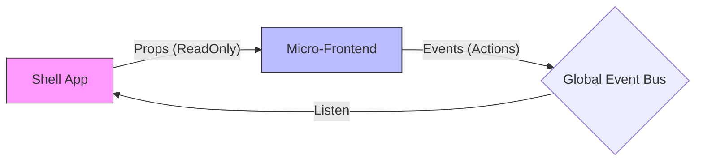
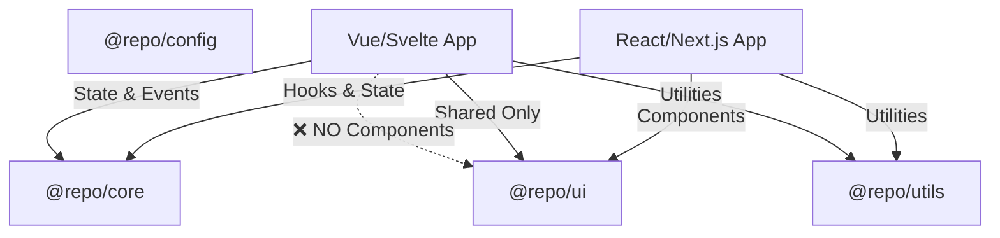

# 📏 Standards & Conventions

This document outlines the coding standards, structural conventions, and best practices for the **Orbit** platform.

---

## 📑 Table of Contents

1. [Code Style](#1-code-style)
2. [Naming Conventions](#2-naming-conventions)
3. [Application Structure](#3-application-structure)
4. [Micro-Frontend Rules](#4-micro-frontend-rules)
5. [UI & Styling](#5-ui--styling)
6. [Package & Import Guidelines](#6-package--import-guidelines)
7. [Git Workflow](#7-git-workflow)
8. [Git Hooks (Husky)](#8-git-hooks-husky)
9. [Testing Standards](#9-testing-standards)
10. [Documentation](#10-documentation)

---

## 1. Code Style

### TypeScript

- **Strict mode** enabled for all packages
- **No explicit `any`** unless absolutely necessary for boundary types
- Use **interfaces** for object shapes, **types** for unions/primitives
- Prefer **const assertions** for literal types

```typescript
// ✅ Good
interface UserProps {
  id: string;
  name: string;
  role: "admin" | "user";
}

// ❌ Bad
type UserProps = any;
```

### Linting & Formatting

- **ESLint**: Shared config from `@repo/config/eslint-preset.cjs`
- **Prettier**: Enforced via git hooks
- Run before committing: `pnpm lint` and `pnpm lint:fix`

```bash
# Check linting
pnpm lint

# Auto-fix issues
pnpm lint:fix
```

### File Organization

```typescript
// Order of imports
// 1. External packages
import { useState } from "react";
import { cn } from "@repo/utils";

// 2. Internal packages
import { Button } from "@repo/ui/react";
import { EventBus } from "@repo/core";

// 3. Relative imports
import { useLocalState } from "./hooks";
import { UserCard } from "./components";

// 4. Types (last)
import type { User } from "./types";
```

---

## 2. Naming Conventions

### Files & Directories

| Item            | Convention       | Example                             |
| :-------------- | :--------------- | :---------------------------------- |
| **Files**       | kebab-case       | `user-profile.tsx`, `login-form.ts` |
| **Directories** | kebab-case       | `components/ui/`, `features/auth/`  |
| **Test files**  | `.test.ts(x)`    | `button.test.tsx`, `utils.test.ts`  |
| **Story files** | `.stories.ts(x)` | `button.stories.tsx`                |

### Code Symbols

| Item           | Convention       | Example                           |
| :------------- | :--------------- | :-------------------------------- |
| **Components** | PascalCase       | `UserProfile`, `LoginForm`        |
| **Functions**  | camelCase        | `handleSubmit`, `fetchData`       |
| **Variables**  | camelCase        | `userName`, `isLoading`           |
| **Constants**  | UPPER_SNAKE_CASE | `API_URL`, `MAX_RETRIES`          |
| **Types**      | PascalCase       | `UserProps`, `ApiResponse`        |
| **Interfaces** | PascalCase       | `IUserService` or `UserService`   |
| **Enums**      | PascalCase       | `UserRole.Admin`, `Status.Active` |
| **Hooks**      | useCamelCase     | `useAuth`, `useLocalStorage`      |

### Component Naming

```tsx
// ✅ Good - descriptive, PascalCase
function UserProfileCard({ user }: UserProfileCardProps) {}

// ❌ Bad - unclear, not descriptive
function Card({ data }: CardProps) {}
```

---

## 3. Application Structure

We follow a **Feature-Based** architecture. Group files by business logic rather than technical type.

### MFE Structure

```text
apps/app-react/
├── src/
│   ├── entry-mfe.tsx        # MFE entry point (required)
│   ├── main.tsx             # Standalone entry
│   ├── App.tsx              # Root component
│   │
│   ├── features/            # Feature modules
│   │   ├── dashboard/
│   │   │   ├── components/  # Feature-specific components
│   │   │   ├── hooks/       # Feature-specific hooks
│   │   │   ├── api/         # API calls
│   │   │   ├── types.ts     # Types
│   │   │   └── index.ts     # Public exports
│   │   │
│   │   └── settings/
│   │       ├── components/
│   │       ├── hooks/
│   │       └── index.ts
│   │
│   ├── shared/              # Shared within this app
│   │   ├── components/      # Shared components
│   │   ├── hooks/           # Shared hooks
│   │   └── utils/           # Shared utilities
│   │
│   └── assets/              # Static assets
│
├── public/
│   ├── health.json          # Health check (required)
│   └── manifest.json        # MFE manifest (required)
│
└── package.json
```

### Feature Module Pattern

```typescript
// features/dashboard/index.ts - Public API
export { DashboardPage } from "./components/DashboardPage";
export { useDashboardData } from "./hooks/useDashboardData";
export type { DashboardProps } from "./types";

// Only export what's needed publicly
// Keep internal components private
```

---

## 4. Micro-Frontend Rules

### Rule 1: Isolation

An MFE must **NEVER** import code directly from `apps/shell` or another MFE.

```typescript
// ❌ FORBIDDEN - Direct import from another app
import { ShellHeader } from "../../shell/app/components";
import { useVueStore } from "../../app-vue/src/stores";

// ✅ CORRECT - Use shared packages
import { EventBus, useUserStore } from "@repo/core";
import { Button } from "@repo/ui/react";
```

### Rule 2: Communication via Events

MFEs communicate through the EventBus, not direct method calls:

```typescript
// ✅ CORRECT - Event-based communication
import { EventBus } from "@repo/core";

// Request navigation
EventBus.emit("nav:navigate", { path: "/settings" });

// Show notification
EventBus.emit("notification:show", {
  type: "success",
  message: "Saved!",
});
```

### Rule 3: Props vs Events

| Pattern    | Use Case                     | Example                   |
| ---------- | ---------------------------- | ------------------------- |
| **Props**  | Read-only context from Shell | Session, Theme, Locale    |
| **Events** | Actions/side effects         | Navigation, Notifications |



### Rule 4: Required Files

Every MFE must have:

```text
public/
├── health.json     # Required for health checks
└── manifest.json   # Required for MFE discovery
```

```json
// health.json
{
  "status": "up",
  "version": "1.0.0",
  "timestamp": "2024-01-20T00:00:00Z"
}

// manifest.json
{
  "name": "app-react",
  "version": "1.0.0",
  "entry": "./remoteEntry.js"
}
```

### Rule 5: Cleanup on Unmount

Always clean up resources when unmounting:

```typescript
// entry-mfe.tsx
unmount: (container) => {
  // Clean up subscriptions
  // Clear intervals/timeouts
  // Dispose event listeners
  container._reactRoot?.unmount();
};
```

---

## 5. UI & Styling

### Design System

Use `@repo/ui` for all core components:

```typescript
// ✅ CORRECT - Use design system
import { Button, Card, Input } from "@repo/ui/react";

// ❌ AVOID - Custom implementations of existing components
const MyButton = styled.button`...`;
```

### Tailwind CSS

- Use **design tokens** over arbitrary values
- Avoid hardcoded hex colors for Dark Mode compatibility
- Use the `cn()` utility for conditional classes

```tsx
import { cn } from '@repo/utils';

// ✅ Good - Uses design tokens
<div className={cn(
  'bg-background text-foreground',
  'rounded-lg p-4',
  isActive && 'bg-primary text-primary-foreground'
)} />

// ❌ Bad - Hardcoded values
<div className="bg-[#1a1a1a] text-[#ffffff] rounded-[12px] p-[16px]" />
```

### CSS Variables

All colors should use CSS variables for theming:

```css
/* ✅ Good - Theme-aware */
.card {
  background: hsl(var(--card));
  color: hsl(var(--card-foreground));
}

/* ❌ Bad - Hardcoded */
.card {
  background: #ffffff;
  color: #000000;
}
```

### Shared Variants (CVA)

Use shared variants for consistent styling across frameworks:

```typescript
import { buttonVariants } from "@repo/ui/shared";
import { cn } from "@repo/utils";

// Works in any framework
const classes = cn(buttonVariants({ variant: "default", size: "lg" }));
```

---

## 6. Package & Import Guidelines

### Import Rules by Package



### @repo/config

Build and environment configurations. Use in config files only:

```typescript
// ✅ In vite.config.mts
import { createMfeConfig, APP_IDS, PORTS } from "@repo/config/vite";

export default createMfeConfig({
  appName: APP_IDS.APP_REACT,
  port: PORTS.APP_REACT,
});

// ❌ In runtime code - avoid importing heavy config
import { PORTS } from "@repo/config/vite";
```

### @repo/ui

Multi-framework design system:

```typescript
// React/Next.js Apps
import { Button, Card } from "@repo/ui/react";
import "@repo/ui/globals.css";

// Vue Apps
import { Button, Card } from "@repo/ui/vue";
import "@repo/ui/globals.css";

// Svelte Apps
import { Button, Card } from "@repo/ui/svelte";
import "@repo/ui/globals.css";

// SolidJS Apps
import { Button, Card } from "@repo/ui/solid";
import "@repo/ui/globals.css";

// Shared variants (any framework)
import { buttonVariants, cardVariants } from "@repo/ui/shared";
```

### @repo/core

State management and MFE utilities:

```typescript
// EventBus
import { EventBus } from "@repo/core";

// Stores
import { useUserStore, useThemeStore, useLocaleStore } from "@repo/core";

// MFE utilities
import { createMfeEntry, AppRegistry } from "@repo/core";

// Logger
import { Logger } from "@repo/core";
```

### @repo/utils

General utilities:

```typescript
import { cn } from "@repo/utils";

const className = cn("base-class", isActive && "active-class");
```

---

## 7. Git Workflow

### Branch Naming

```
type/description
```

| Type       | Description       | Example               |
| ---------- | ----------------- | --------------------- |
| `feat`     | New feature       | `feat/user-dashboard` |
| `fix`      | Bug fix           | `fix/login-error`     |
| `refactor` | Code refactoring  | `refactor/auth-flow`  |
| `docs`     | Documentation     | `docs/api-reference`  |
| `chore`    | Maintenance tasks | `chore/update-deps`   |
| `test`     | Testing           | `test/unit-tests`     |

### Commit Messages

Follow [Conventional Commits](https://www.conventionalcommits.org/):

```
type(scope): description

[optional body]

[optional footer]
```

**Types:**

- `feat`: New feature
- `fix`: Bug fix
- `docs`: Documentation changes
- `refactor`: Code change that neither fixes a bug nor adds a feature
- `test`: Adding or modifying tests
- `chore`: Maintenance tasks
- `style`: Formatting, white-space (not CSS)
- `perf`: Performance improvements

**Examples:**

```bash
# Feature
git commit -m "feat(dashboard): add user activity chart"

# Bug fix with scope
git commit -m "fix(auth): resolve token refresh loop"

# Documentation
git commit -m "docs: update API reference for EventBus"

# Breaking change
git commit -m "feat(core)!: change EventBus API

BREAKING CHANGE: emit() now requires object payload"
```

### Pull Request Guidelines

1. **Title**: Use conventional commit format
2. **Description**: Explain what, why, and how
3. **Testing**: Describe how you tested
4. **Screenshots**: For UI changes
5. **Breaking Changes**: Highlight prominently

---

## 8. Git Hooks (Husky)

We use Husky to enforce quality standards:

### Pre-commit Hook

Runs on every commit:

```bash
# .husky/pre-commit
pnpm lint-staged
pnpm validate:app-ids
```

**lint-staged config:**

```json
{
  "*.{js,jsx,ts,tsx,mjs,cjs}": ["eslint --fix"],
  "*.{json,md,yml,yaml}": ["prettier --write"]
}
```

### Commit-msg Hook

Validates commit message format:

```bash
# .husky/commit-msg
npx --no -- commitlint --edit $1
```

### Pre-push Hook

Runs before pushing:

```bash
# .husky/pre-push
pnpm type-check
```

### Bypassing Hooks (Emergency Only)

```bash
# ⚠️ Only use in emergencies
git commit --no-verify -m "emergency fix"
git push --no-verify
```

---

## 9. Testing Standards

### Test File Naming

```text
component.test.tsx    # Unit tests
feature.spec.ts       # Integration tests
e2e.spec.ts          # E2E tests (Playwright)
```

### Test Structure

```typescript
describe('ComponentName', () => {
  describe('when condition', () => {
    it('should expected behavior', () => {
      // Arrange
      const props = { ... };

      // Act
      render(<Component {...props} />);

      // Assert
      expect(screen.getByText('...')).toBeInTheDocument();
    });
  });
});
```

### Test Commands

```bash
# Run all tests
pnpm test

# Run specific package tests
pnpm test --filter=@repo/core

# Watch mode
pnpm test --watch

# Coverage report
pnpm test --coverage
```

---

## 10. Documentation

### Code Comments

````typescript
/**
 * Mounts a micro-frontend application into a container element.
 *
 * @param container - The DOM element to mount into
 * @param props - Initial props passed from the Shell
 * @returns A cleanup function or mounted instance
 *
 * @example
 * ```tsx
 * mount(document.getElementById('mfe-root'), {
 *   session: { user: currentUser },
 *   theme: 'dark'
 * });
 * ```
 */
function mount(container: HTMLElement, props: MfeProps): MountResult {
  // ...
}
````

### README Guidelines

Each package should have a README with:

1. **Description** - What the package does
2. **Installation** - How to install
3. **Usage** - Basic examples
4. **API Reference** - Exports and types
5. **Examples** - Real-world usage

### Documentation Files

| File                      | Content                       |
| ------------------------- | ----------------------------- |
| `README.md`               | Project overview, quick start |
| `docs/GETTING_STARTED.md` | Setup and installation        |
| `docs/TUTORIAL.md`        | Step-by-step guides           |
| `docs/ARCHITECTURE.md`    | System design                 |
| `docs/STANDARDS.md`       | This file                     |
| `docs/DEPLOYMENT.md`      | CI/CD and production          |

---

## 📚 Related Documentation

- [Getting Started](./GETTING_STARTED.md) - Local development setup
- [Tutorial](./TUTORIAL.md) - Hands-on development guide
- [Architecture](./ARCHITECTURE.md) - System design and patterns
- [Deployment](./DEPLOYMENT.md) - CI/CD and production setup
