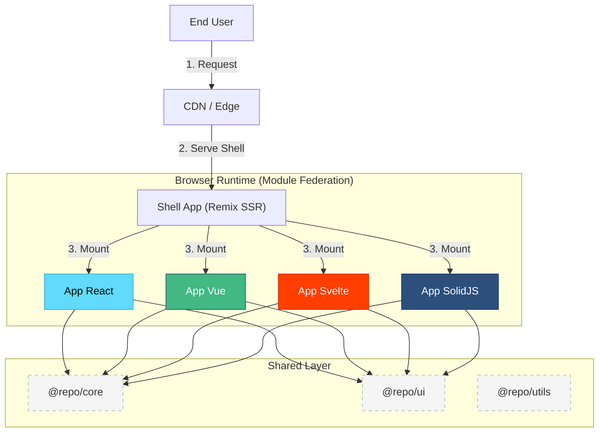
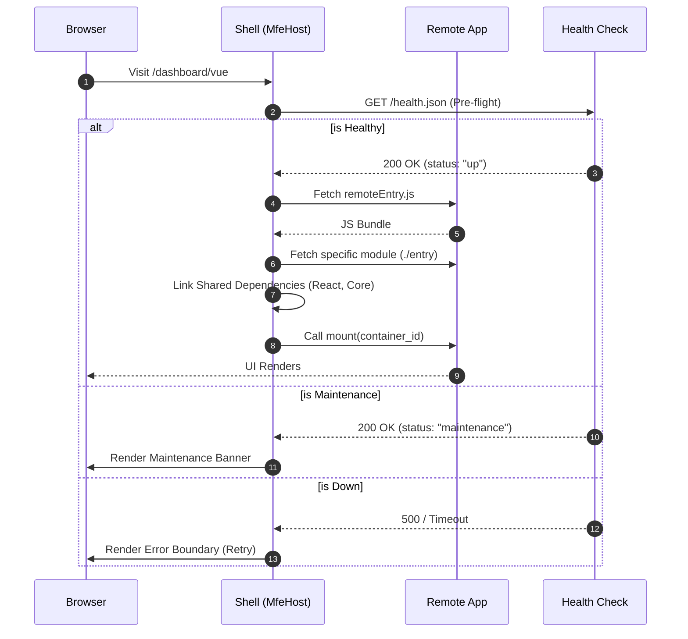
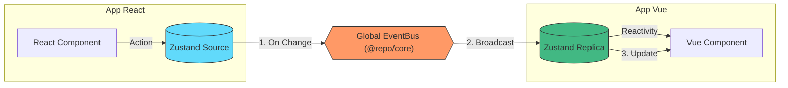
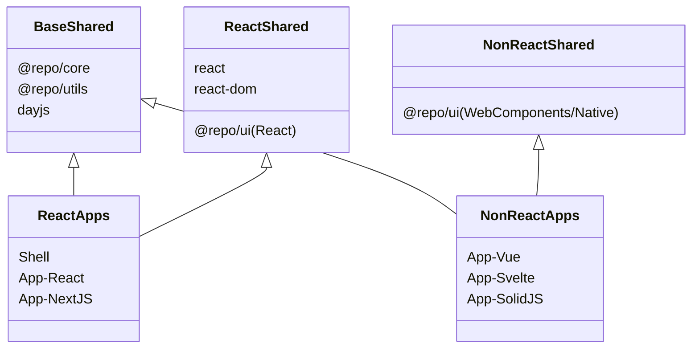
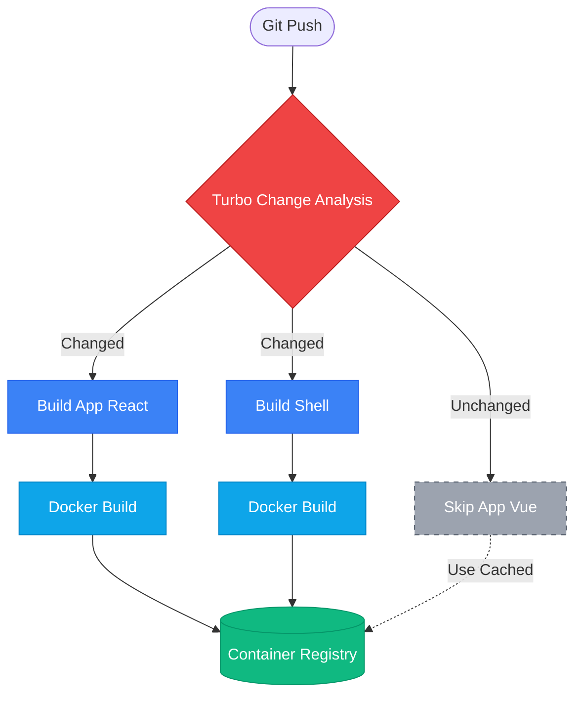

# 🧠 Technical Overview & System Design

As a Senior Architect, this document outlines the core technical decisions, patterns, and visual architectures that make this platform scalable and framework-agnostic.

## 1. High-Level Architecture

The platform follows a **Hub-and-Spoke** architecture where the Remix Shell acts as the orchestrator for various micro-frontends.

---

## 2. MFE Orchestration Lifecycle

The `MfeHost` component manages the lifecycle of a remote application. It handles loading, mounting, error boundaries, and maintenance modes.

---

## 3. Cross-Framework State Syncing (EventBus)

We use a **Distributed State Pattern**. Each app has its own local Zustand store, kept in sync via a global `EventBus` in `@repo/core`.

---

## 4. Federated Dependency Sharing

We optimize bundle sizes by selectively sharing dependencies based on the consumer's framework.

---

## 5. Deployment Strategy (Smart Builds)

Our CI/CD pipeline uses `smart-docker-build.js` to minimize build times and costs.

---

## 6. Decision Log (ADR)

| Decision            | Logic                                                                  |
| :------------------ | :--------------------------------------------------------------------- |
| **Remix for Shell** | Excellent SSR capabilities, routing, and DX for the host application.  |
| **Vite for MFEs**   | Lightning-fast builds and great Module Federation support via plugins. |
| **Zustand Vanilla** | Avoids framework lock-in for core logic.                               |
| **pnpm Workspaces** | Efficient disk usage and strict dependency management.                 |
