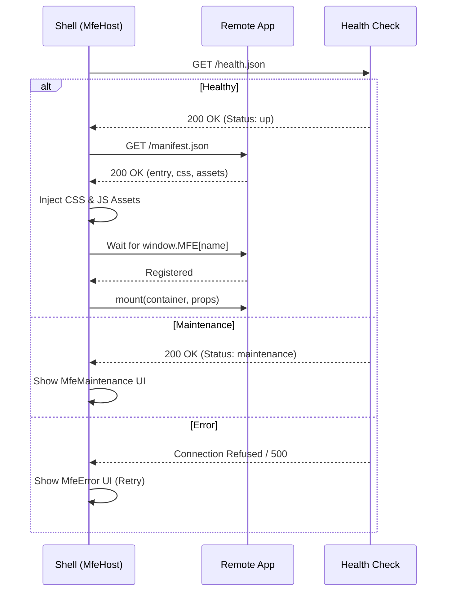
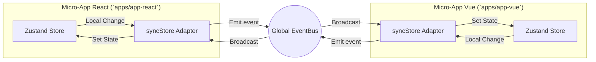

# 🧠 Technical Overview & System Design

As a Senior Architect, this document outlines the core technical decisions and patterns that make this platform scalable and framework-agnostic.

## 1. MFE Orchestration Lifecycle

The `MfeHost` component manages the lifecycle of a remote application. It doesn't just "load" a script; it follows a robust orchestration pattern:

## 2. Cross-Framework State Syncing

We use **Zustand** as our state management library because of its minimalist "vanilla" nature, which allows it to run in any JS environment (React, Vue, Svelte, or pure JS).

### State Synchronization Flow

The `syncStore` utility ensures that when state changes in App React, it is reflected in App Vue via the `EventBus`.

## 3. Deployment Strategy (Smart Builds)

In a large monorepo, we avoid building everything on every commit. Our `smart-docker-build.js` script analyzes changed files using Turborepo's hashing and only builds the affected Docker images.

## 4. Design System Architecture

The `@repo/ui` package is the single source of truth for design.

- **Styling**: Tailwind CSS with shared configuration in `@repo/config`.
- **Components**: Framer Motion for animations, Radix UI for primitives.
- **Versioning**: Consumers use the workspace version during development and can be pinned in production.

## Architecture Overview

### 1. Routing Convention (Shell)

The Shell application uses a **Next.js-style folder-based routing** system:

- `app/routes/folder/page.tsx` -> `/folder`
- `app/routes/folder/layout.tsx` -> Layout for `/folder` path.
  This is implemented via a custom Vite plugin configuration bridging to Remix.

### 2. Module Federation

Lightning-fast builds and great Module Federation support via plugins.

## 5. Decision Log (ADR)

| Decision            | Logic                                                                  |
| :------------------ | :--------------------------------------------------------------------- |
| **Remix for Shell** | Excellent SSR capabilities, routing, and DX for the host application.  |
| **Vite for MFEs**   | Lightning-fast builds and great Module Federation support via plugins. |
| **Zustand Vanilla** | Avoids framework lock-in for core logic.                               |
| **pnpm Workspaces** | Efficient disk usage and strict dependency management.                 |
