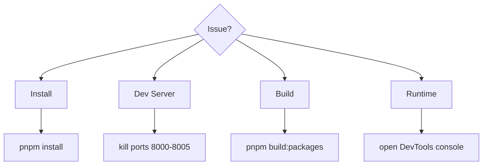

# Troubleshooting

Quick fixes for the most common issues.



---

## Install Issues

```bash
pnpm store prune
rm -rf node_modules
pnpm install
```

---

## Dev Server Issues

```bash
pnpm kill-ports
pnpm dev:all
```

---

## Build Issues

```bash
pnpm build:packages
pnpm build:apps
```

---

## Runtime Issues

- Open DevTools → Console
- Look for Module Federation load errors
- Refresh shell after restarting MFEs
