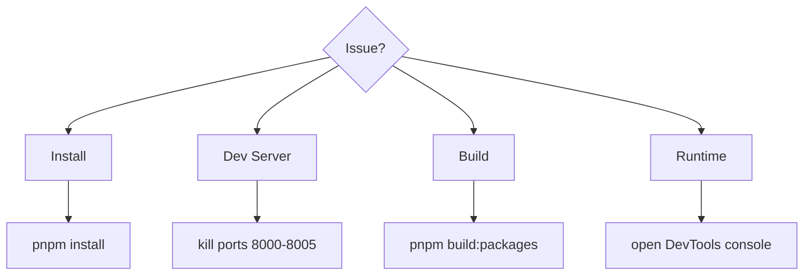

# Troubleshooting

Quick fixes for the most common issues.



---

## Install Issues

```bash
pnpm store prune
rm -rf node_modules
pnpm install
```

---

## Dev Server Issues

```bash
pnpm kill-ports
pnpm dev:all
```

---

## Build Issues

```bash
pnpm build:packages
pnpm build:apps
```

---

## Runtime Issues

- Open DevTools → Console
- Look for Module Federation load errors
- Refresh shell after restarting MFEs

### "Timeout waiting for MicroApp \"<name>\" to register"

`MfeHost` waits for the remote to call `AppRegistry.register()`, which dispatches an `mfe:registered` event on `window`. If this times out (default 5s):

- Confirm the remote's entry script actually loaded (Network tab — check for a 404 or CORS error on the entry JS/manifest).
- Confirm the remote calls `AppRegistry.register(appId, ...)` (usually via one of the `create*MfeEntry` factories in `@repo/core`) and that `appId` matches the `name` prop passed to `MfeHost`.
- If the remote registers before `MfeHost` mounts (e.g. a fast page reload with an already-cached script), this is fine — `MfeHost` checks `window.MFE[name]` synchronously before falling back to the event listener.

### "Invalid MFE host configuration for \"<name>\""

`MfeHost` now rejects any `host` that isn't a well-formed `http(s)` URL before using it (see [docs/ARCHITECTURE.md § Security Considerations](ARCHITECTURE.md#security-considerations)). Check the `host` value being passed in — it should come from `apps/shell/app/server/config.ts`, not be hand-constructed from user input.

### "Mount timeout for \"<appId>\" after Nms"

`MountManager.mount()` now aborts if the mount (including any `onBeforeMount`/`onAfterMount` hooks) doesn't resolve within the configured `timeout` (default 10s). If you see this, check whether a lifecycle hook is awaiting something that never resolves (e.g. a network call with no timeout of its own).
