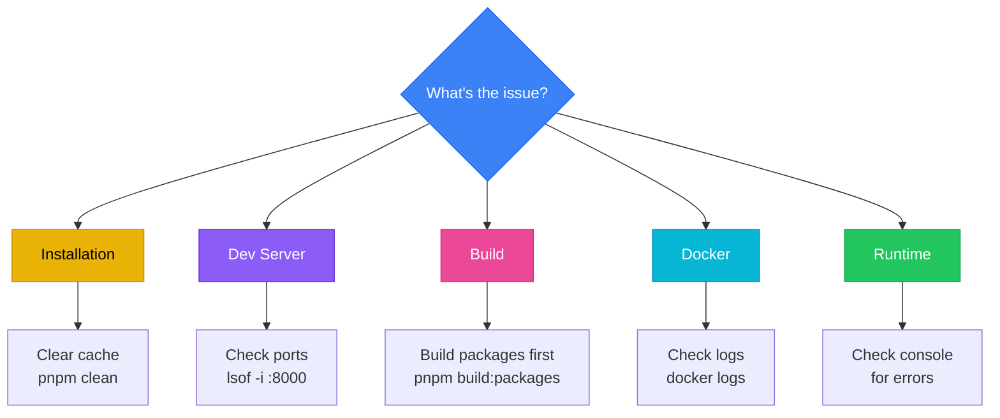
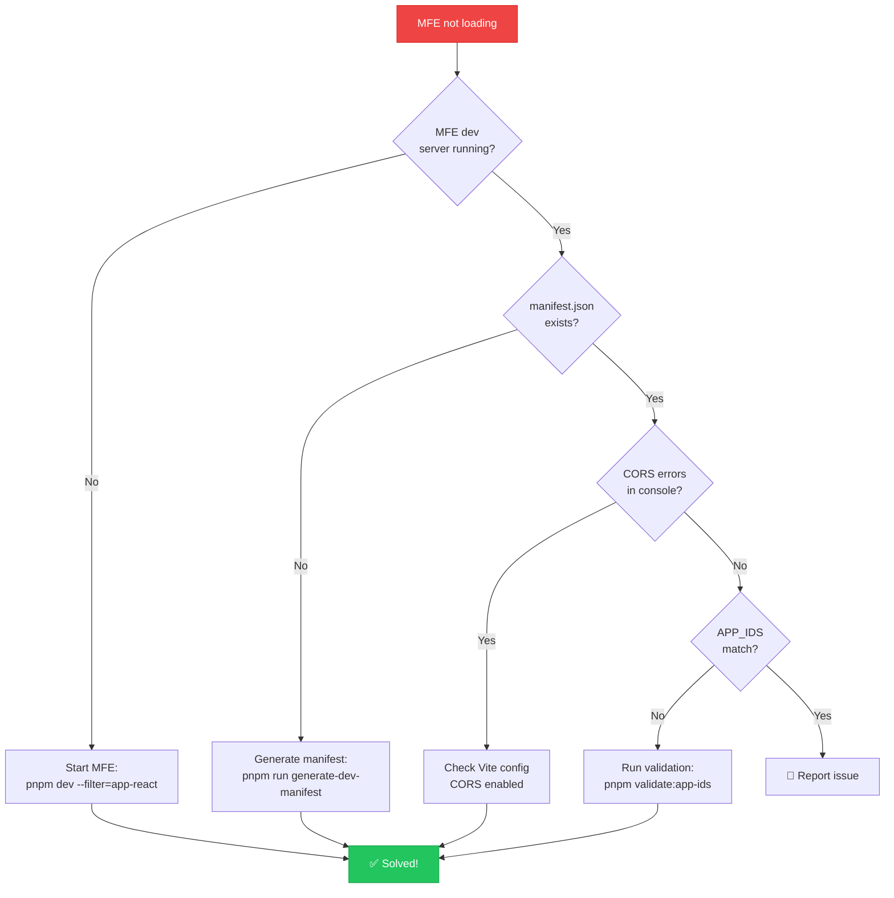

# Troubleshooting Guide

Common issues and solutions for the Orbit Micro-Frontend Platform.



---

## Table of Contents

1. [Installation Issues](#installation-issues)
2. [Development Server Issues](#development-server-issues)
3. [Build Issues](#build-issues)
4. [Module Federation Issues](#module-federation-issues)
5. [Docker Issues](#docker-issues)
6. [CI/CD Issues](#cicd-issues)
7. [Runtime Issues](#runtime-issues)
8. [Performance Issues](#performance-issues)
9. [Getting Help](#getting-help)

---

## Installation Issues

### pnpm install fails

**Problem:** Installation fails or hangs

**Solutions:**

```bash
# Clear pnpm cache
pnpm store prune

# Remove node_modules and reinstall
rm -rf node_modules
rm pnpm-lock.yaml
pnpm install

# Use specific Node version
nvm use 18
pnpm install
```

### Node version mismatch

**Problem:** `Error: The engine "node" is incompatible with this module`

**Solution:**

```bash
# Check required version
cat package.json | grep "engines" -A 2

# Install correct version
nvm install 18
nvm use 18

# Or update your system Node.js
```

### Workspace dependency resolution fails

**Problem:** `ERR_PNPM_WORKSPACE_PKG_NOT_FOUND`

**Solution:**

```bash
# Ensure all packages are built
pnpm build:packages

# Check workspace configuration
cat pnpm-workspace.yaml

# Verify package names match in package.json files
grep -r "\"name\":" packages/*/package.json
```

---

## Development Server Issues

### Port already in use

**Problem:** `Error: listen EADDRINUSE: address already in use :::8000`

**Solution:**

```bash
# Find process using the port
lsof -i :8000

# Kill the process
kill -9 <PID>

# Or use a different port
PORT=8010 pnpm dev:shell
```

### MFE not loading in Shell

**Problem:** MFE shows "Loading..." indefinitely



**Solutions:**

1. **Check if MFE dev server is running**:

```bash
# Check running processes
ps aux | grep vite

# Ensure MFE is running
cd apps/app-react
pnpm dev
```

1. **Verify manifest.json**:

```bash
# Should be auto-generated at root
cat manifest.json

# Regenerate if missing
pnpm run generate-dev-manifest
```

1. **Check console for CORS errors**:

```typescript
// In browser console, you might see:
// Access to fetch at 'http://localhost:8001' has been blocked by CORS policy

// Solution: Ensure Vite dev server has CORS enabled
// vite.config.ts already includes this
```

1. **Verify APP_IDS match**:

```bash
pnpm validate:app-ids
```

### Hot Module Replacement not working

**Problem:** Changes don't reflect without full page reload

**Solutions:**

```bash
# Clear Vite cache
rm -rf apps/*/node_modules/.vite
rm -rf .turbo

# Restart dev server
pnpm dev
```

### TypeScript errors in editor but build works

**Problem:** VS Code shows errors but `pnpm build` succeeds

**Solutions:**

1. **Restart TypeScript server**: `Cmd+Shift+P` → "TypeScript: Restart TS Server"
2. **Clear VS Code cache**: `Cmd+Shift+P` → "Developer: Reload Window"
3. **Check tsconfig.json paths**:

```json
{
  "compilerOptions": {
    "paths": {
      "@repo/*": ["../../packages/*/src"]
    }
  }
}
```

---

## Build Issues

### Build fails with type errors

**Problem:** `TS2307: Cannot find module '@repo/core'`

**Solutions:**

```bash
# Build packages first
pnpm build:packages

# Clean and rebuild
pnpm clean:cache
pnpm install
pnpm build
```

### Build succeeds but bundle size is too large

**Problem:** Bundle size is unexpectedly large

**Solutions:**

1. **Analyze bundle**:

```bash
# Build with analysis
ANALYZE=true pnpm build --filter app-react

# Check for duplicate dependencies
pnpm list react
```

1. **Verify tree-shaking**:

```json
// package.json
{
  "sideEffects": false
}
```

1. **Check shared dependencies**:

```typescript
// vite.config.ts
import { baseShared } from "@repo/config";

federation({
  shared: [...baseShared], // Ensure shared properly
});
```

### Production build fails but dev works

**Problem:** `pnpm build:mfes:prod` fails

**Solutions:**

```bash
# Check for environment-specific issues
NODE_ENV=production pnpm build

# Verify environment variables
cat .env
cat apps/shell/.env

# Check for dynamic imports
# Ensure all dynamic imports are properly typed
```

---

## Module Federation Issues

### remoteEntry.js 404 error

**Problem:** `Failed to load remote entry from http://localhost:8001/remoteEntry.js`

**Solutions:**

1. **Development**: Ensure dev server is running
2. **Production**: Check manifest.json exists

```bash
# Development
curl http://localhost:8001/remoteEntry.js

# Production
curl http://localhost:8001/manifest.json
```

1. **Verify publicPath**:

```typescript
// vite.config.ts
build: {
  manifest: true,
  rollupOptions: {
    output: {
      publicPath: 'auto'
    }
  }
}
```

### Module Federation type errors

**Problem:** `Property 'app_react' does not exist on type 'Window'`

**Solutions:**

```typescript
// Ensure remotes.d.ts exists
// apps/shell/remotes.d.ts
declare module "app_react/App" {
  const App: React.ComponentType;
  export default App;
}
```

### Shared dependencies not working

**Problem:** Multiple React instances in runtime

**Solutions:**

```typescript
// vite.config.ts - Ensure singleton
federation({
  shared: {
    react: {
      singleton: true,
      requiredVersion: "^18.0.0",
    },
    "react-dom": {
      singleton: true,
      requiredVersion: "^18.0.0",
    },
  },
});
```

---

## Docker Issues

### Docker build fails

**Problem:** `ERROR [internal] load metadata for docker.io/library/node:20-alpine`

**Solutions:**

```bash
# Check Docker daemon
docker ps

# Login if using private registry
docker login

# Build with verbose output
docker build --progress=plain -t orbit-shell -f apps/shell/Dockerfile .
```

### pnpm-lock.yaml not found in Docker

**Problem:** `ERROR: pnpm-lock.yaml not found`

**Solutions:**

```bash
# Ensure lock file is committed
git add pnpm-lock.yaml
git commit -m "chore: add lock file"

# Check .dockerignore doesn't exclude it
cat .dockerignore | grep -v "^#" | grep pnpm
```

### Docker image too large

**Problem:** Docker image is several GB

**Solutions:**

```dockerfile
# Use multi-stage builds (already implemented)
# Ensure .dockerignore is properly configured
# .dockerignore
node_modules
.git
*.log
dist
.turbo
```

### Container starts but MFEs don't load

**Problem:** Shell loads but MFEs show 404

**Solutions:**

1. **Check port mappings**:

```yaml
# docker-compose.yml
services:
  shell:
    ports:
      - "8000:3000" # Host:Container

  app-react:
    ports:
      - "8001:80"
```

1. **Verify manifest.json in container**:

```bash
# Enter container
docker exec -it orbit-app-react sh

# Check files
ls -la /usr/share/nginx/html/
cat /usr/share/nginx/html/manifest.json
```

1. **Check browser can access**:

```bash
# From host machine
curl http://localhost:8001/manifest.json
curl http://localhost:8001/health.json
```

---

## CI/CD Issues

### GitHub Actions workflow fails

**Problem:** Workflow fails on lint or build

**Solutions:**

1. **Check locally first**:

```bash
pnpm lint
pnpm type-check
pnpm build
```

1. **Verify secrets**:

```yaml
# .github/workflows/ci-cd.yml
# Ensure required secrets are set in GitHub
env:
  GITHUB_TOKEN: ${{ secrets.GITHUB_TOKEN }}
```

1. **Check change detection**:

```bash
# Manually test change detection
git diff --name-only origin/main
```

### Docker push fails in CI

**Problem:** `denied: permission_denied: authorization failed`

**Solutions:**

```yaml
# Ensure registry login
- name: Login to Registry
  run: |
    echo "${{ secrets.GITHUB_TOKEN }}" | docker login ghcr.io -u ${{ github.actor }} --password-stdin
```

### Turbo cache not working

**Problem:** CI rebuilds everything every time

**Solutions:**

```yaml
# Enable Turborepo remote cache
- name: Setup Turbo Cache
  uses: actions/cache@v3
  with:
    path: .turbo
    key: ${{ runner.os }}-turbo-${{ github.sha }}
    restore-keys: |
      ${{ runner.os }}-turbo-
```

---

## Runtime Issues

### State not syncing across MFEs

**Problem:** Changes in one MFE don't reflect in others

**Solutions:**

1. **Use EventBus for cross-MFE communication**:

```typescript
// In MFE A
import { EventBus } from "@repo/core/react";

EventBus.emit("user:updated", { userId: "123" });

// In MFE B
EventBus.on("user:updated", (data) => {
  console.log("User updated:", data);
});
```

1. **Use syncStore for reactive stores**:

```typescript
import { useUserStore, syncStore } from "@repo/core/react";

// Enable sync
syncStore();

// Now updates propagate
const { user, setUser } = useUserStore();
```

### CSS conflicts between frameworks

**Problem:** Styles from one MFE affect another

**Solutions:**

1. **Use Tailwind with unique prefixes** (if needed)
2. **Ensure CSS modules are scoped**:

```typescript
// Use scoped styles
import styles from "./component.module.css";
```

1. **Use CSS-in-JS for critical components**:

```typescript
import { styled } from "@repo/ui/react";
```

### Memory leaks

**Problem:** Application becomes slow over time

**Solutions:**

1. **Clean up event listeners**:

```typescript
// React
useEffect(() => {
  const unsubscribe = EventBus.on("event", handler);
  return () => unsubscribe(); // Cleanup
}, []);

// Vue
onMounted(() => {
  const unsubscribe = EventBus.on("event", handler);
  onUnmounted(() => unsubscribe());
});
```

1. **Properly unmount MFEs**:

```typescript
// Shell - ensure proper cleanup
const cleanup = await loadMicroApp(config);
// On route change
cleanup();
```

---

## Performance Issues

### Slow initial load

**Problem:** Application takes too long to load

**Solutions:**

1. **Enable code splitting**:

```typescript
// Use dynamic imports
const Dashboard = lazy(() => import("./Dashboard"));
```

1. **Preload critical MFEs**:

```typescript
// Shell
<link rel="modulepreload" href="/remoteEntry.js" />
```

1. **Check bundle size**:

```bash
ANALYZE=true pnpm build --filter app-react
```

### Slow HMR in development

**Problem:** Hot reload takes several seconds

**Solutions:**

```bash
# Clear cache
rm -rf node_modules/.vite
rm -rf .turbo

# Limit what Turborepo watches
# turbo.json
{
  "pipeline": {
    "dev": {
      "cache": false,
      "persistent": true
    }
  }
}
```

---

## Getting Help

If you can't find a solution here:

1. **Check GitHub Issues**: Search for [existing issues](https://github.com/OWNER/REPO/issues)
2. **GitHub Discussions**: Ask in [discussions](https://github.com/OWNER/REPO/discussions)
3. **Create an Issue**: Use the bug report template
4. **Include debug information**:

```bash
# Gather debug info
node -v
pnpm -v
git log -1 --oneline

# Include relevant logs
pnpm dev 2>&1 | tee debug.log
```

---

## Debug Checklist

Before asking for help, try:

- [ ] Clear all caches: `pnpm clean:all`
- [ ] Reinstall dependencies: `rm -rf node_modules && pnpm install`
- [ ] Verify Node/pnpm versions
- [ ] Check for EADDRINUSE errors (ports in use)
- [ ] Validate APP_IDS: `pnpm validate:app-ids`
- [ ] Validate MFE config: `pnpm validate:mfe-config`
- [ ] Build packages first: `pnpm build:packages`
- [ ] Check git for uncommitted changes
- [ ] Review recent commits that may have introduced the issue
- [ ] Test in a clean checkout

---

## Useful Debug Commands

```bash
# Show all running Node processes
ps aux | grep node

# Show all running Vite processes
ps aux | grep vite

# Check what's using a port
lsof -i :8000

# View Docker logs
docker logs orbit-shell -f

# Check Docker container status
docker ps -a

# Inspect Docker network
docker network inspect micro-frontend-base_default

# View Turborepo logs
cat .turbo/runs/*.log

# Check disk space (builds can fail with low space)
df -h

# List all node_modules sizes
du -sh apps/*/node_modules packages/*/node_modules
```

---

## Related Documentation

- [Getting Started](./docs/GETTING_STARTED.md) - Setup guide
- [Architecture](./docs/ARCHITECTURE.md) - System design
- [Deployment](./docs/DEPLOYMENT.md) - Deployment guide
- [Contributing](./CONTRIBUTING.md) - Development workflow

---

**Still stuck? Don't hesitate to ask for help in GitHub Discussions!**
