# 📊 Visual Architecture Guide

Complete visual reference for the Orbit Micro-Frontend Platform.

---

## 🏗️ System Overview

### Complete Architecture

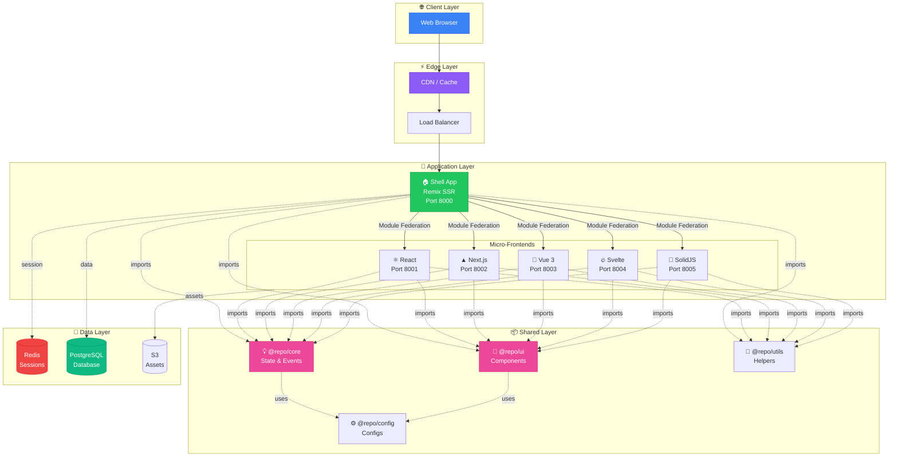

---

## 🔄 Data Flow

### Request Flow

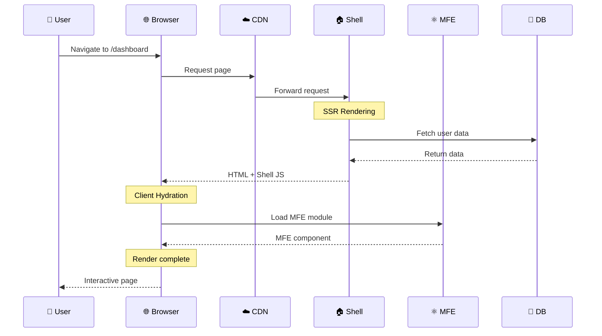

### State Synchronization

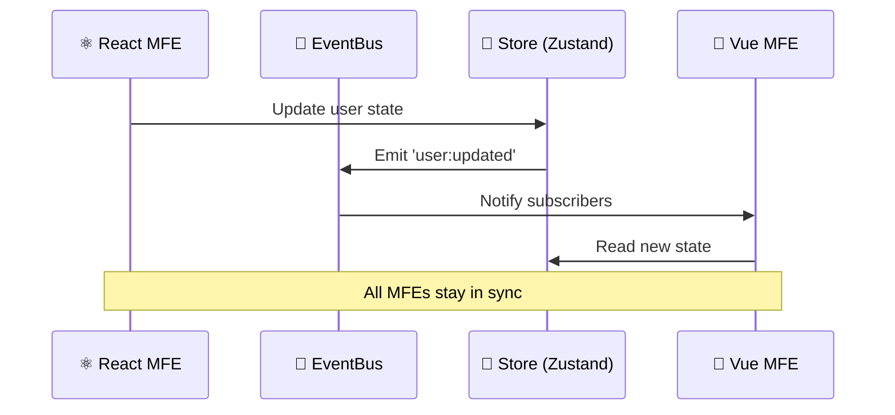

---

## 🏭 Build System

### Build Pipeline

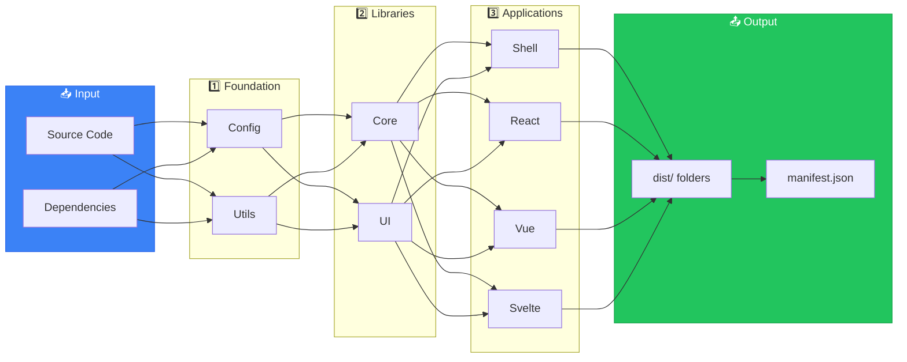

### Development vs Production

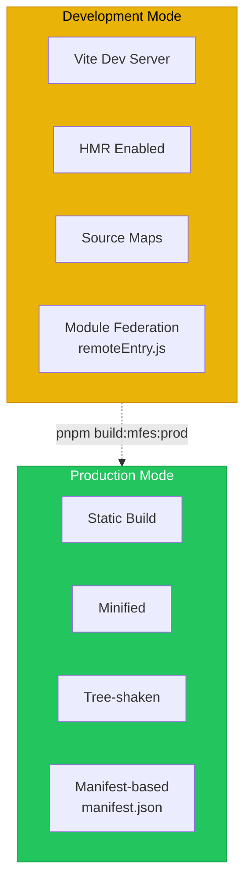

---

## 🚢 Deployment Flow

### CI/CD Pipeline

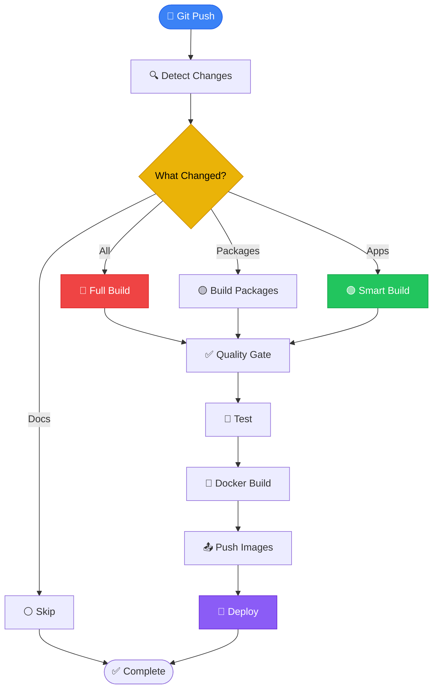

### Docker Build Strategy

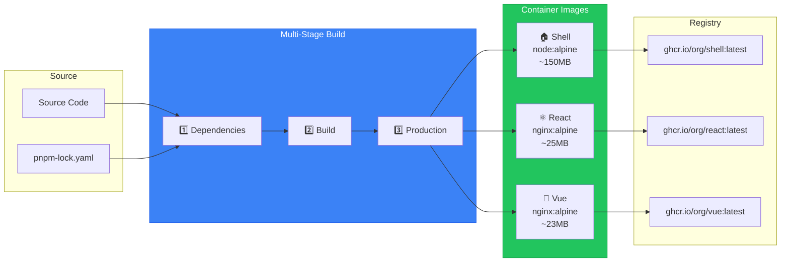

---

## 🎯 Module Federation

### Runtime Loading

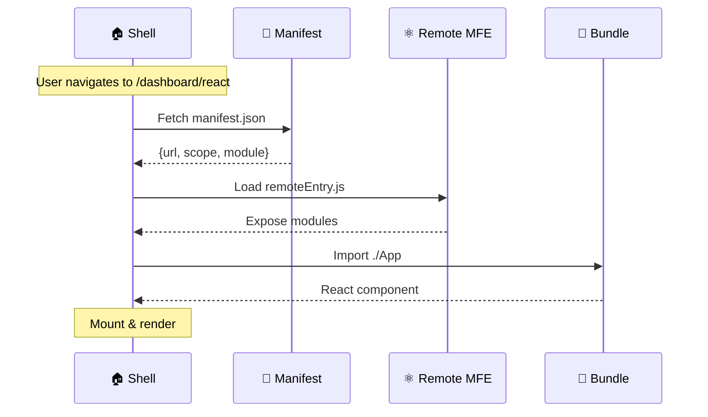

### Shared Dependencies

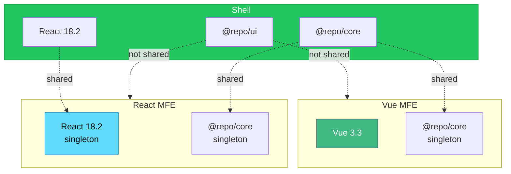

---

## 🔐 Security Architecture

### Defense Layers

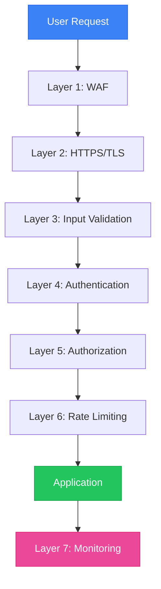

---

## 📈 Performance Optimization

### Bundle Size Journey

```mermaid
graph LR
    subgraph Before ["Before"]
        B1[850KB Bundle]:::bad
        B2[All frameworks]:::bad
        B3[No splitting]:::bad
    end

    subgraph Actions ["Optimizations"]
        A1[Tree shaking]:::action
        A2[Code splitting]:::action
        A3[Lazy loading]:::action
        A4[Framework-specific]:::action
    end

    subgraph After ["After"]
        AF1[245KB Bundle]:::good
        AF2[71% smaller]:::good
        AF3[Faster loads]:::good
    end

    Before --> Actions --> After

    classDef bad fill:#ef4444,stroke:#dc2626,color:#fff
    classDef action fill:#eab308,stroke:#ca8a04,color:#000
    classDef good fill:#22c55e,stroke:#16a34a,color:#fff
```

### Loading Strategy

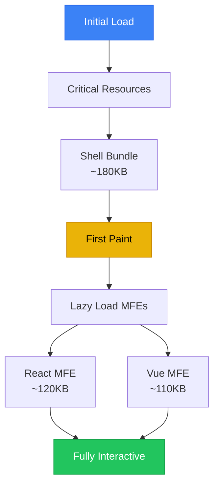

---

## 🧪 Testing Strategy

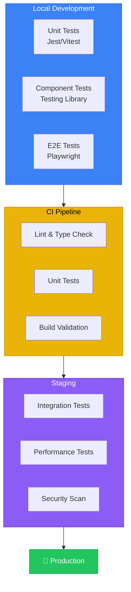

---

## 📱 Responsive Architecture

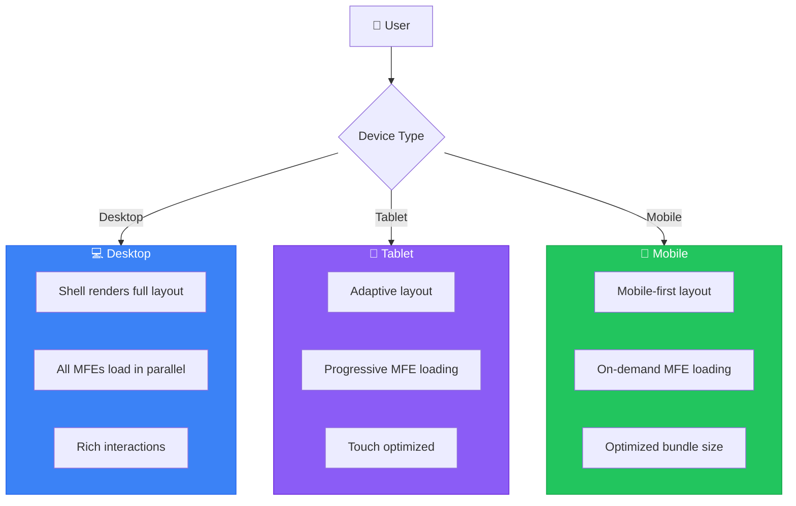

---

## 🎨 Component Library Architecture

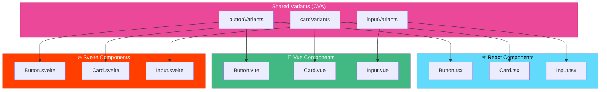

---

## 📊 Monitoring & Observability

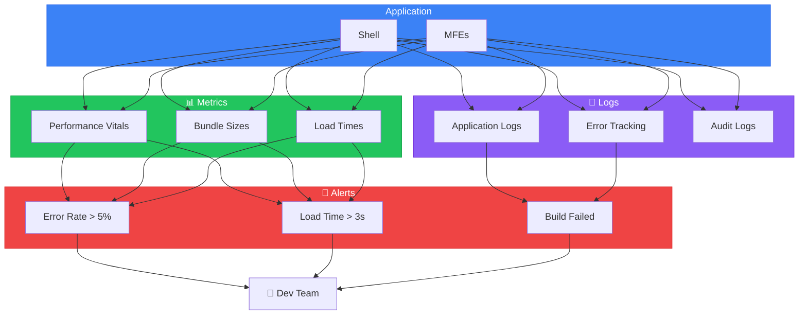

---

## 🔄 State Management Flow

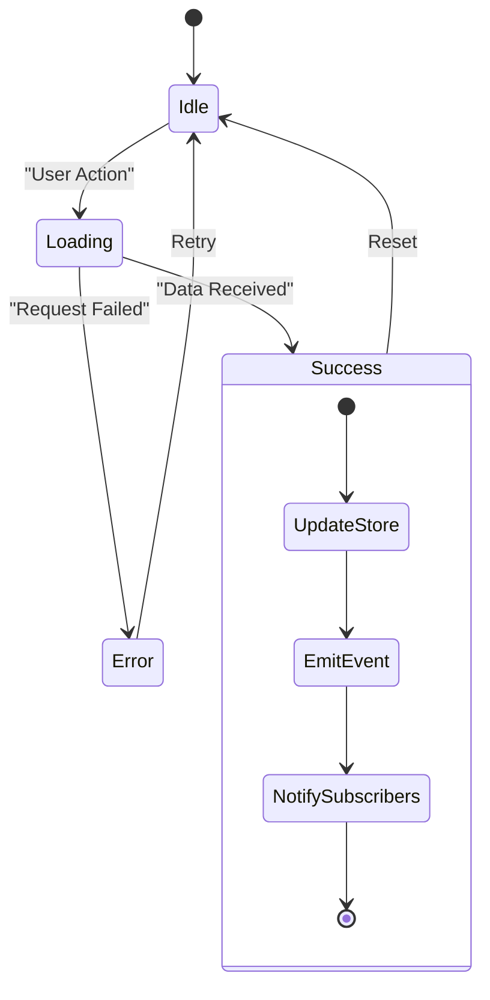

---

## 🎯 Quick Reference

| Concept                   | Diagram Location    | Purpose                     |
| ------------------------- | ------------------- | --------------------------- |
| **Complete Architecture** | System Overview     | Full system view            |
| **Request Flow**          | Data Flow           | Understand request handling |
| **Build Pipeline**        | Build System        | Build process               |
| **CI/CD**                 | Deployment Flow     | Automation pipeline         |
| **Module Federation**     | Runtime Loading     | MFE loading mechanism       |
| **Security**              | Defense Layers      | Security strategy           |
| **Performance**           | Bundle Optimization | Optimization journey        |
| **Components**            | Component Library   | UI architecture             |

---

**💡 Tip**: Use this guide alongside the main documentation for comprehensive understanding of the Orbit platform!
