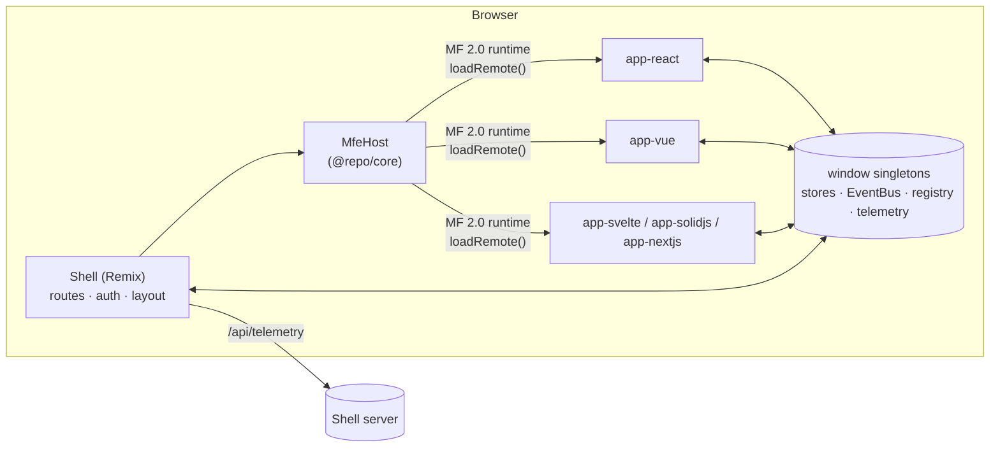
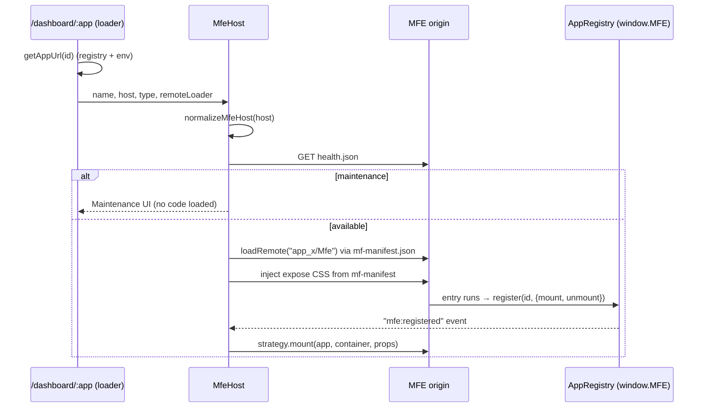
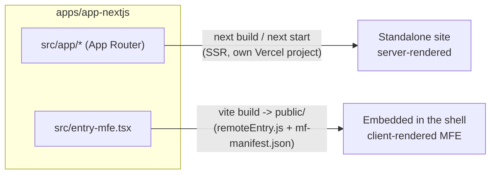
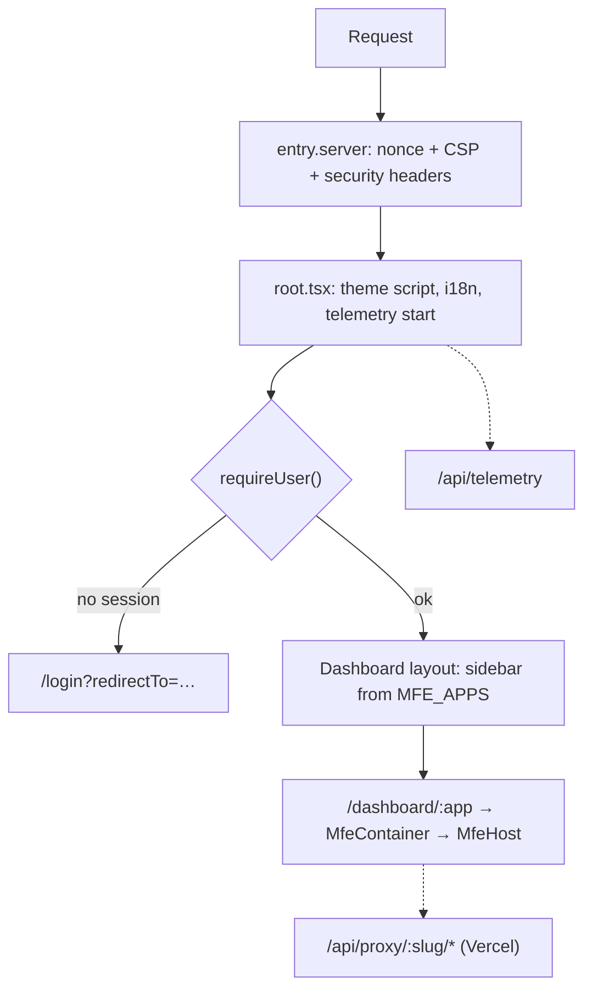

# Architecture

Orbit is a **host + remotes** micro-frontend platform:

- **Shell** (`apps/shell`, Remix, SSR) owns routing, authentication,
  layout, security headers and telemetry collection.
- **Micro-frontends** (`apps/app-*`) are independently built and deployed
  apps in any framework (React, Next.js, Vue, Svelte, SolidJS). Each one
  exposes a single `./Mfe` module.
- **Platform packages** (`packages/*`) hold the contracts both sides share.



## Packages

| Package        | Role                                                                                                                                                        |
| -------------- | ----------------------------------------------------------------------------------------------------------------------------------------------------------- |
| `@repo/config` | **Registry** (`MFE_APPS`), ports, Vite factory (`createMfeConfig`), scoped Tailwind (`createMfeTailwindConfig`), federation shared lists, TS/ESLint presets |
| `@repo/core`   | Runtime: `MfeHost`, `AppRegistry`, framework entry factories, `EventBus` + typed events, shared stores, telemetry, logger, i18n, error boundaries           |
| `@repo/ui`     | Design system: React components (shadcn-style) plus Vue/Svelte/Solid ports, shared CSS tokens, Storybook                                                    |
| `@repo/utils`  | `cn()` class-name helper                                                                                                                                    |

`@repo/core` exposes per-framework entry points: `@repo/core/react`,
`/vue`, `/svelte` and `/solid`. Each one re-exports the framework-agnostic
`@repo/core/shared`, so an app only pulls in its own framework's code.

## Single source of truth: the registry

`packages/config/src/constants/apps.ts`:

```ts
{ id: "app-react", name: "React Dashboard", framework: "react", port: 8001,
  slug: "react", type: "react", title: "React Application",
  description: "…", accent: "primary" }
```

Everything else is **derived** from it:

| Derived                                                     | Where                                             |
| ----------------------------------------------------------- | ------------------------------------------------- |
| Dev ports (`PORTS`)                                         | `@repo/config`                                    |
| Federation container name (`app_react`)                     | `toFederationName()`                              |
| Browser URL per environment (+ `MFE_URL_<ID>` override)     | `apps/shell/app/server/config.ts`                 |
| Shell route `/dashboard/:app` and sidebar nav               | `routes/dashboard/$app/page.tsx`, `nav-config.ts` |
| Proxy paths `/api/proxy/<slug>/` and `VITE_APP_<SLUG>_HOST` | `routes/api/proxy/*`                              |
| CSP allowed origins                                         | `server/csp.server.ts`                            |

`scripts/mfe.config.mjs` is a JS mirror for Node build scripts. A unit test
fails if it drifts from `MFE_APPS`.

## Loading pipeline (Module Federation 2.0)

Remotes are built with `@module-federation/vite`, which emits
`remoteEntry.js` and `mf-manifest.json` in both dev and production. The
shell has **no federation build plugin**: it loads remotes at runtime with
`@module-federation/runtime`, which keeps Remix SSR untouched and uses the
same code path in dev and production.



**Shared dependencies**: only framework runtimes are shared, as
singletons. The shell provides React, so React MFEs don't download their
own. Vue, Svelte and Solid remotes share their runtime with each other.
Platform state isn't shared through federation at all (see below).

**Manifest mode** (`MfeHost` without `remoteLoader`) is still supported for
hosts that don't use federation: it reads Vite's `manifest.json`, injects
the entry `<script type="module">` and CSS, then waits for registration.

## Next.js: two delivery modes

The Next.js app is delivered two ways from the same code:



- **Standalone**: a normal Next.js deployment with SSR (CI job
  _Deploy app-nextjs SSR to Vercel_).
- **Embedded**: the shell loads `entry-mfe.tsx` through Module Federation
  and mounts it with `createRoot`. This part renders **on the client only**.
  The shell's SSR covers the layout around it, not the MFE's content. Next.js
  server features (server components, `getServerSideProps`, server actions)
  are therefore not available inside the embedded MFE. Fetch data from
  APIs, or keep server-rendered pages on the standalone site.

There is no Vite-based Next.js runtime (e.g. vinext) in this repo. The
Vite build only produces the federation bundle.

## The MFE contract

An MFE's `./Mfe` expose must, when evaluated, register:

```ts
interface MicroApp {
  mount(container: HTMLElement, props: MicroAppProps): void | Promise<void>;
  unmount(container: HTMLElement): void;
}
AppRegistry.register("app-react", microApp);
```

The framework factories (`createReactMfeEntry`, `createVueMfeEntry`,
`createSvelteMfeEntry`, `createSolidMfeEntry`) implement this for you. See
[creating-a-micro-frontend.md](./creating-a-micro-frontend.md).

`MicroAppProps` = `{ theme?, locale?, auth?, eventBus?, …custom }`.

## State & communication

Every MFE bundles its own copy of `@repo/core`, so module-level singletons
would be duplicated. Platform singletons therefore live on `window`:

| Global                        | Purpose                                                                          |
| ----------------------------- | -------------------------------------------------------------------------------- |
| `window.MFE`                  | registered apps (`AppRegistry`)                                                  |
| `window.__MFE_EVENT_BUS__`    | the shared `EventBus`                                                            |
| `window.__USER_STORE__` & co. | zustand vanilla stores (user, theme, locale, counter) via `createSingletonStore` |
| `window.__MFE_TELEMETRY__`    | telemetry reporters installed by the shell                                       |

Ways to communicate, in order of preference:

1. **Shared stores** (`userStore`, `themeStore`, `localeStore`) for
   app-wide state. Framework bindings: React hooks (`useUserStore`, …);
   Vue, Svelte and Solid subscribe to the vanilla store.
2. **Typed events** (`runtimeEvents`, `createTypedEventBus`) for
   fire-and-forget messages. They're namespaced and versioned
   (`runtime:v1:*`).
3. **Props** passed at mount, for host → MFE configuration.

`syncStore()` can mirror a store over the `EventBus` (for example across
windows or iframes). Same-page MFEs already share one store instance.

## Shell responsibilities



- **Auth**: signed cookie session. `verifyCredentials()` is the plug-in
  point for your identity provider. See [security.md](./security.md).
- **Security headers**: per-request CSP nonce, `strict-dynamic`, origins
  derived from the registry.
- **Proxy** (Vercel): same-origin access to MFE deployments. It never
  forwards credentials.
- **Telemetry**: beacon endpoint + Core Web Vitals. See
  [observability.md](./observability.md).

## Isolation boundaries

| Concern       | Mechanism                                                                   |
| ------------- | --------------------------------------------------------------------------- |
| JS crashes    | `MfeErrorBoundary` per MFE; global error capture                            |
| Load failures | `MfeHost` states: error / maintenance / retry                               |
| CSS           | Tailwind utilities scoped to `[data-mfe="<id>"]`                            |
| Credentials   | Proxy strips cookies/authorization; CSP restricts origins                   |
| Events        | Namespaced + versioned typed buses                                          |
| Versions      | Shared singletons only for framework runtimes; catalog keeps majors aligned |

Every failure mode and how it's handled is listed in
[edge-cases.md](./edge-cases.md).

## Repository layout

```text
apps/
  shell/            Remix host (SSR) - auth, routing, CSP, proxy, telemetry
  app-react/        React 18 MFE (Vite)
  app-nextjs/       Next.js app (SSR when standalone); its MFE bundle is built with Vite into public/
  app-vue/          Vue 3 MFE
  app-svelte/       Svelte 4 MFE
  app-solidjs/      SolidJS MFE
packages/
  config/           registry, Vite/Tailwind factories, presets
  core/             runtime (MfeHost, registry, stores, events, telemetry)
  ui/               design system + Storybook
  utils/            cn()
e2e/                Playwright specs
scripts/            dev/build helpers (mfe.config.mjs, add-mfe, manifests)
docs/               this documentation
```
