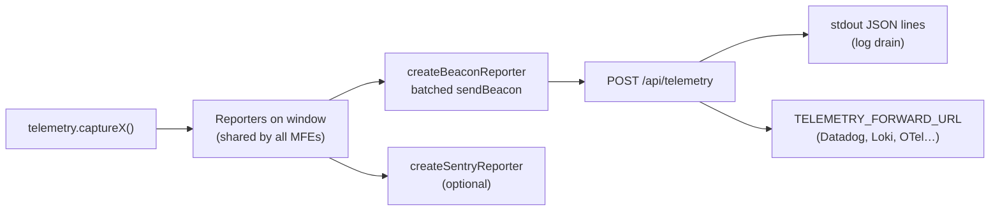

# Observability

## What is collected

| Signal                                 | Source                  | Record                                                                   |
| -------------------------------------- | ----------------------- | ------------------------------------------------------------------------ |
| Uncaught errors / unhandled rejections | `captureGlobalErrors()` | `error`, `source: window.onerror \| unhandledrejection`                  |
| React render errors                    | `MfeErrorBoundary`      | `error`, `source: ErrorBoundary`, component stack                        |
| Invalid MFE host                       | `MfeHost`               | `error`, `source: MfeHost.validateHost`                                  |
| MFE load / mount failures              | `MfeHost`               | `error`, `source: MfeHost.load \| MfeHost.mount`                         |
| MFE load time                          | `MfeHost`               | `metric mfe.load_to_mount` (ms), per `mfeId`                             |
| Core Web Vitals                        | `web-vitals`            | `metric web_vitals.{lcp,inp,cls,fcp,ttfb}` with `rating` and `page` tags |

Every record carries `mfeId`, `source`, `timestamp`, and optionally `tags`
and `extra`.

## Pipeline



- The shell installs the reporters once (`startTelemetry()` in `root.tsx`).
  MFEs only call `telemetry.*`.
- Batches flush at 20 records, every 5 s and on page hide.
- `/api/telemetry` logs one JSON line per record:

  ```json
  {
    "type": "telemetry",
    "kind": "metric",
    "name": "web_vitals.lcp",
    "value": 1976,
    "unit": "ms",
    "context": {
      "mfeId": "shell",
      "source": "web-vitals",
      "tags": { "rating": "good", "page": "/login" }
    },
    "timestamp": "…",
    "receivedAt": "…"
  }
  ```

## Sending to Sentry

Load the Sentry browser SDK in the shell **before** `startTelemetry()`
runs. It's picked up automatically through `window.Sentry`, or install it
explicitly:

```ts
import * as Sentry from "@sentry/browser";
Sentry.init({ dsn: "…" });
addTelemetryReporter(createSentryReporter(Sentry));
```

Remember to allow the Sentry origin in `CSP_EXTRA_ORIGINS`.

## Writing a custom reporter

```ts
addTelemetryReporter({
  report(record) {
    if (record.kind === "metric")
      datadogRum.addTiming(record.name, record.value);
  },
});
```

## Suggested dashboards & alerts

- Error rate per `mfeId` (spikes right after an MFE deploy → roll back with
  `MFE_URL_<ID>`)
- p75 `mfe.load_to_mount` per `mfeId`
- p75 LCP / INP / CLS per `page` (Core Web Vitals thresholds: LCP ≤ 2.5 s,
  INP ≤ 200 ms, CLS ≤ 0.1)
- Count of `MfeHost.load` errors with `CORE_CONNECTION_REFUSED` (host down)

## Lighthouse budgets

CI scores the production shell build with Lighthouse on every PR. See
[testing-and-quality.md](./testing-and-quality.md#lighthouse-ci).

## Local debugging

| Helper                         | What it gives you                             |
| ------------------------------ | --------------------------------------------- |
| `window.__MFE_PERF__.export()` | Per-MFE load/mount timings (console table)    |
| `window.__MFE_DEBUG__`         | Logger debug helpers                          |
| `window.MFE`                   | Registered apps                               |
| `mfeLogger.enableDebug()`      | Verbose logging (persisted in `localStorage`) |
