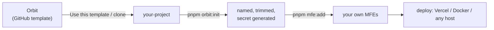

# Starting a New Project from Orbit

Orbit is meant to be **copied, initialised and owned** by each project. You
don't install it as a dependency. You start from it and get the whole
platform (shell, runtime, CI, quality gates, docs), already wired together.



## 1. Get a copy

- **GitHub**: open the Orbit repository → **Use this template** → _Create a
  new repository_. The repository must be marked as a template
  (_Settings → General → Template repository_).
- **Anywhere else**:

  ```bash
  git clone --depth 1 https://github.com/tian972k/micro-fontend-base.git acme-portal
  cd acme-portal && rm -rf .git && git init
  ```

## 2. Initialise

```bash
pnpm install
pnpm orbit:init --name acme-portal --title "Acme Portal" --keep react,vue
```

| Flag           | Meaning                                                                                                     |
| -------------- | ----------------------------------------------------------------------------------------------------------- |
| `--name`       | Workspace/package name (slugified)                                                                          |
| `--title`      | Human title used in the README and the shell's `<title>` (default: from `--name`)                           |
| `--keep`       | MFEs to keep: ids (`app-react`) or frameworks (`react`, `vue`, `svelte`, `solidjs`, `nextjs`). Default: all |
| `--dry-run`    | Print every change without touching files                                                                   |
| `--yes`        | Non-interactive (no prompts)                                                                                |
| `--no-install` | Skip `pnpm install` at the end                                                                              |

What it changes:

| For each removed MFE                                               | Project-wide                                                  |
| ------------------------------------------------------------------ | ------------------------------------------------------------- |
| deletes `apps/<id>`                                                | `package.json` name                                           |
| removes it from `MFE_APPS` and `scripts/mfe.config.mjs`            | README title (+ "Built on Orbit")                             |
| removes its CI build/deploy jobs, change filters and secret checks | shell page title                                              |
| removes its docker-compose service and `depends_on` entry          | fresh `CHANGELOG.md`                                          |
| removes its turbo env vars, nav icon and env-example port          | `apps/shell/.env` with a random `SESSION_SECRET` (gitignored) |

Every removal is unit-tested against the real files
(`packages/config/test/orbit-init.test.ts`), so the template can't drift
into a state where initialising breaks CI.

Run it **once**, on a fresh copy, before your first commit. Use
`--dry-run` first if you want to review the changes.

## 3. Make it yours

| Task                                   | Where                                                                                                  | Doc                                                            |
| -------------------------------------- | ------------------------------------------------------------------------------------------------------ | -------------------------------------------------------------- |
| Plug in the client's identity provider | `verifyCredentials()` in `apps/shell/app/server/auth.server.ts`                                        | [security.md](./security.md#authentication)                    |
| Add the client's micro-frontends       | `pnpm mfe:add <name> <framework>`                                                                      | [creating-a-micro-frontend.md](./creating-a-micro-frontend.md) |
| Brand colours / tokens                 | `packages/ui/src/styles/globals.css` (keep WCAG AA contrast)                                           | [packages/ui](../packages/ui/README.md)                        |
| Shared state & events for the domain   | `createSingletonStore`, `createTypedEventBus("<domain>:v1")`                                           | [api/core.md](./api/core.md)                                   |
| Environments                           | `SESSION_SECRET`, `MFE_URL_<ID>`, `VITE_APP_<SLUG>_HOST`, `CSP_EXTRA_ORIGINS`, `TELEMETRY_FORWARD_URL` | [configuration.md](./configuration.md)                         |
| Monitoring                             | Sentry / collector via telemetry reporters                                                             | [observability.md](./observability.md)                         |
| Quality targets                        | `lighthouserc.cjs` budgets, e2e specs in `e2e/`                                                        | [testing-and-quality.md](./testing-and-quality.md)             |

## 4. What you get out of the box

- **Runtime core** (`@repo/core`): `MfeHost` with health checks, maintenance,
  retry, timeouts, unmount-race safety; registry; framework factories;
  shared stores; typed versioned events; telemetry; error boundaries.
- **Shell**: Remix SSR, signed sessions, CSP with nonces, a registry-driven
  `/dashboard/:app` route and nav, Vercel proxy, telemetry endpoint.
- **Build**: Module Federation 2.0 via `createMfeConfig`, scoped Tailwind,
  pnpm catalog, Turborepo caching.
- **CI**: type-check, lint, unit, e2e, Lighthouse, per-app Vercel deploys.
- **Docs**: these docs, including the
  [edge-case handbook](./edge-cases.md). Keep them as your project's
  technical documentation.

## 5. Keeping up with Orbit

Projects own their copy. To pull later improvements from Orbit:

```bash
git remote add orbit https://github.com/tian972k/micro-fontend-base.git
git fetch orbit
git cherry-pick <commit>       # or: git merge orbit/main --allow-unrelated-histories
```

`packages/core` and `packages/config` are the parts most worth syncing.
Their public API is documented in [docs/api](./api) and changes are listed
in the CHANGELOG.

## Checklist for a client handover

- [ ] `pnpm orbit:init` run; unused MFEs removed
- [ ] Real `verifyCredentials()`; demo account disabled in production
- [ ] Secrets set per environment (never commit `apps/shell/.env`)
- [ ] CI green: type-check, lint, unit, e2e, Lighthouse
- [ ] Deploy targets + rollback procedure documented
      ([deployment.md](./deployment.md#rollback--canary))
- [ ] Edge cases reviewed with the client team ([edge-cases.md](./edge-cases.md))
